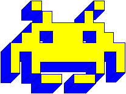
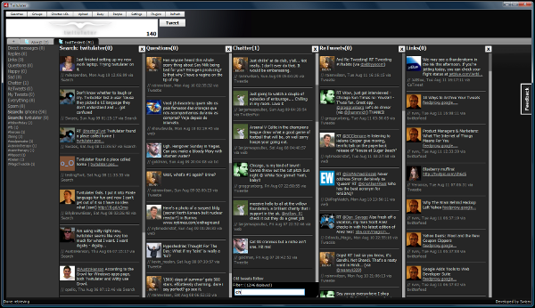

Yesterday [a comment on HackerNews](http://news.ycombinator.com/item?id=4213564) got me thinking about the horrible _horrible_ code I used to produce as a young human (and to this day)

> To be honest, I wouldn't worry too much. Everyone is like "I was programming since I was 10!" Nobody ever asks what they were programming at 10, most people wrote relatively simple stuff until they grew up and got a professional job. Now to wait for replies from people who designed OSes when they were 12 :)

I started programming when I was 9 because there was a class at my school. Without that class I'd probably become something silly like a writer or a linguist. Thank you [ZRI](http://www.zri.si/) and the awesome professor whose name I can never remember. You guys are great! Back then I used Logo, which was fun, but the _real_ fun started when they let me loose on Pascal at 11. I have no idea how good a coder I was for an 11 year old, all I know is that I was a _terrible_ coder by real standards. Here is a non-exhaustive list of the worst monstrosities I have created in the past 13 years.

## 1. A maths tutoring program

**Age**: 11 **Tech**: Pascal and text "graphics" I wanted to make maths exercises and present them to the user. Use random to produce infinite examples. But, I didn't know about _GotoXY_ yet and couldn't print things at specific points on a text screen. That's why I implemented the welcome screen as a set of procedures that would print an increasing number of empty lines before the _"WELCOME!"_ line. I needed many procedures because I didn't know about loops either - each had a hardcoded number of empty lines. They were called as a huge chunk of code with a _delay_to make it smooth. Code lost to history.

## 2. A space invaders game

**Age**: 11 **Tech**: Pascal and BGI graphics \[caption id="" align="alignright" width="207" caption="This is NOT how my invaders looked (Photo credit: Wikipedia)"]\[/caption] I called this game space invaders - I had no knowledge of the _real_ space invaders game. Mine was just two spaceships floating above you that you would shoot at from below. I discovered [BGi](http://en.wikipedia.org/wiki/Borland_Graphics_Interface "Borland Graphics Interface") graphics so I could draw pretty things on the screen. I even knew loops this time. The problem was that I didn't know about arrays yet so there were roughly 200 global variables in the code. I remember the main problem being that Pascal said _"Hey, your [line of code](http://en.wikipedia.org/wiki/Source_lines_of_code "Source lines of code") can't be \_that\_ long!"_ so I had to break up variable definitions into separate lines. Code lost to history.

## 3. An "OS"

**Age**: 12 to 13 **Tech**: Pascal, text graphics and a mouse driver \[caption id="" align="alignright" width="448" caption="Something like this"]\[/caption] I wanted to make a general interface to my computer that looked just as cool as [Turbo Pascal](http://en.wikipedia.org/wiki/Turbo_Pascal "Turbo Pascal") 7 did. I called it an operating system even though it was really just a visual shell running on top of DOS. It had a lot of general programs for doing various tasks - I can no longer remember how many, but I know there were a lot of menus you could click around to get to stuff. You could even run native programs (I often used it to launch Doom). You could, of course, set up different settings for how things looked and even sign in as different users. There was a secret way to type a password so you could go into Admin mode and mess around with settings of other users! Version 2 featured a much slicker [GUI](http://en.wikipedia.org/wiki/Graphical_user_interface "Graphical user interface"). (no screenshots remain, sorry) I eventually had to learn how to properly use functions and procedures because the _[GOTO](http://en.wikipedia.org/wiki/Goto "Goto")_ instruction couldn't jump around the 4000+ line monstrosity anymore. And all those "programs" you could run? Monolithic codebase, not actually different programs. Oh and I still had the problem of having to split up global variable definitions into separate lines. Code lost to history PS: I later tried to implement this in BGI graphics, but never got past the stage of drawing windows

## 4. Space Invaders v2

**Age**: 12 or 13 **Tech**: Pascal and BGI At this point I still had no knowledge of the real Space Invaders game, so I made a game where you were fighting against two opponents flying to and fro above you. When you shot them down new ones would fly in. I think this was mostly due to limitations in the code (array size? number of variables for opponents? don't know). The coolest thing about this game was that you could purchase new weapons and ammunition and that the AI players could run out of ammo as well, at which point they would just crash into you. For some reason there was a potato head guy on your dashboard, offering encouragement and tips. There are no more screenshots, but I could probably reproduce the GUI with pen and paper. By this time I had gotten past my obsession with GOTO jumps, but records were still beyond my grasp. I didn't know about readability either so most of the variables were _a, aa, ab_ and so on. But I finally started indenting my code! That was lovely. Code lost to history.

## 5. Space Invaders v3 (might have had a different name)

**Age**: 13 **Tech**: Pascal, 24-bit graphics, mouse driver, [BMP](http://en.wikipedia.org/wiki/BMP_file_format "BMP file format") sprite library This was my first game that started looking good. Due to limitations of memory and such you could still only play against four opponents at a time, but they finally started flying around in 2D space instaed of just left-right at the top. You could also fully play with a mouse this time so your spaceship replaced the mouse cursor and you could click to shoot. That was lovely. And so was the fact I started using BMP sprites and 24-bit graphics - it was all really shiny! Unfortunately just drawing the parallax effect on the stars in the background wasted so much resources there wasn't much that I could add to the game beyond moving around and shooting. I also had a lot of trouble with array size and the amount of bullets that could be drawn on screen. Eventually I scrapped the project because I kept getting the equivalent of a "null pointer" error and I didn't know what a pointer was. Code lost to history.

## 6. Space Invaders 3D (might be a different name)

**Age**: 13 **Tech**: Pascal, 24-bit graphics I wanted to make a 3D engine and failed miserably. designed it around the idea that the universe is a cube and when I update whatever is on the screen, I simply have to update everything else that you don't see as well. After adding **two** objects to the screen my computer would run out of memory (16MB of RAM) and it took forever to update a single step anyway, so the "game" was completely useless. Code lost to history.

## 7. A personal calendar app

**Age**: 14 **Tech**: Delphi I think this app was some sort of way to keep track of tasks and stuff. It would show you a calendar - that I implemented manually of course. You could add events and stuff to get reminders later. Except I didn't even know how to properly calculate when it's a leap year (hint: not just "is it divisible by 4"). But it did win me the 3rd prize in a national program developing competition. Code lost to history.

## 8. A ww2 shooting game

**Age**: 14 **Tech**: Delphi You know you're bound to fail when you set out to make a 2D shooting game in Delphi with the idea that you can make a running animation by quickly changing sprites on an object in a window. After spending a few months getting the game menu just right, with good pictures and ominous music I lost interest and never even started working on the gameplay itself. Code lost to history.

## 9. An assortment of early websites

**Age**: 15 to 16 **Tech**: PHP I can't pinpoint a specific project from this era. There were many smaller ones and a few big websites designed for the webcomics I thought I could make in those days. The main issues I had were understanding that I can't just pass state around like I'm used to in a dynamic program, HTML being a stateless protocol confused me to no end. Most of my code also relied on register globals and other monstrosities like that. Figuring out how sessions work took forever. Code lost to history.

## 10. Chlorine Boards - a website-making system

**Age**: 17 to 20 **Tech**: PHP After I got frustrated with the phpBB system of mods and extensions I started working on an opensource system for creating websites so that modules didn't have to know about each other at all. Essentially a good idea that even got used in the wild by some large-ish websites because I convinced a web agency that they should hire me because I can use this thing. There were at least several failings

- I used relational databases _very_ incorrectly (at first). To the point of not knowing how a many-to-many table works
- I wrote my own template engine and language - complete with a poorly implemented template-to-php compiler
- There was a package manager that couldn't resolve dependencies and was implemented as _a 2000 sloc function_
- Everything was a singleton
- others I can't think of

Code still lives on sourceforge: [Chlorine Boards](http://sourceforge.net/projects/chlorineboards/)

## 11. Text mining engine in PHP

**Age**: 19 to 20 **Tech**: PHP, Perl Around the time Zemanta was launching with a very well implemented text mining system, I started working on my own. From scratch. In PHP. It grew out of a tag cloud generator and was actually pretty cool - could even make out sentences, find collocations and so on. But I should have known something was terribly wrong when I had to implement some key regular expressions in Perl because PHP's regex engine wasn't fast enough. Word of warning: don't write a sentence extractor as a regex. Even if PCRE does let you do that. I think the guy who inherited that codebase still hates me. Code lost to NDA's.

## 12. Twitulater

\[caption id="" align="alignnone" width="600" caption="Twitulater screenshot"]\[/caption] **Age**: 20 to 21 **Tech**: Javascript, Adobe AIR The idea was simple - a twitter client that lets you filter conversations based on what's happening. Put links in different tabs, have happy tweets here and conversation tweets there. Modeled very much after TweetDeck, but better! Better in oh so many ways! Except it was utterly buggy and complete crap. There is something terribly wrong when you have 20,000 lines of spaghetti javascript on your hands, created by a guy who doesn't know enough about very simple things ... such as how Javascript handles closures and how exactly events work. Code is archived on github: [Twitulater](https://github.com/Swizec/Twitulater)

## 13. A reinforcement learning -based graph clique analyzer

**Age**: 22 **Tech**: python, django, databases Without much machine learning experience I decided that thinking of a graph as a set of objects with forces acting on them would be a good idea. Then you can just run a particle simulation and eventually the nodes that belong together will float to one another and you can pick out overlaps with a grid-segmentation algorithm. When new data flies into the system in real-time you can just tweak the forces between related nodes. Simple stuff. Except that's not _really_ how one goes about finding cliques in a graph. I didn't even know the name of the problem was "finding cliques in a graph" and thought I was breaking some awesome new ground. At first I even implemented this inside a relational database and, as you can predict, everything broke down. Calculating a single result would take seconds, even minutes ... just getting the nodes out of a database was completely untenable. The problem was slightly alleviated once we moved to App Engine and its BigTable. In retrospect, I should have used a graph database. They were just getting popular around that time too! Or, you know, use an algorithm that doesn't use an incredibly slow and complex process for the first part and then a very slow process for the second part. That might've helped. Code lost to pure shame.

###### Related articles

- [PASCAL is STILL ALIVE :-)](http://olimex.wordpress.com/2012/04/25/pascal-is-still-alive/)

  * * *

- [iheartchaos: Watch Space Invaders come to life in this time...](http://lifeandcode.tumblr.com/post/25517702913/iheartchaos-watch-space-invaders-come-to-life)

  * * *

- [Hong Kong Apartment with Space Invaders Bathroom by OneByNine](http://design-milk.com/hong-kong-apartment-with-space-invaders-bathroom-by-onebynine/)

  * * *

- [Space Invaders Light Would Look Great In Any Room](http://www.ohgizmo.com/2012/05/07/space-invaders-light-would-look-great-in-any-room/)

  * * *

