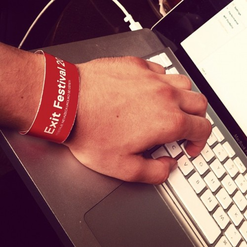
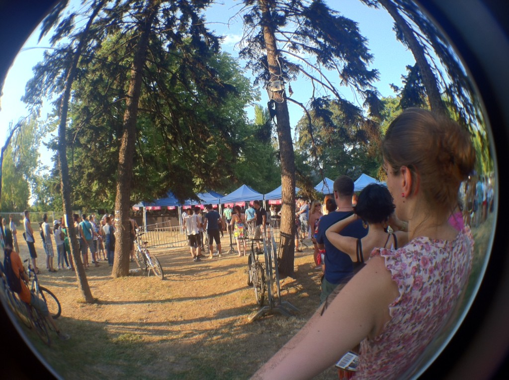
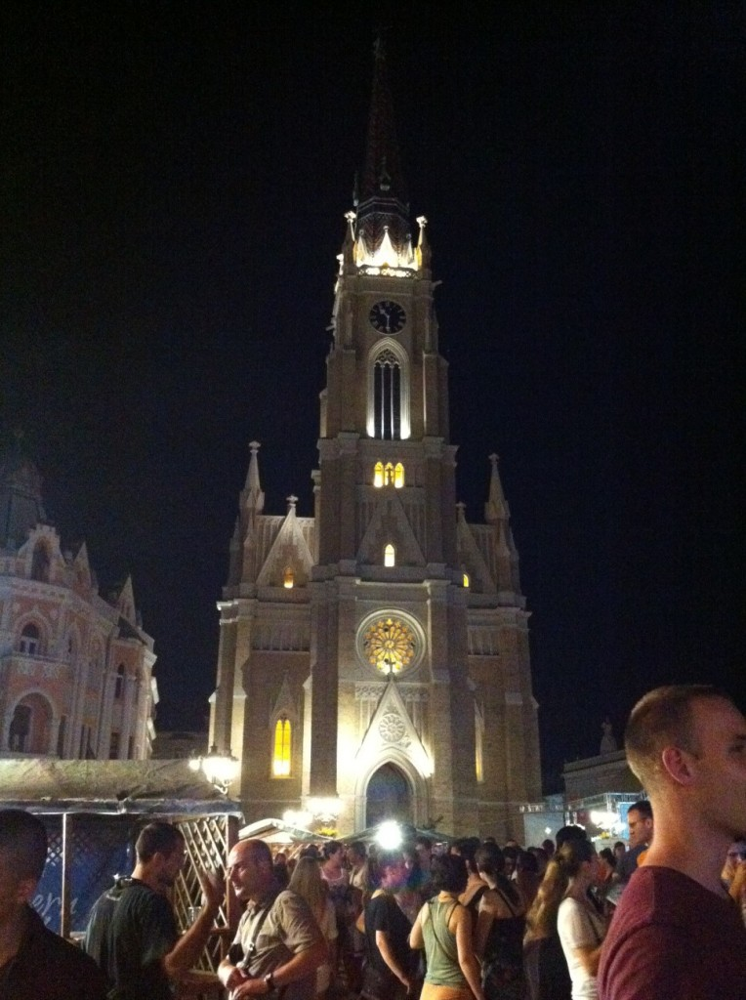

This week I'm in [Novi Sad](<http://maps.google.com/maps?ll=45.25,19.85&spn=0.1,0.1&q=45.25,19.85 (Novi%20Sad)&t=h> "Novi Sad") for the [EXIT festival](http://www.exitfest.org/ "Exit (festival)")- a four day massively huge event full of music, sexy people and booze. Some people will be using drugs and having sex as well. And I imagine all sorts of other things I'm too big of a geek to even think of. \[caption id="" align="alignright" width="400" caption="You can't party without a laptop"]\[/caption] Since, despite the fact I'm 24, this is my first music festival, I will try to blog about my experiences every day. Mostly pictures. Yesterday morning I hopped in the car in Ljubljana and set off on the road. Just five hours of driving, how hard can it be, right? Turns out that when it's the middle of summer, you have three other people in the car, there is no air conditioning and the sun is bearing down on you for hours on end ... it can be pretty hard. We had to stop every hour. Just because of the unbearable heat. Stepping out of a car into the sun at 34°C heat and thinking _"Oh this is nice. So fresh!"_is a very very strange feeling. Don't even want to know how hot it was in that car. [Serbia](<http://maps.google.com/maps?ll=44.8,20.4666666667&spn=10.0,10.0&q=44.8,20.4666666667 (Serbia)&t=h> "Serbia") itself looks rather lovely otherwise, at least the parts I've seen. There's still a bunch of old cars from the 80's around, the lorry's still can't go faster than 20km/h up a hill and the roads are ... bumpy. BUT! All the girls in Novi Sad, oh my, the girls. It's like a showcase of flesh and skimpy clothing! Very recommended! Just watch out for the small gipsy children folk. One of them almost stole the card from my hat this morning! As for the festival, it starts tonight. We went to a pre-party concert thing last night in the main square. That was fun and it turns out I find it impossible to dance to dubstep. The slow rhythm just completely confuses me and I stand there like a lumbering fool, trying to figure out what to do with my arms. Please don't try to picture that. It's 2PM now and I'm sitting at an incredible irish pub with amazing music, getting ready to punch out some code. Because, you know, that's something geeks do at music festivals. Keep on working like the festival was some sort of annoying distraction. \[caption id="attachment_4826" align="alignnone" width="717" caption="Getting the bracelets"]\[/caption] \[caption id="attachment_4827" align="alignnone" width="535" caption="Novi Sad's epic cathedral"]\[/caption]

###### Related articles

-   [Top 10 Music Festivals](http://www.mirror.co.uk/lifestyle/travel/europe-short-haul/top-ten-809417)

    * * *

-   [Do You Funk It Up at Music Festivals?](http://www.bellasugar.com/Do-You-Funk-Up-Music-Festivals-3303689)

    * * *

-   [How to Save Money at Summer Music Festivals: Tips from the Experts](http://www.dailyfinance.com/2012/06/29/summer-music-festival-money-saving-tips-experts/)

    * * *

