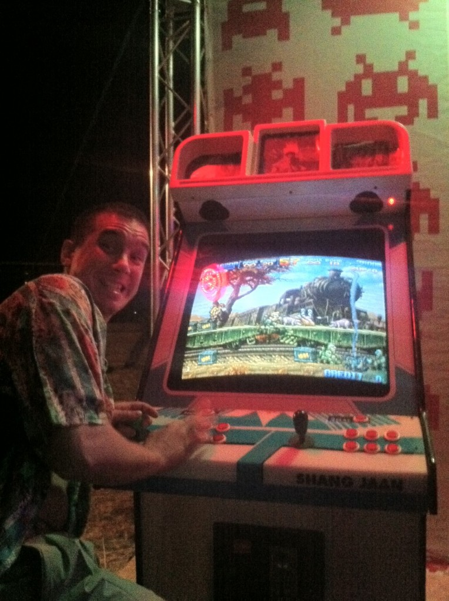
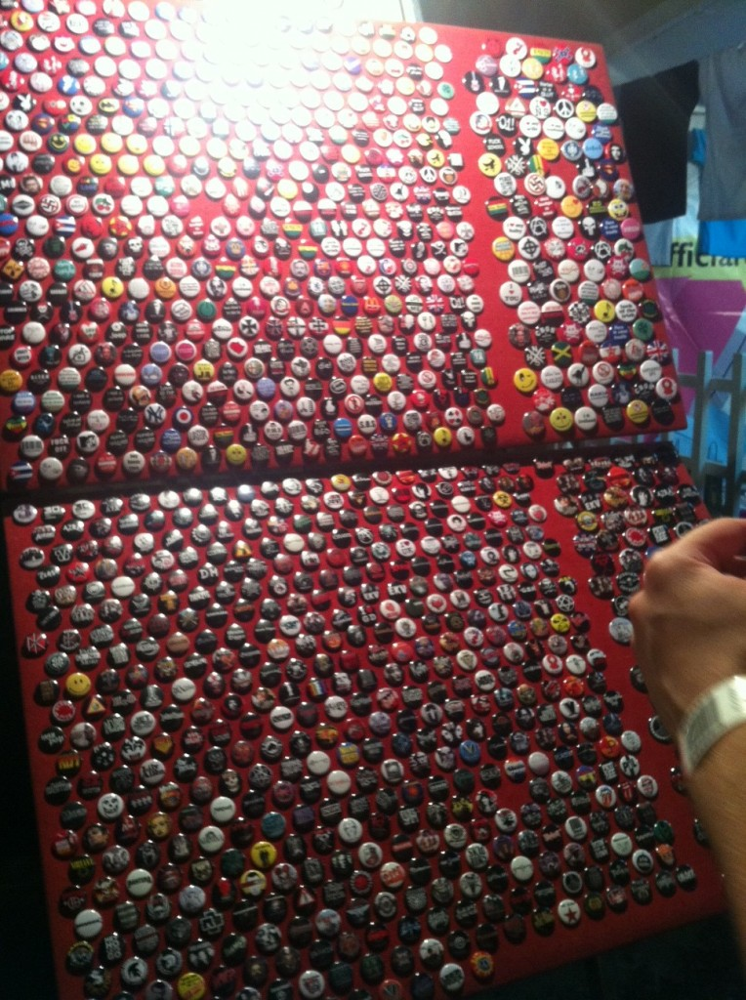
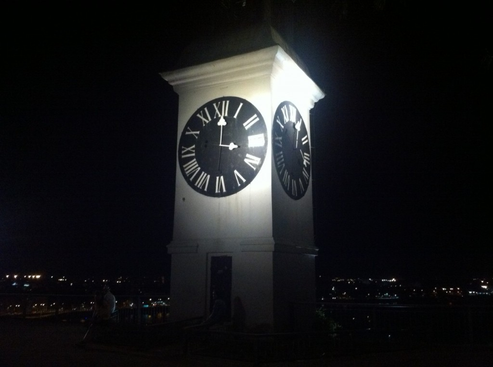
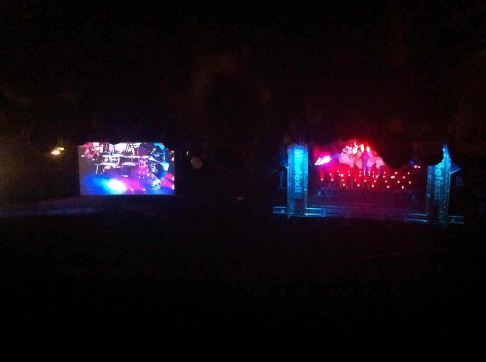

Today I discovered a fatal flaw in my plans for all night partying and merry making - I don't sleep. Got back from the festival at 5am. Woke up 5 hours later ... simply because I didn't do a lot of braining the previous day and that was enough. \[caption id="attachment_4831" align="alignright" width="366" caption="Arcade - the funnest thing at EXIT"]\[/caption] So much for _"Oh yeah, you're gonna party all night and sleep all day"_ Nope, not for me. I'm going to walk around all day and do stuff, then become insanely sleepy and tired at 3am and have to go home because trying to party when you're half asleep just isn't all that fun. But I have to say the general festival experience is pretty awesome! I never expected I could have this much fun cramped together in a party, with no elbow room to speak of and trying to dance my feet off to some strange music. Although I can hardly call Gossip strange music since I almost sort of recognised almost a third of the songs. And I count that as a great success. By the way, EXIT doesn't serve any proper drinks so I have been reduced to the savage state of subsisting on beer, hot dogs and energy drinks. The dark beer is almost palatable, but it gets the job done. The highlight of the evening was of course the arcade. [@robertbasic](http://twitter.com/robertbasic) and I found this old style arcade that's set up to have infinite coins. When you die, you just press continue and it goes on forever and ever in spite of your skill! Hooray! Really amazing stuff, I think we played for at least an hour ... no idea what the game was, don't even know what it was called or how to play it. Pure fun. Yes, yes that was much more fun than the time I suddenly found myself entertaining a group of four or five girls and sort of dancing with them in one large pile of sexy bodies. Yes, even more fun than paying 200 [dinars](http://en.wikipedia.org/wiki/Dinar "Dinar") for [rakia](http://en.wikipedia.org/wiki/Rakia "Rakia") and getting 300 dinars back because of reasons. Yep, they sell rakia in small tubes on the way up to the fortress. Oh and it was _definitely_ more fun than losing the rageface badge I bought with the 100 dinars I earned by buying rakia. \[caption id="attachment_4832" align="alignnone" width="535" caption="Badges!"]\[/caption] \[caption id="attachment_4833" align="alignnone" width="717" caption="Clock tower with inverted hands"]\[/caption] \[caption id="attachment_4834" align="alignnone" width="717" caption="Gossip on the main stage"]\[/caption]

###### Related articles

- [Geek at a music festival: Day 1](http://swizec.com/blog/geek-at-a-music-festival-day-1/swizec/4825)

  * * *

- [How to Play Classic Arcade Games On Your PC](http://www.howtogeek.com/118622/how-to-play-classic-arcade-games-on-your-pc/)

  * * *

- [Take advantage of 'Renaissance for geeks', Startup Festival goers told](http://business.financialpost.com/2012/07/12/take-advantage-of-renaissance-for-geeks-startup-festival-goers-told/)

  * * *

- ['Age of the Geek' Comes to the Edinburgh Fringe Festival](http://geeksyndicate.wordpress.com/2012/06/22/age-of-the-geek-comes-to-the-edinburgh-fringe-festival/)

  * * *

