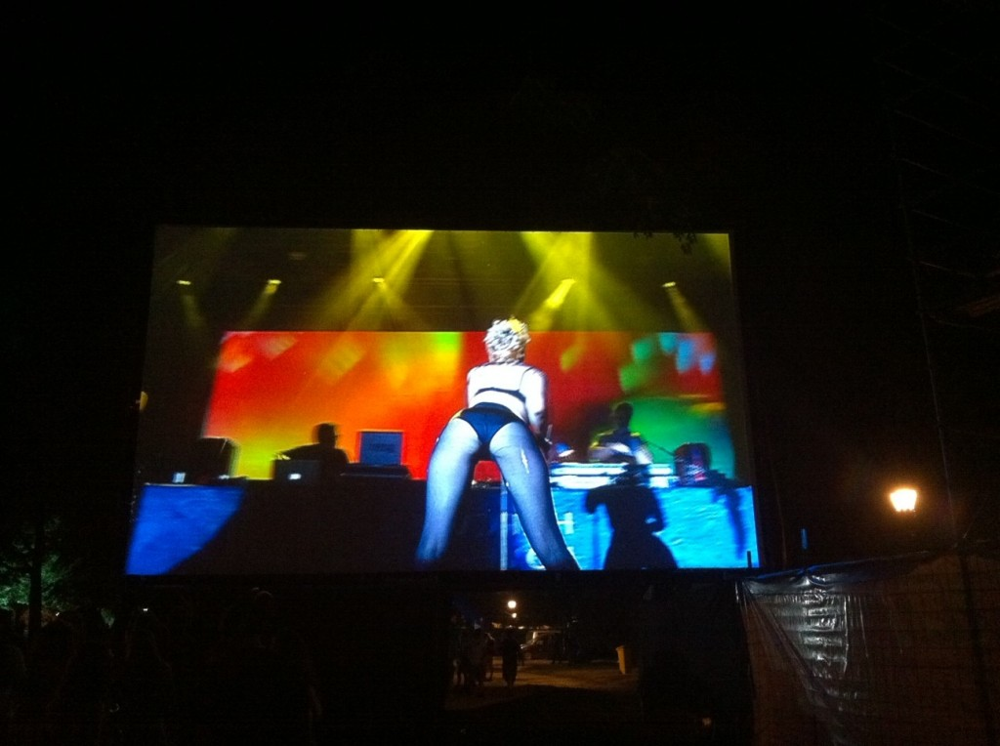
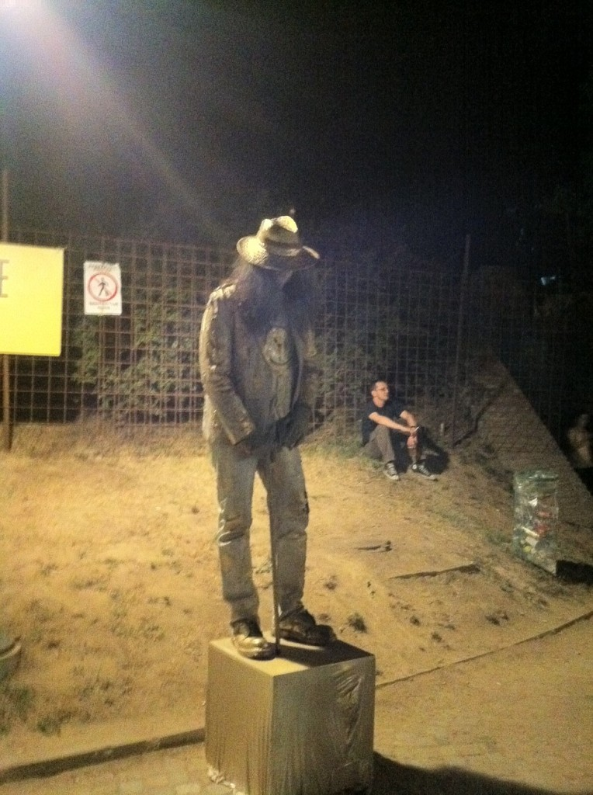
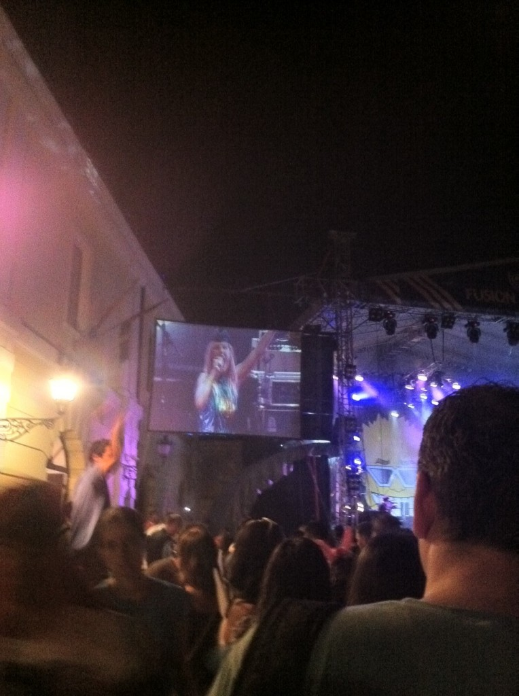
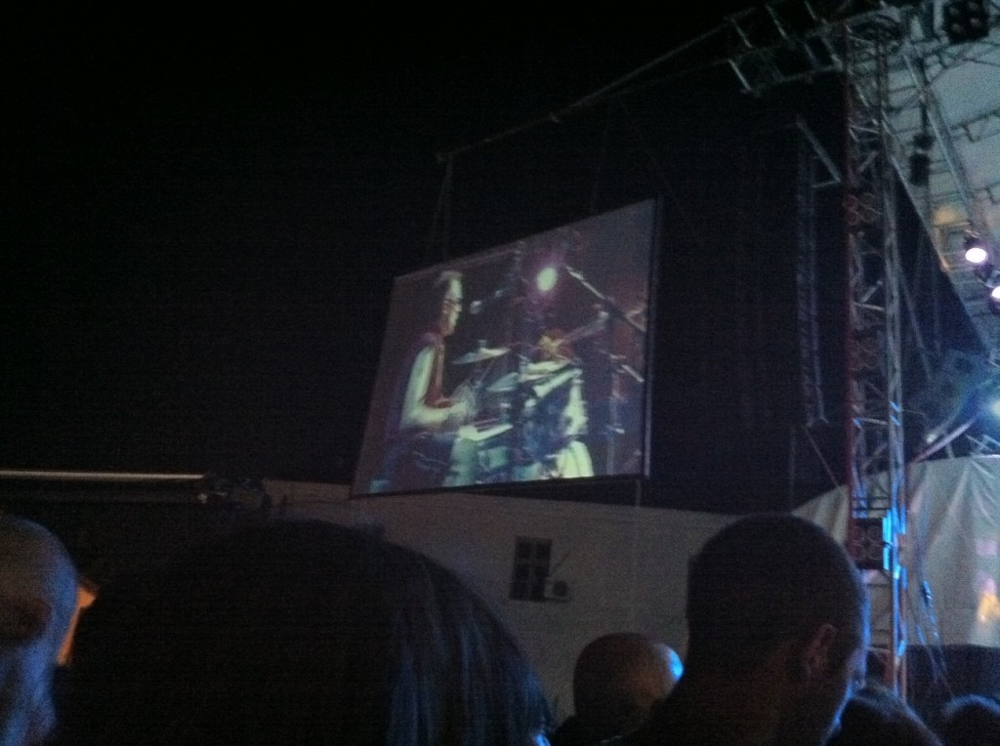
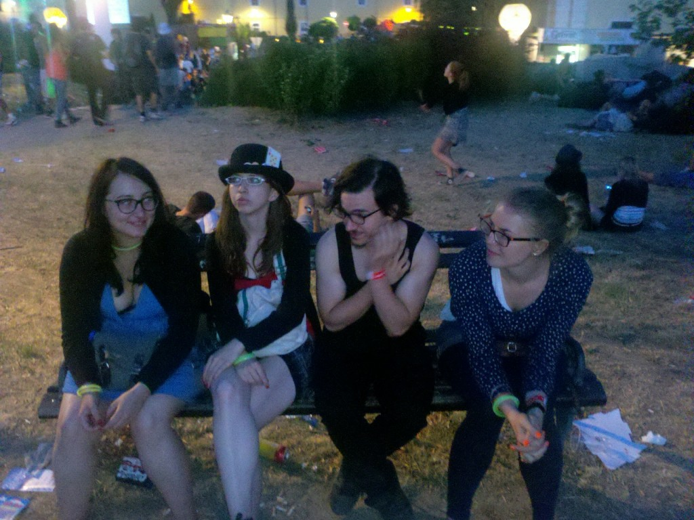
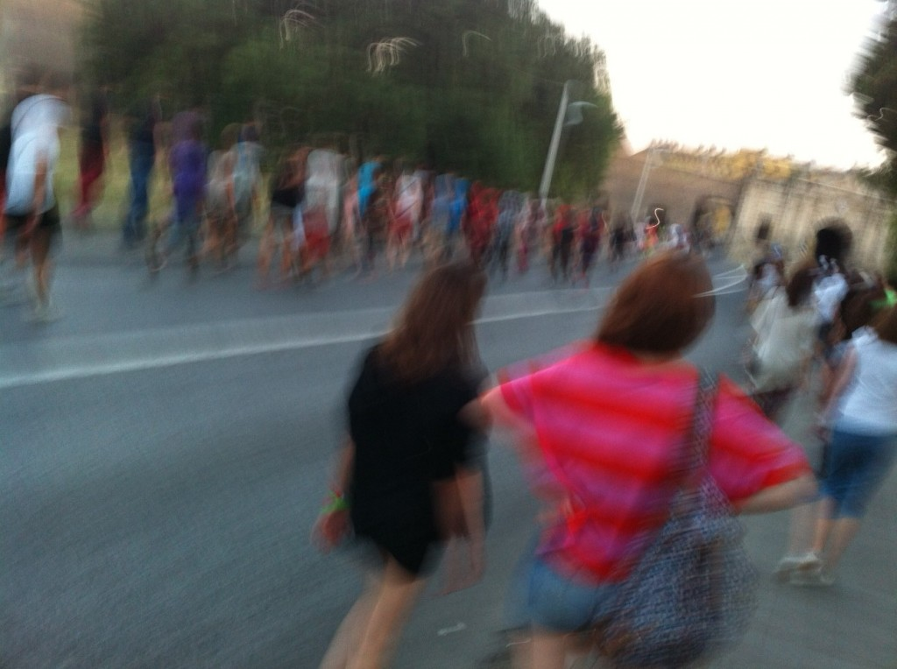

\[caption id="attachment_4839" align="alignnone" width="574" caption="Hercules and Love Affair have great arses and bad music"]\[/caption]

Pain. Pain. Pain. Everything hurts.

Everything.

I'm supposed to do this for two more days? Are you people insane!? I'm getting too old for this shit. Don't think I was never young enough for this shit actually. My body just wasn't made for constant partying and dancing.

And I know it wasn't because a moshpit [injured my shoulder again](http://swizec.com/blog/programmers-are-optimists/swizec/4509 "Programmers are optimists") and I spent half the night dancing with just one useful arm.

Despite the pain and tiredness last night will probably turn out to be the best day of EXIT. The music was perfect. The company was great. And I had enough energy to survive the whole night.

Everything just ... clicked.

I even realized the telephone has already been invented and can be used to call up people you know are at the festival. Met up with all the girls from Slovenia, didn't even bother finding out if I know any guys who are coming. Screw them :P

There isn't much of a story there, I just wanted to mention I spent most of the night in the company of four girls.

Oh and last night finally provided proof that [paying people random compliments](http://swizec.com/blog/can-you-pay-one-compliment-to-one-stranger-every-day/swizec/4449 "Can you pay one compliment to one stranger every day?") really _does_ work. A girl ran up to me from the crowd _"Heeeeey, you're from Slovenia right!? We met at bi-ko-fe!"_ And, honestly, I didn't remember her at first. I knew I saw her at the arcades the previous night and that she seemed familiar.

We discovered that she's also an exchange student at my college. But we met at bikofe, when I said her shirt looked cool. The funny thing was that she understands Slovenian, but doesn't speak it and I understand Croatian but don't speak it. So we talked in two languages for like an hour and it was just the most confusing thing ever.

Ever.

It's also very good to wear a hat. When we were leaving at 5am or so another girl ran up to me _"Heeeey, you're that guy from the other night! I don't know if you remember me, but I found your card. Have it back at the come, wanna come over and I can give it to you?"_

Didn't go. Nature calling. Then I couldn't find her anymore even though she said she'd wait.

That's a geek's life for ya, get invited to a girl's place and somehow manage not to go.

PS: moshpits are _fun_!

\[caption id="attachment_4840" align="alignnone" width="428" caption="Random living statue"]\[/caption]

\[caption id="attachment_4841" align="alignnone" width="428" caption="Lollobrigida were just awesome"]\[/caption]

\[caption id="attachment_4842" align="alignnone" width="574" caption="The Toy Dolls had a brilliant moshpit"]\[/caption]

\[caption id="attachment_4844" align="alignnone" width="574" caption="Slovenian crew represent!"]\[/caption]

\[caption id="attachment_4845" align="alignnone" width="574" caption="So tired my hands were shaking"]\[/caption]

###### Related articles

- [Geek at a music festival: Day 2](http://swizec.com/blog/geek-at-a-music-festival-day-2/swizec/4830)

  * * *

- [Geek at a music festival: Day 1](http://swizec.com/blog/geek-at-a-music-festival-day-1/swizec/4825)

  * * *

