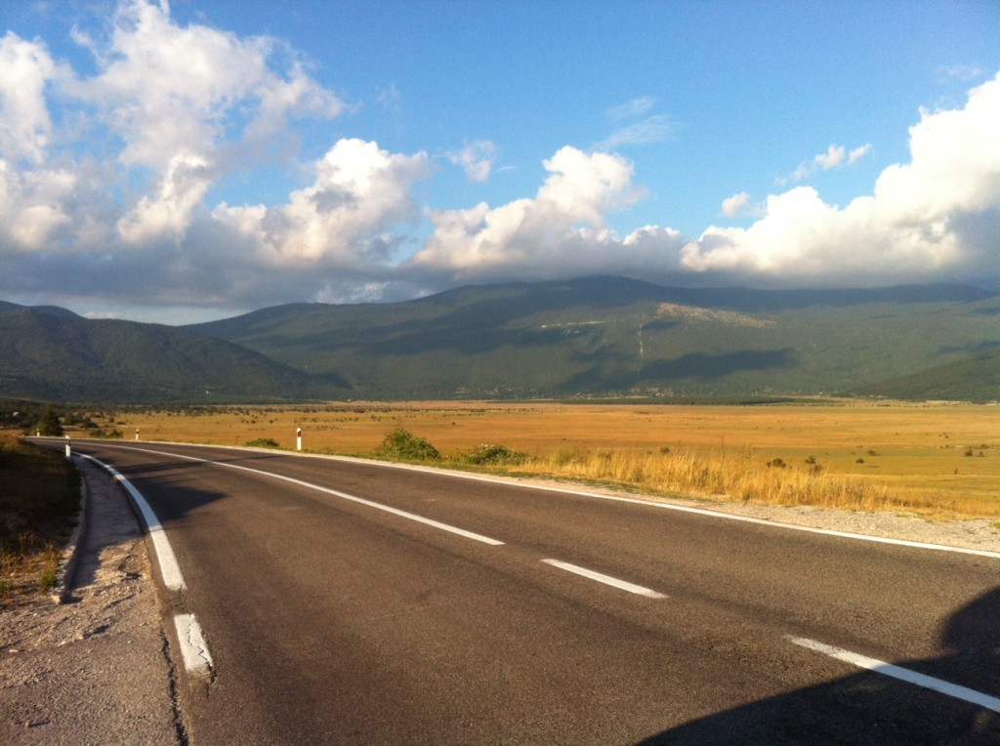
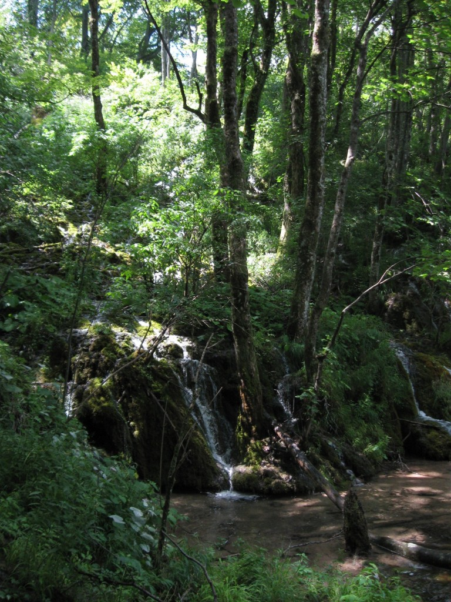
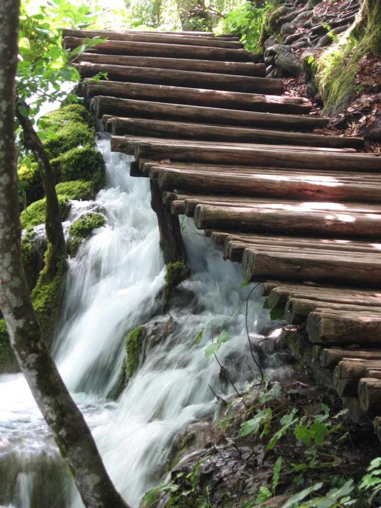
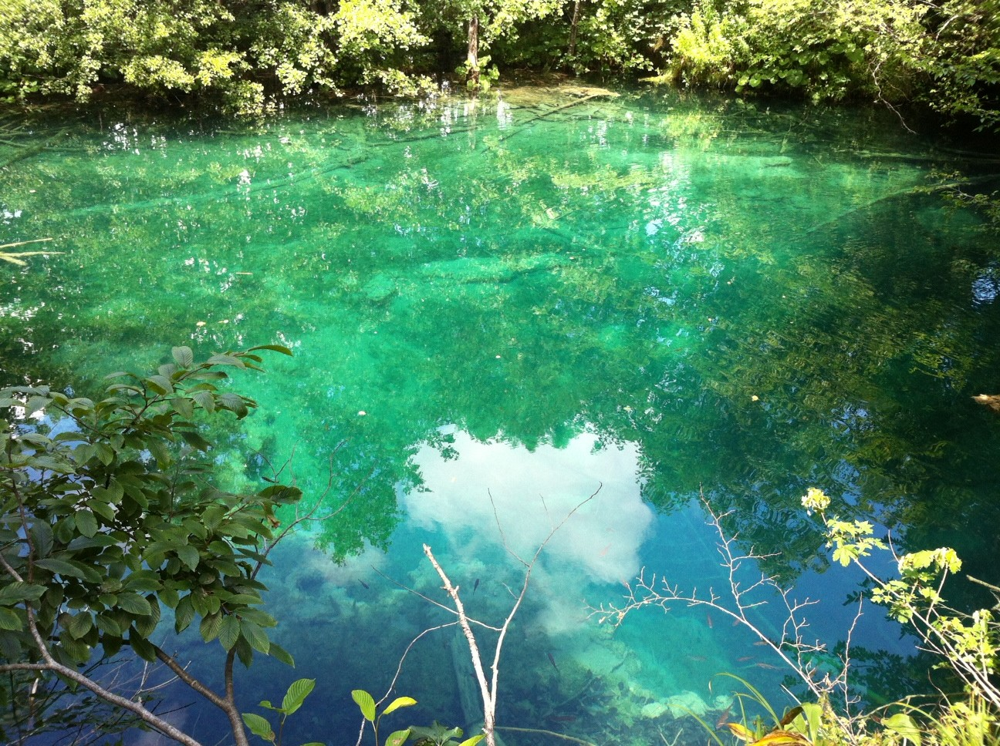
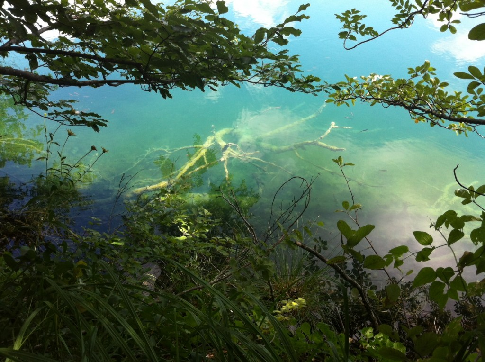
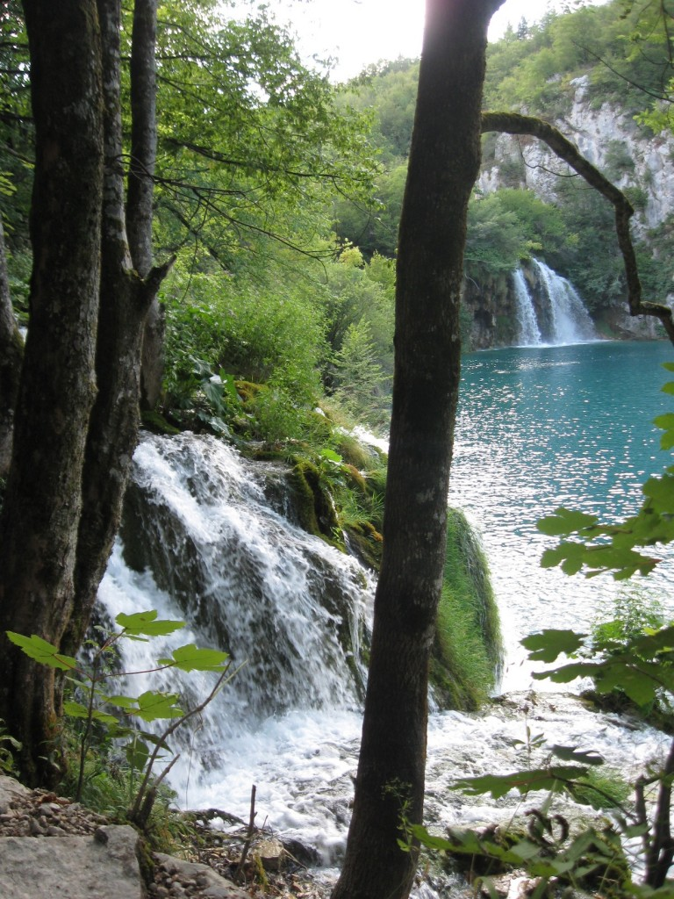
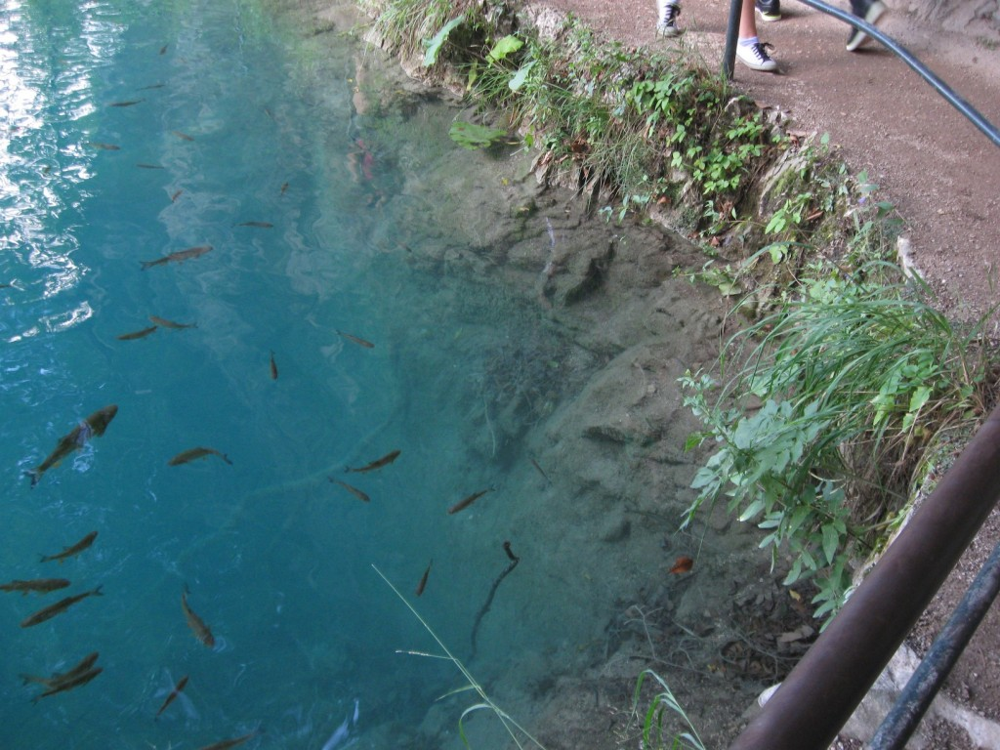
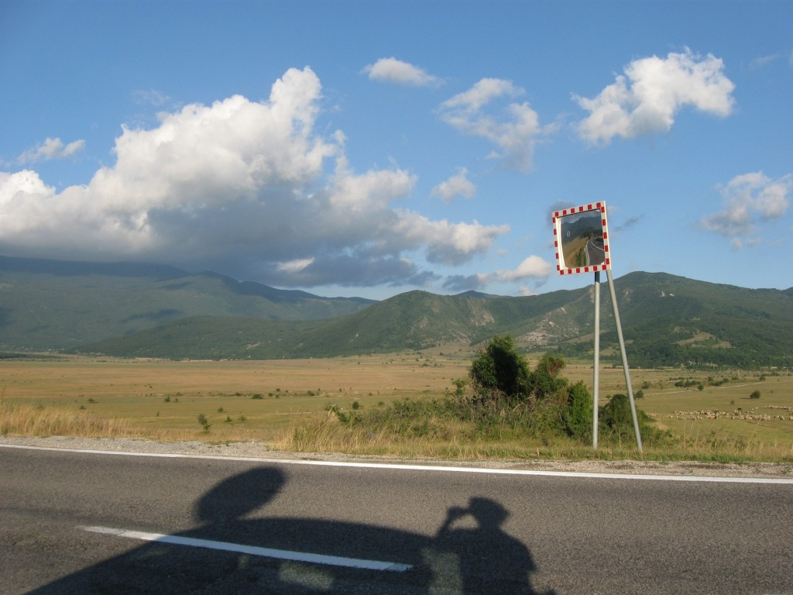
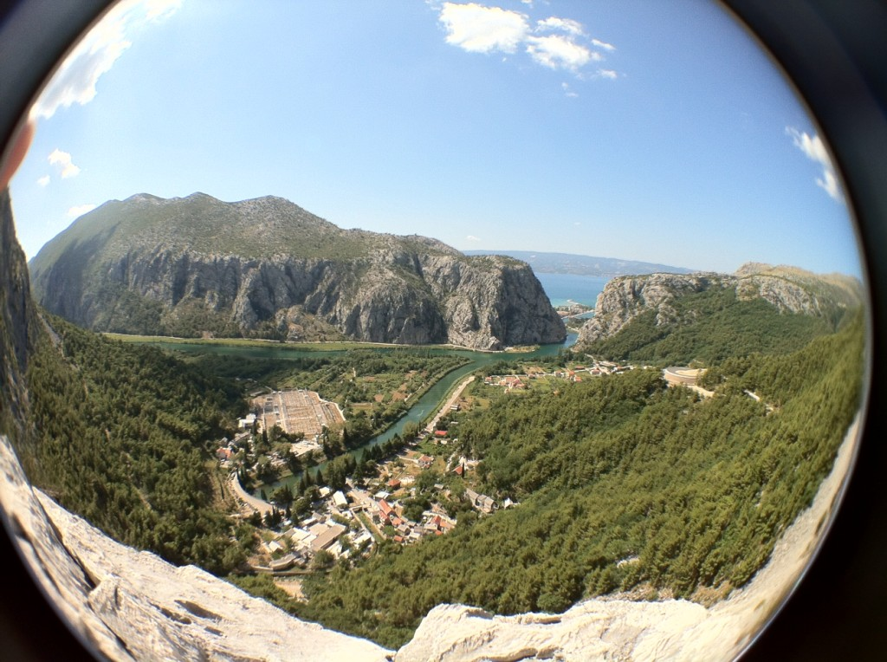

\[caption id="attachment_4908" align="alignnone" width="574" caption="Roadtrip Croatia"]\[/caption] Here I am. Here _we_ are, on a roadtrip of epic proportions ... or rather, as much as you can pack into ten days. This is the main event of the summer, the reason I borrowed [@smotko](http://twitter.com/smotko)'s car. The plan is to make it down to [Dubrovnik](http://whc.unesco.org/en/list/95 "Old City of Dubrovnik") - some 600km away from home - visit [Bruce Lee](http://www.bruceleefoundation.com/ "Bruce Lee")'s statue in [Mostar](<http://maps.google.com/maps?ll=43.3333333333,17.8&spn=0.1,0.1&q=43.3333333333,17.8 (Mostar)&t=h> "Mostar"), then go visit some Croatian islands for a few days of proper lounging around the beach like a pair of cows. Yesterday at ungodly hours in the morning the expedition was launched. So far the journey's included:

- hoards of cow-eyed tourists with their brain shut off, trying to take the single best picture of [Plitvice Lakes](http://whc.unesco.org/en/list/98 "Plitvice Lakes National Park") ... no idea why they bothered, of course ours are going to be best.
- discovering [Croatia](<http://maps.google.com/maps?ll=45.8,16.0&spn=10.0,10.0&q=45.8,16.0 (Croatia)&t=h> "Croatia") is actually beautiful - but only inland [Dalmatia](http://en.wikipedia.org/wiki/Dalmatia "Dalmatia"), the [flatland on the way to EXIT](http://swizec.com/blog/geek-at-a-music-festival-day-1/swizec/4825 "Geek at a music festival: Day 1") was weird and the coast is full of lazy cowstourists
- a scary old house without working electricity
- sleeping on the balcony of said house ... and later inside, with all the ghosts keeping us company
- hydroelectric power plant _inside a fucking mountain_
- one of the best looking longboarding roads ever ... with _maaaaaaybe_ just a bit too much traffic ... maybe, we'll see, I might have to sneak out while [@ponywithhiccups](http://twitter.com/ponywithhiccups) isn't looking
- huge wind tourbines! very huge!
- getting to know the interior of Car, very very well

Oh and we took some possibly good photos. Take a look, y'know, if you want to. I'm a blogpost not a cop. \[caption id="attachment_4909" align="alignnone" width="432" caption="Plitvice Lakes - where boats chase trains"]\[/caption] \[caption id="attachment_4910" align="alignnone" width="461" caption="Forestry!"]\[/caption] \[caption id="attachment_4911" align="alignnone" width="461" caption="Jesus was a chump, this is how you do it"]\[/caption] \[caption id="attachment_4912" align="alignnone" width="614" caption="The greenest green"]\[/caption] \[caption id="attachment_4913" align="alignnone" width="614" caption="\*whisper\* I see dead trees"]\[/caption] \[caption id="attachment_4914" align="alignnone" width="461" caption="Waterfalliness"]\[/caption] \[caption id="attachment_4915" align="alignnone" width="614" caption="Down, down, down"]\[/caption] \[caption id="attachment_4916" align="alignnone" width="614" caption="Roadtrip - the picture"]\[/caption] \[caption id="attachment_4917" align="alignnone" width="614" caption="View from the longboard road"]\[/caption]

###### Related articles

- [Croatia Blog Week: Plitvice](http://theegotripper.com/2012/06/17/croatia-blog-week-plitvice/)
- [Focus on Croatia](http://travelnotes.wordpress.com/2012/06/18/focus-on-croatia/)
- [Roadtrip](http://girlonamissionblog.wordpress.com/2012/06/03/roadtrip/)
- [Confused.com's Guide to Driving in Croatia](http://www.confused.com/guides/motoring/car-insurance/confused-com-s-guide-to-driving-in-croatia-2442555746)

