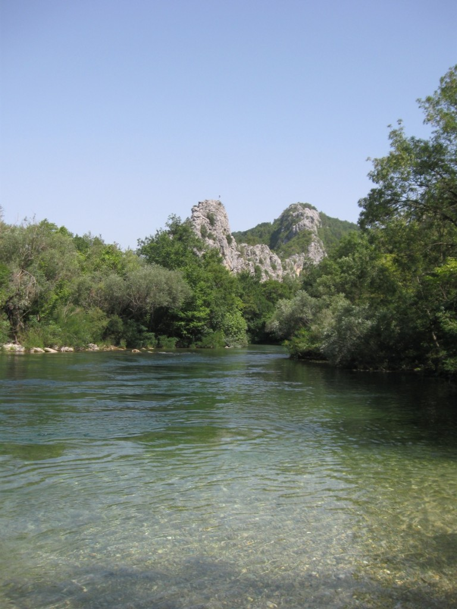
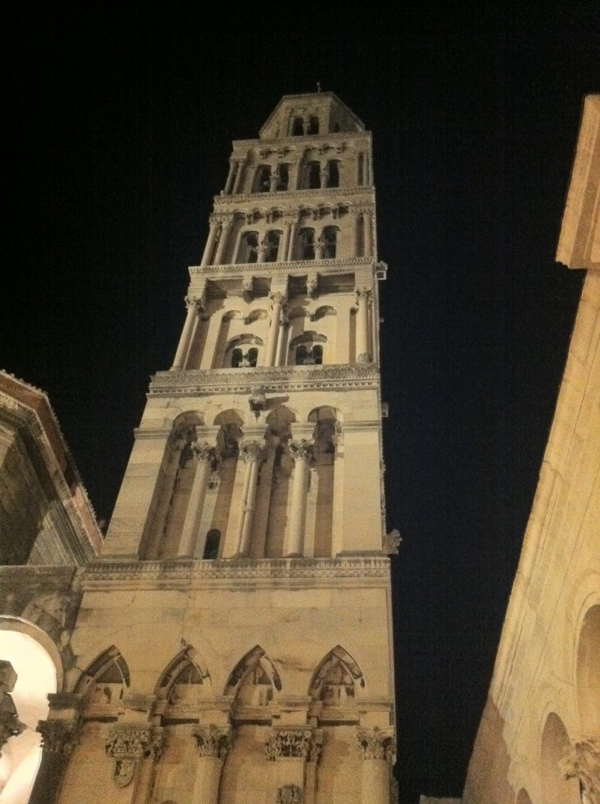
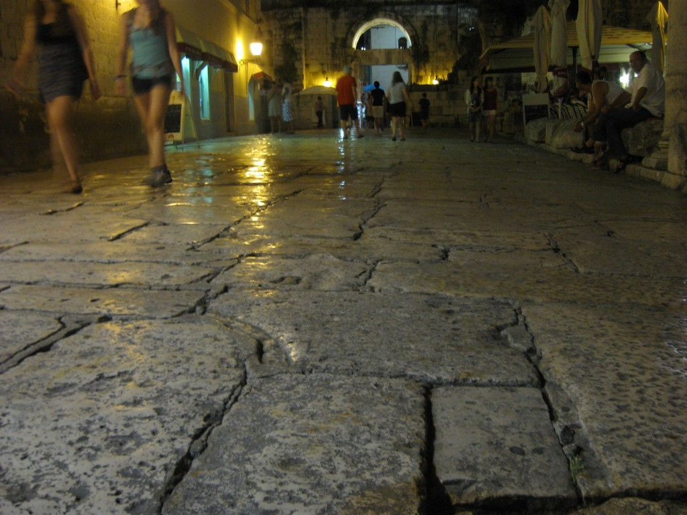
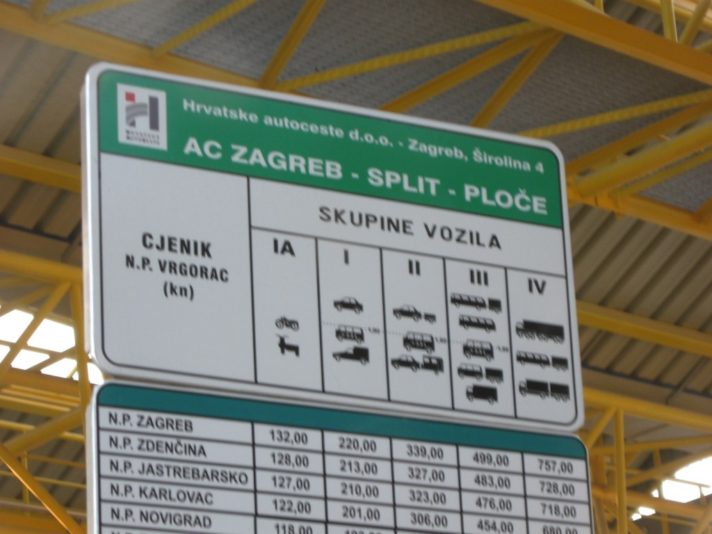
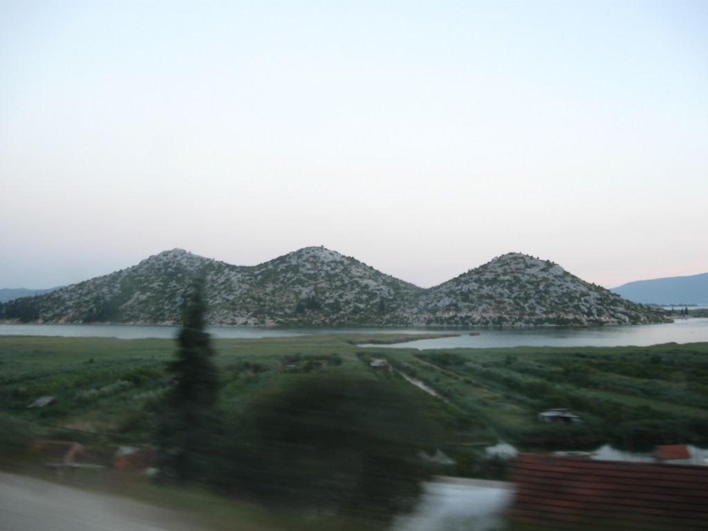
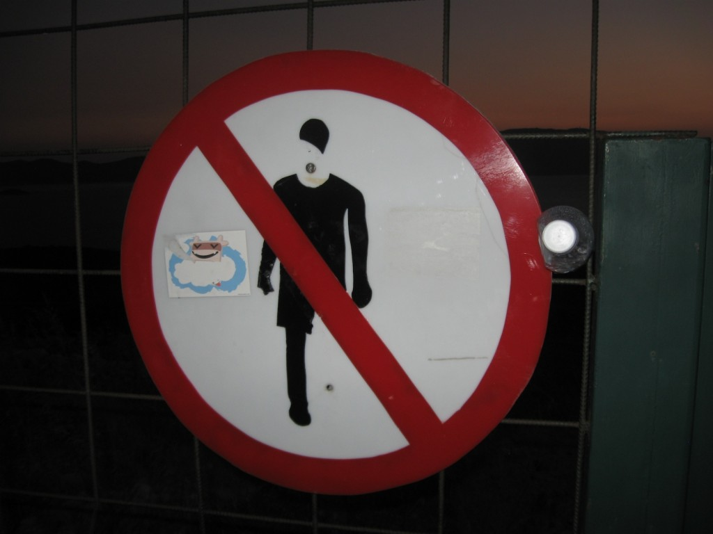

\[caption id="attachment_4955" align="alignnone" width="614" caption="Highway towards Dubrovnik"]\[/caption]

Despite [The Key Debacle](http://swizec.com/blog/a-roadtrip-wherein-swizec-is-not-to-be-trusted-with-\important-objects-without-supervision/swizec/4923 "A roadtrip: wherein Swizec is not to be trusted with \\important objects without supervision") we made it to Dubrovnik last night - only a day late.

And just as well, I was getting rather fed up with the lack of proper internet access in [Omiš](<http://maps.google.com/maps?ll=43.4333333333,16.6833333333&spn=0.1,0.1&q=43.4333333333,16.6833333333 (Omi%C5%A1)&t=h> "Omiš"). Whole town, only two bars with actual wifi access. Alright, there was also a restaurant with wifi. A very expensive restaurant ... and who goes to hang out at a restaurant while they do stuff online anyway, that's just not how it's done.

Despite everyone's advice on how roadtrips are supposed to work and what makes them interesting, we took as much of the highway down to Dubrovnik as we possibly could. The only other road tends to get really stuffed up with traffic in the evenings.

We've heard rumours of six hour traffic jams. Definitely not something you want to see on a drive that's going to take three hours even if everything goes according to plan.

Oh and the night before - this would make it the day before yesterday - we went to see [Split](<http://maps.google.com/maps?ll=43.5,16.4333333333&spn=0.1,0.1&q=43.5,16.4333333333 (Split%2C%20Croatia)&t=h> "Split, Croatia") and its infamous palace thing. Not impressed. Not at all. Split looks like a messy town full of too many people, very insane traffic, poorly marked roads and everything just had that _"We haven't cleaned this since it was built 30 years ago"_ feel.

The palace itself was kind of pretty, but there were too many tourists and most of the views were obscured by the stands selling the same old stuff I've been seeing at every Croatian seaside town since I was 5 years old.

Contrasting this with Dubrovnik, which looks incredibly clean and very posh. Even though it looks to be much smaller than Split, I have a feeling of being very well off as a town. Everything is nice and clean. There's pretty boats everywhere and all the houses look pretty damn good and finished.

And the traffic makes sense! This far south and _the traffic makes sense!_

That's just amazing if you ask me.

Now excuse me while I go to the beach for the first time ... on the 6th day of this seaside trip.

PS: putting up a large and complex tent in the dark is silly business

\[caption id="attachment_4966" align="alignnone" width="461" caption="We skinny dipped in Cetina, and by skinny dipped I mean we put our skinny toes in there"]\[/caption]

\[caption id="attachment_4956" align="alignnone" width="458" caption="Something or another in Split"]\[/caption]

\[caption id="attachment_4957" align="alignnone" width="614" caption="Split employs tourists to polish its floors"]\[/caption]

\[caption id="attachment_4958" align="alignnone" width="571" caption="Pan ... maybe, probably"]\[/caption]

\[caption id="attachment_4960" align="alignnone" width="614" caption="Bike and Goat, the cheap way to travel"]\[/caption]

\[caption id="attachment_4961" align="alignnone" width="614" caption="Island"]\[/caption]

\[caption id="attachment_4962" align="alignnone" width="614" caption="No zombies allowed at this rest stop"]\[/caption]

###### Related articles

- [A roadtrip: First leg](http://swizec.com/blog/a-roadtrip-first-leg/swizec/4906)
- [A roadtrip: wherein Swizec is not to be trusted with \\important objects without supervision](http://swizec.com/blog/a-roadtrip-wherein-swizec-is-not-to-be-trusted-with-\important-objects-without-supervision/swizec/4923)
- [Dubrovnik from Above](http://www.chrystal-clear.com/2012/07/dubrovnik-from-above/)

