

At 9am on Friday, after being awake for twenty-four hours, [@ponywithhiccups](http://twitter.com/ponywithhiccups) and I concluded The Roadtrip by collapsing into bed. This morning (Monday) is the first time I woke up actually feeling rested.

You know it's been an epic adventure when the hangover lasts for four days! And even though we had to cut it short by a few days because ... money stuff ... it was bloody brilliant!

Looking forward to doing something similar again. Soon. But not the drive home ... that was a silly and tiring part. Five cans of Red Bull and one cup of tea and one thirty minute nap tiring.

But let's start at the beginning, the [last roadtrip blogpost](http://swizec.com/blog/a-roadtrip-second-leg/swizec/4953 "A roadtrip: second leg") concluded with us arriving in [Dubrovnik](http://whc.unesco.org/en/list/95 "Old City of Dubrovnik") and setting up a large tent on rocky ground at night.

PS: this post turned out a bit long, scroll through at least for the pictures ;)

## Dubrovnik

[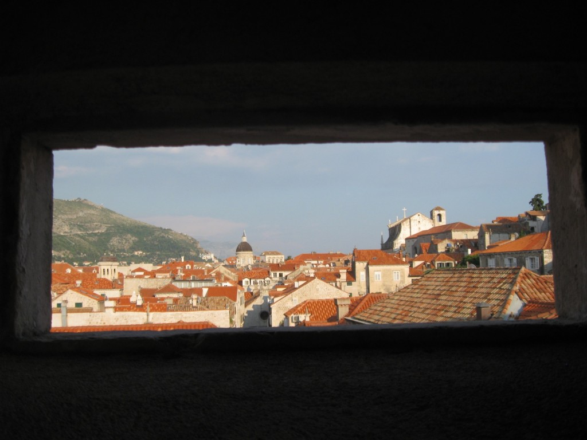](http://swizec.com/blog/wp-content/uploads/2012/08/IMG_1932.jpg)

Dubrovnik - the city that played [King's Landing](http://en.wikipedia.org/wiki/World_of_A_Song_of_Ice_and_Fire "World of A Song of Ice and Fire") in [Game of Thrones](http://www.hbo.com/game-of-thrones "Game of Thrones") last season - is probably the most gorgeous city I've ever visited as a tourist.

The City Wall is just as impressive and mesmerizing as I remember it from the roadtrip with my dad ~12 years ago, but then I've always been a sucker for medieval buildings. Going the whole way around would take too long, but we did get to see a bunch of very pretty views, some old canons, a few jail cells and plenty of the unrelenting sun.

\[caption id="attachment_4985" align="alignright" width="323" caption="Swizec in jail"][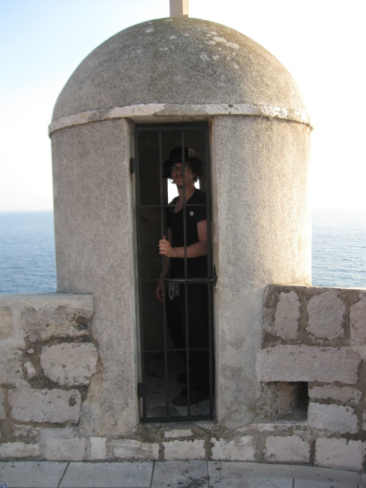](http://swizec.com/blog/wp-content/uploads/2012/08/IMG_1947.jpg)\[/caption]

My favourite were the jail cells - great acoustics in there and a nice sea breeze. Although being locked up in there, three to four storeys above the sea must have been ... quite an experience.

Not even enough room to lie down. Ouch.

Besides the City Wall, Dubrovnik looks a lot like any wealthy old town - everything is white and shiny, no hint of vegetation anywhere, all the streets are cramped and all the buildings are very tall. I heard a couple discussing that it's much prettier/better than [Venice](http://whc.unesco.org/en/list/394 "Venice and its Lagoon").

One great thing about Dubrovnik is that it's actually a very clean and orderly city. There's barely a hint of rundown buildings (common in most of [ex-Yugoslavia](http://en.wikipedia.org/wiki/Former_Yugoslavia "Former Yugoslavia")) and the only ruins you see are actual ruins rather than houses abandoned for the past 20 or 30 years.

The absolute worst, however, is the price of everything. They even have a tax on laziness! Parking ~500 meters from the wall costs about 0.66 euro, parking right next to the walls is just under 4 euro. In the blazing sun.

And I'm sorry but charging 6 euro for an audio guide on top of a 10 euro entrance fee to The Wall is pretty terrible. Not that the entrance fee is too expensive, but charge me 12 euro and give me the guide for free.

\[caption id="attachment_4987" align="alignnone" width="614" caption="Troubadours"][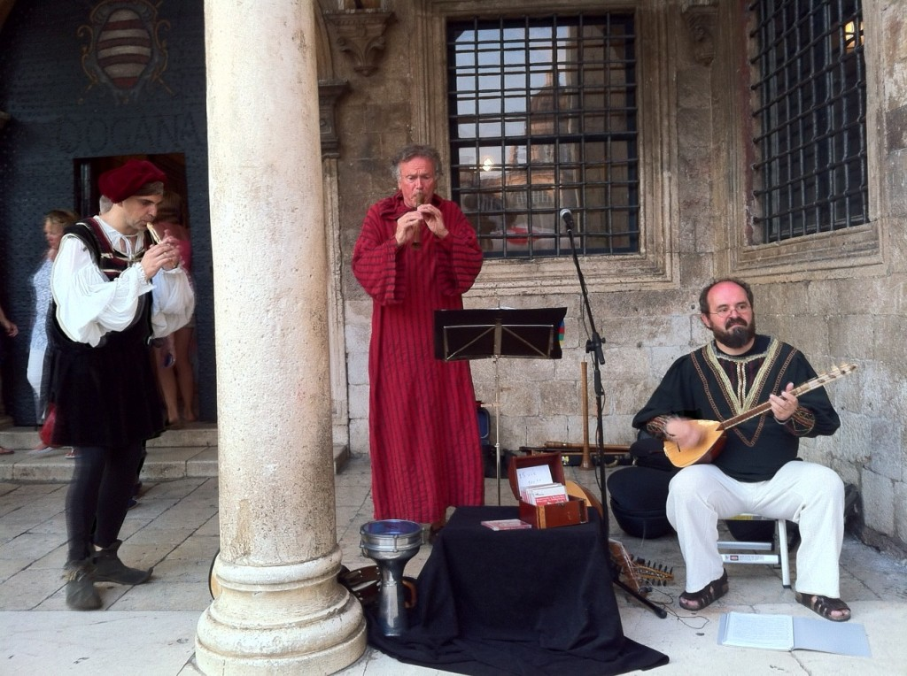](http://swizec.com/blog/wp-content/uploads/2012/08/photo-11.jpeg)\[/caption]

\[caption id="attachment_4988" align="alignnone" width="458" caption="Wall cliff thing"][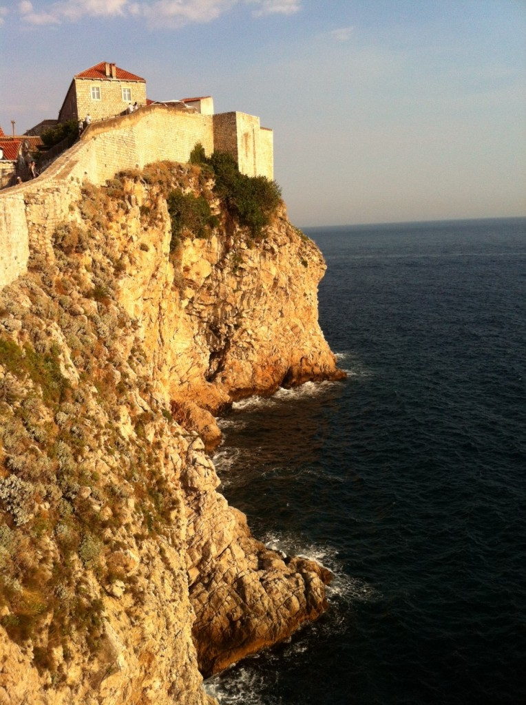](http://swizec.com/blog/wp-content/uploads/2012/08/photo-21.jpeg)\[/caption]

\[caption id="attachment_4989" align="alignnone" width="461" caption="You can totally climb up a church"][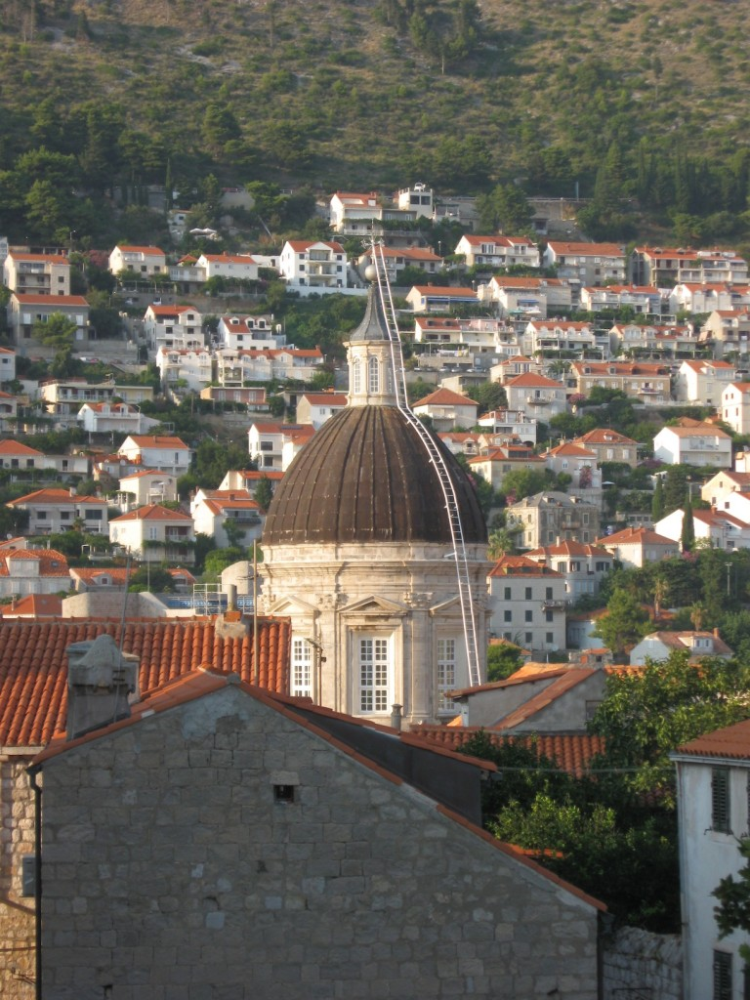](http://swizec.com/blog/wp-content/uploads/2012/08/IMG_1954.jpg)\[/caption]

\[caption id="attachment_4990" align="alignnone" width="614" caption="Want a romantic dinner? Dubrovnik is your man"][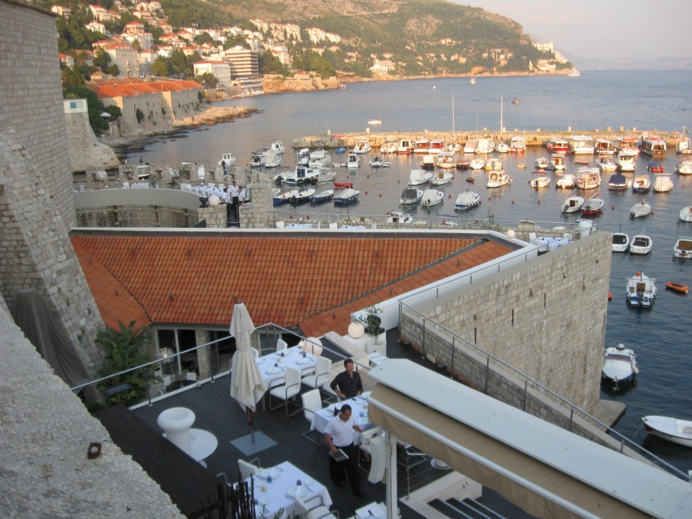](http://swizec.com/blog/wp-content/uploads/2012/08/IMG_1978.jpg)\[/caption]

\[caption id="attachment_5001" align="alignnone" width="614" caption="This cat needs a redditor"][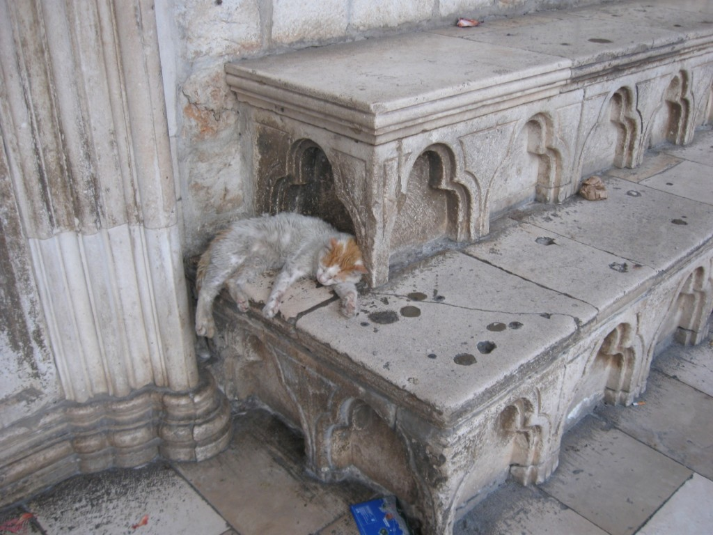](http://swizec.com/blog/wp-content/uploads/2012/08/IMG_2003.jpg)\[/caption]

\[caption id="attachment_4991" align="alignnone" width="458" caption="Sunset on the main street"][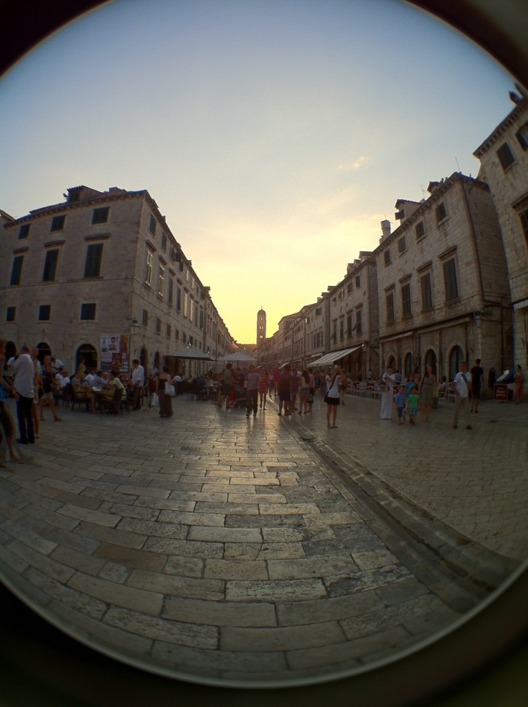](http://swizec.com/blog/wp-content/uploads/2012/08/photo2.jpeg)\[/caption]

## 

## Mostar

\[caption id="" align="alignright" width="428" caption="Čevapi in Mostar"]\[/caption]

Conversely Mostar was a surprisingly cheap experience. Eating famous local cuisine (čevapi) right next to their most popular tourist destination was cheaper than a meal in Ljubljana.

Everyone knows you don't visit Bosnia without eating čevapi.

I'd say they were delicious and a whole lot different and better and more realer than what I'm used to eating at home, but I inhaled them so quickly I don't even remember the taste beyond _"It was very tasty."_

The old town itself has a much poorer feel to it than Dubrovnik did. The streets weren't made of marble, there was no hint of white anywhere and most of the buildings looked to be made of plain rocks. Actually the streets looked like river stones thrown into some cement.

Even though the Old Bridge is a reconstruction of the 16th century ottoman bridge and has only been open for 8 years now, it still looks pretty good. Most of the road-surface looks very authentic. It's a real shame it was blown up after standing for some 470 years. Strategic value my arse.

I mean, the bridge is about two meters wide and the road-surface is more a ladder than it is a road. Yep, at foot-length intervals there's a 5cm wide stone step that protrudes about 5cm from the actual surface. Makes it very easy to walk up and down the incredibly slick stone.

Oh and people dive from the bridge. Crazy bastards. With a loud crash one of them even surprised us right when we were nomming on the čevapi.

To my great disappointment, we completely forgot to go look for [Bruce Lee's statue](http://en.wikipedia.org/wiki/Mostar_Bruce_Lee_statue). Although according to Wikipedia it's been removed anyway ... weird.

\[caption id="attachment_4979" align="alignnone" width="614" caption="Old Town Mostar"][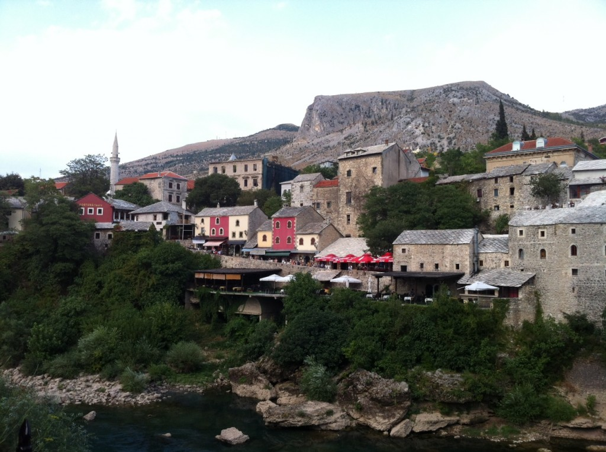](http://swizec.com/blog/wp-content/uploads/2012/08/photo1.jpeg)\[/caption]

\[caption id="attachment_4980" align="alignnone" width="614" caption="A clearer view of the bridge"][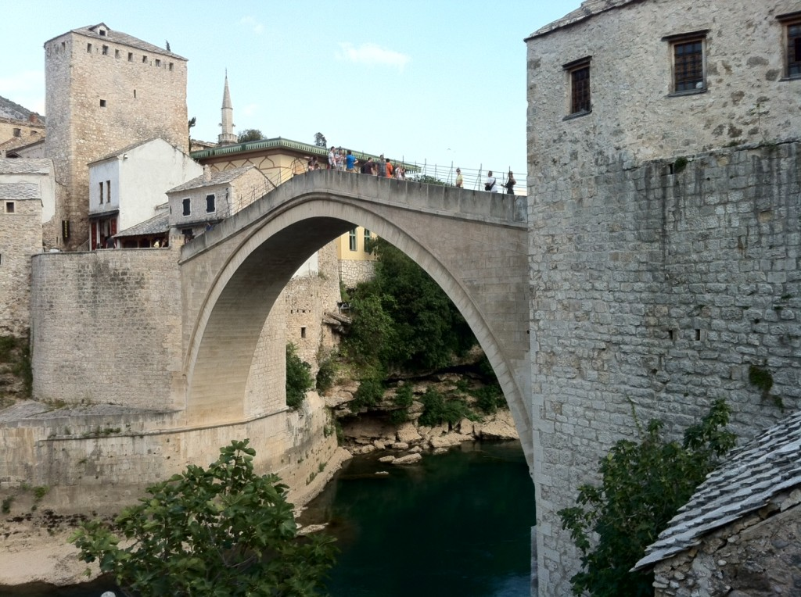](http://swizec.com/blog/wp-content/uploads/2012/08/photo-1.jpeg)\[/caption]

\[caption id="attachment_4981" align="alignnone" width="614" caption="View from the bridge"][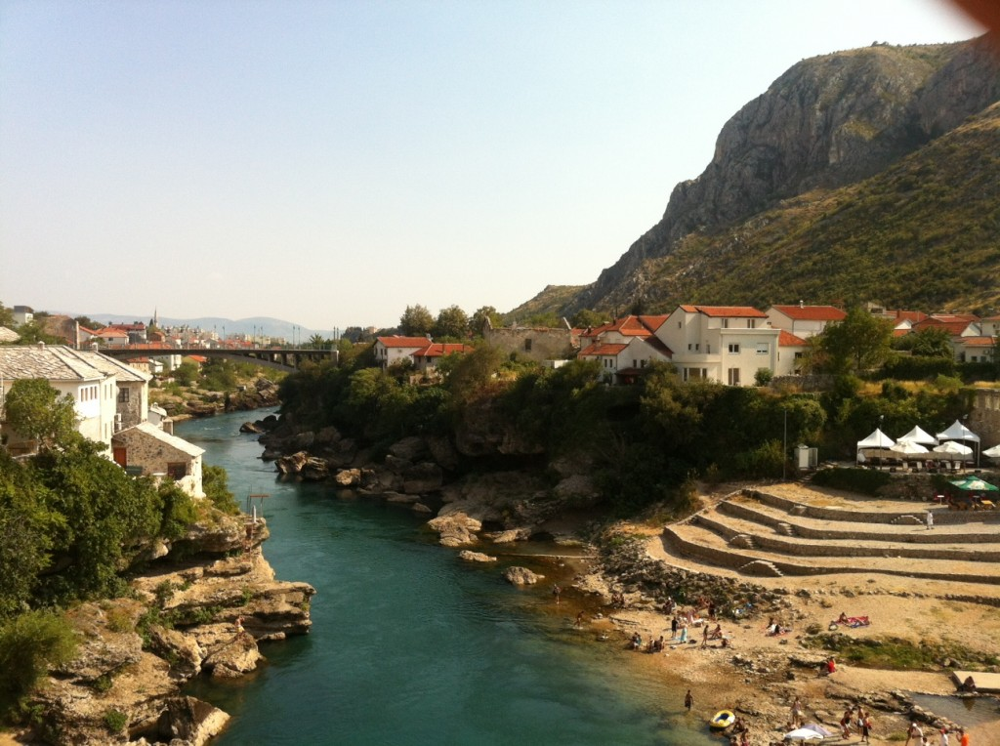](http://swizec.com/blog/wp-content/uploads/2012/08/photo-2.jpeg)\[/caption]

\[caption id="attachment_4998" align="alignnone" width="614" caption="Mostar is full of rockets"][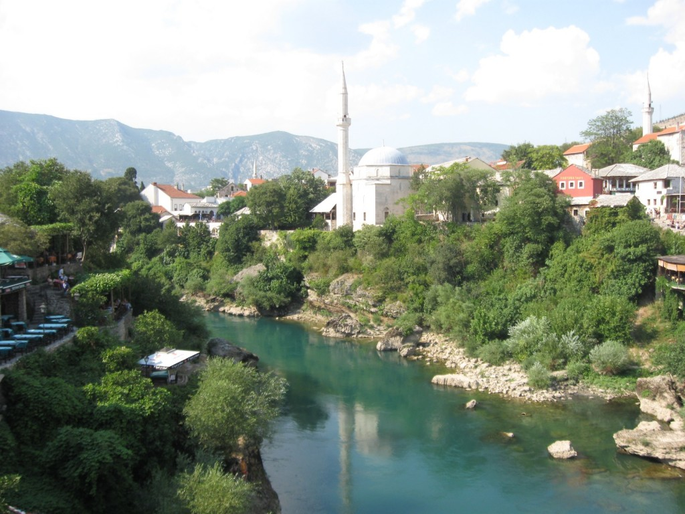](http://swizec.com/blog/wp-content/uploads/2012/08/IMG_2050.jpg)\[/caption]

## 

## Looooong drive home

[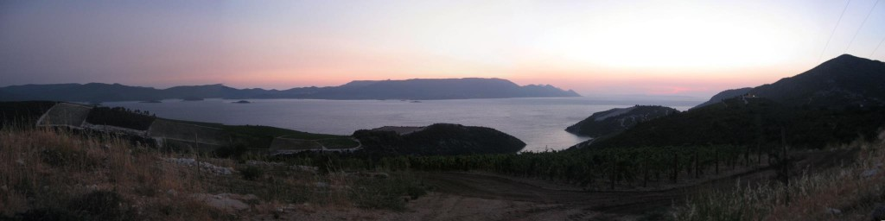](http://swizec.com/blog/wp-content/uploads/2012/08/202505_10150999892841267_1541795793_o.jpeg)

We had originally planned to go home from Dubrovnik in two trips. Go to Mostar and then Pag, sleep over for a night or two and then head back home to Ljubljana.

Pag never happened, not because we'd run out of money per se, but because there wouldn't be enough buffer left for emergencies. And you don't want to be trapped in a foreign country - even Croatia - without any buffer money.

After a three hour drive we arrived at Mostar just in time to avoid a heat stroke or two. By now all of our water was warm enough to shower with and we were drenched in ... ourselves. But that's what you get for traveling at high afternoon on sunny roads without air conditioning when it's anywhere between 34 and 36 degrees in the shade.

Just leave sooner right? We did (at 8am). Packing up the tent, making sure both phones are charged, having breakfast and writing all the postcards makes 1pm arrive mighty quick.

\[caption id="attachment_5003" align="alignright" width="430" caption="A church near Mostar"][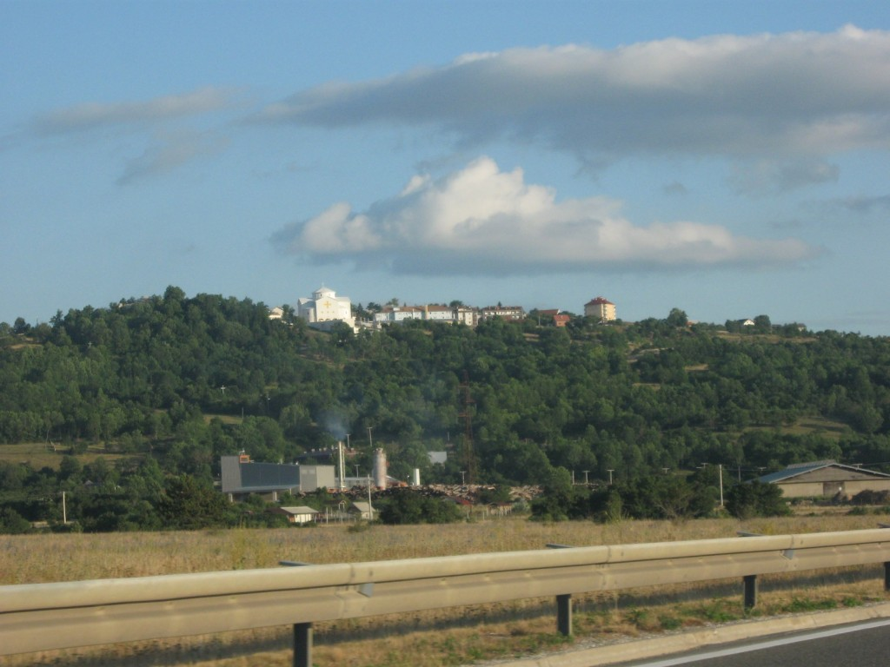](http://swizec.com/blog/wp-content/uploads/2012/08/IMG_1650.jpg)\[/caption]

After Mostar the weather cooled down a bit and we were okay to drive for the seven more hours it would take us to get home by the scenic seaside route ([Jadranska Magistrala](http://en.wikipedia.org/wiki/Adriatic_Highway)).

The vagabond shower in Šibenik was easily my favourite part of the whole roadtrip. Jumping into the sea after ~7 hours in the car and 3 hours in Mostar was amazing in itself, but doing it on a beach with that amazing a view? Priceless.

Can't even describe how good it felt to be clean again.

After that the ride back to Ljubljana was pretty uneventful. At one point I was forced to take a short road-side nap because I almost couldn't see the road anymore my eyes were so tiny. Even almost kind of started swerving a bit. Not enough for @ponywithhiccups to notice, but definitely enough to know the car wasn't always doing exactly what I wanted it to.

If you ever get the chance to drive along a curvy empty road at night (alone, or the only one awake) - go for it. It's one of the most meditative and calming experiences I have ever had. No wonder [Thompson](http://en.wikipedia.org/wiki/Hunter_Thompson) used to race around the mountains on his bike when he had to think.

But I wouldn't recommend driving for ten hours while being awake for twenty-four after a five-ish hour night. It's just as safe as it sounds and it's taken me almost two days to recover enough to write about. To even think about.

But I have to say, this roadtrip will stay in memory longer than most things do.

And for all the right reasons.

\[caption id="attachment_4999" align="alignnone" width="614" caption="Heading out of Dubrovnik"][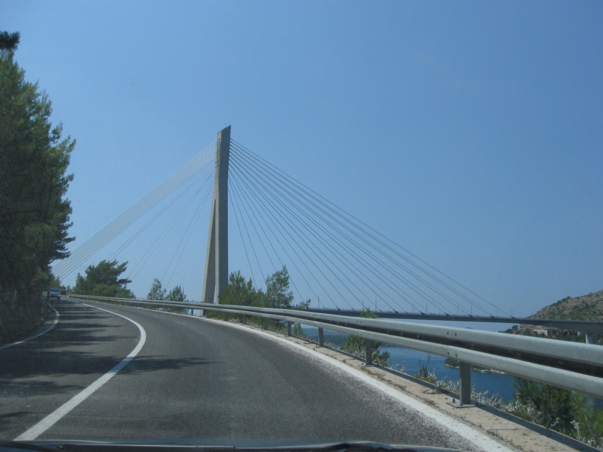](http://swizec.com/blog/wp-content/uploads/2012/08/IMG_2028.jpg)\[/caption]

\[caption id="attachment_4978" align="alignnone" width="614" caption="View of Šibenik from the beach"][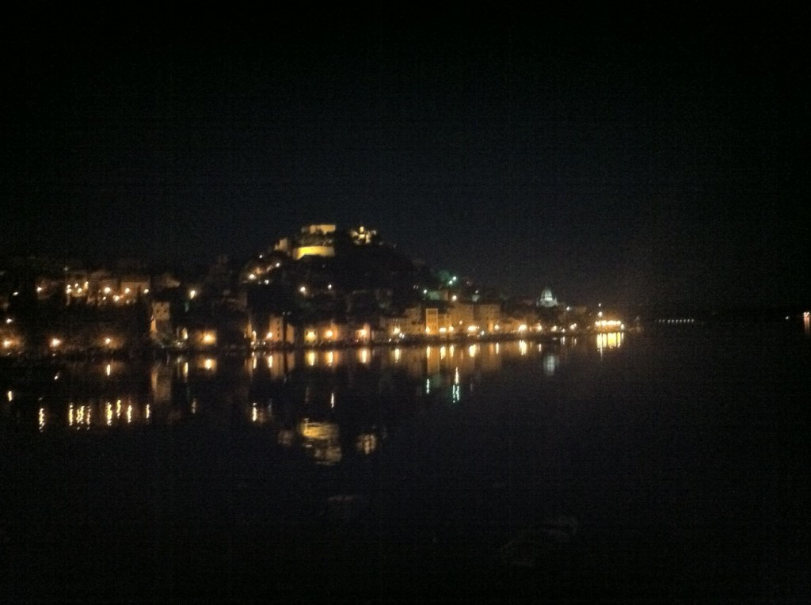](http://swizec.com/blog/wp-content/uploads/2012/08/photo.jpeg)\[/caption]

\[caption id="attachment_5004" align="alignnone" width="614" caption="A road"][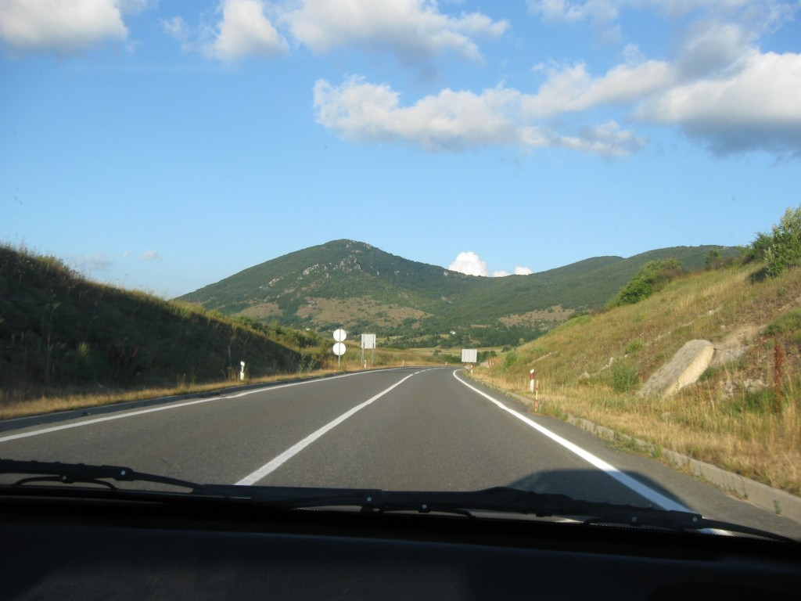](http://swizec.com/blog/wp-content/uploads/2012/08/IMG_1652.jpg)\[/caption]

\[caption id="attachment_5007" align="alignnone" width="614" caption="Landscape so pretty it looks rendered"][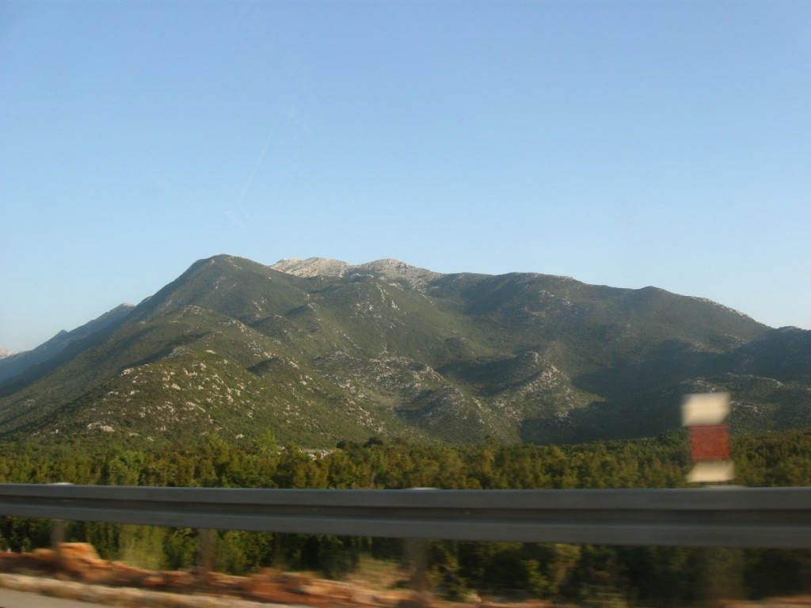](http://swizec.com/blog/wp-content/uploads/2012/08/IMG_1813.jpg)\[/caption]

\[caption id="attachment_5008" align="alignnone" width="614" caption="Looking closely enough reveals a village on that hill"][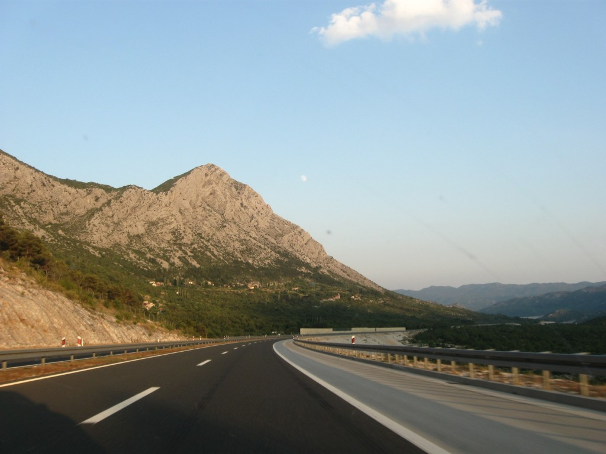](http://swizec.com/blog/wp-content/uploads/2012/08/IMG_1821.jpg)\[/caption]

\[caption id="attachment_5009" align="alignnone" width="614" caption="This is interesting, but I don't know why"][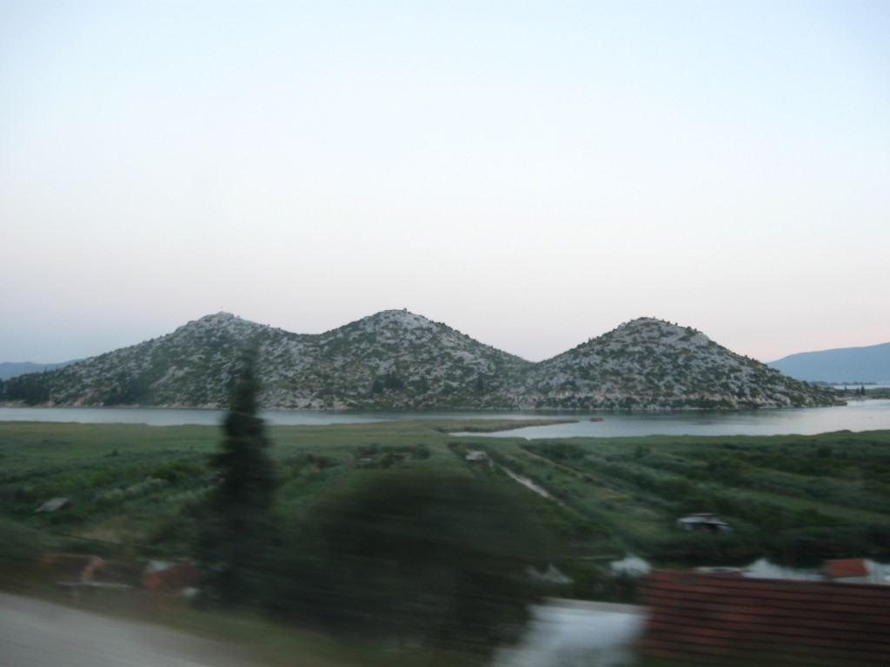](http://swizec.com/blog/wp-content/uploads/2012/08/IMG_1854.jpg)\[/caption]

###### Related articles

- [A roadtrip: second leg](http://swizec.com/blog/a-roadtrip-second-leg/swizec/4953)
- [A roadtrip: wherein Swizec is not to be trusted with \\important objects without supervision](http://swizec.com/blog/a-roadtrip-wherein-swizec-is-not-to-be-trusted-with-\important-objects-without-supervision/swizec/4923)
- [A roadtrip: First leg](http://swizec.com/blog/a-roadtrip-first-leg/swizec/4906)
- [So many reasons to love Dubrovnik](http://sebasilver.wordpress.com/2012/06/13/so-many-reasons-to-love-dubrovnik/)
- [Competitors take plunge off bridge in Mostar](http://photoblog.nbcnews.com/_news/2012/07/30/13026636-competitors-take-plunge-off-bridge-in-mostar)

