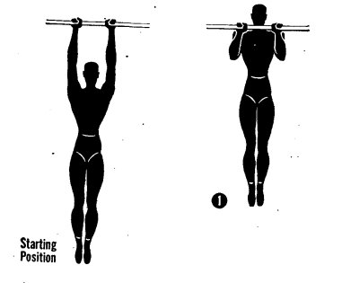
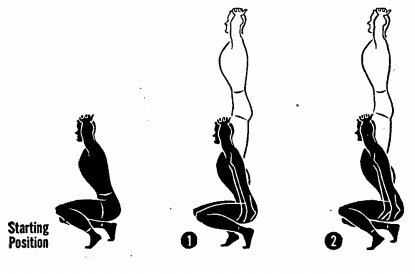
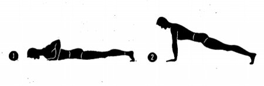
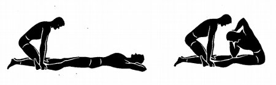

This morning I took the [Art of Manliness](http://artofmanliness.com "Art of Manliness")' [World War 2 Fitness Test](http://artofmanliness.com/2011/09/12/are-you-as-fit-as-a-world-war-ii-gi/). The US military started using this test in 1942 to weed out soldiers who weren't fit enough for the rigors of combat. \[caption id="" align="alignright" width="305" caption="Pullups"]\[/caption] \[caption id="" align="alignright" width="332" caption="Squat jumps"]\[/caption] \[caption id="" align="alignright" width="360" caption="Pushups"]\[/caption] \[caption id="" align="alignright" width="360" caption="Situps"]\[/caption] The test is designed around functional strength rather than looking pretty and puts a big emphasis on good form. There are five exercises:

1. **Pullups** - front grip, full extension, chin above the bar
2. **Squat jumps** - leaping into the air from a squat, hands clasped on your head
3. **Pushups** - palms forward, elbows backward, full extension down to chests touching a palm (1.5cm above ground)
4. **Situps** - extended knees, hands clasped behind head, right elbow to left knee and vice-versa
5. **Cardio** - three different kinds depending on test conditions, all based on starting and stopping

## My attempt

Those situps might be a bit outdated these days (something about the health of spines), but doing them for one test won't kill ya ;) After doing strength exercises every morning for two years and a solid year of boxing practice two to three times a week ... I scored abysmally low with an average score of just **40.4** - which is to say juuuuust under the line where _poor_ turns into _fair_.

- 7 pullups
- 20 squat jumps
- 33 pushups
- 43 situps
- 24 squat thrusts

Going to use my cough as an excuse and say it's really difficult to do this stuff when you're also coughing and wheezing, but the reality is that I'm just not good enough. Yet. I knew I wasn't going to do well in the squats - I can do half squats forever because of longboarding, but deep squats have always been a problem. Just don't have any leg strength at the bottom of the motion. Never have. The biggest disappointment were the pushups, however. I do _150_ of those every morning. On the test I only managed 28 ... and on a second try **33**. Horrible! I probably focus too much on reps rather than good form in my morning routine. This should change. Plus it was a real bummer that as soon as you stop a bit to breathe, your try is over. It really is about continuous motion and _that's hard_. Oh and the situps aren't as bad as they seem at first. I managed to do 43, but I was coughing and wheezing through the last 10 of those. According to the [score sheet](http://artofmanliness.com/wwii-fitness-test-scoresheet/) this is on the bottom end of _fair_, but going into this test I didn't think I'd do more than ten. Despite the somewhat terrible result, I have to say I really like this test. Think I'm going to include it into my weekly routine, plot it on a graph somewhere and use it to track progress. Eventually I might even reach a perfect score ... maybe. Probably not. At least I might be able to break the plateau I've been on for the last six months or so! That'd be awesome. 

###### Related articles

- [Go Green Get Fit Week Seven](http://naturemoms.com/blog/2012/07/30/go-green-get-fit-week-seven/)
- [Dear Mark: Training Edition](http://www.marksdailyapple.com/dear-mark-training-edition/)
- [Are Women in CrossFit Too Bulky?](http://www.washingtonian.com/blogs/wellbeing/fitness/are-women-in-crossfit-too-bulky.php)

