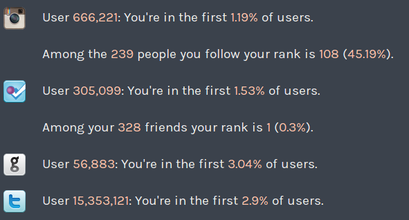

 How does it feel to be the first guy at the party? It's kind of lame. There's nobody to talk to, lonely in the corner you sit, sipping on your drink and look with longing eyes at everyone who comes in. They know. You know they know. _You_ were there first, you're that loser who's got nothing better to do. Nowhere else to be. The guy who's life is so empty and lonely that you would _rush_ to a party and be there first. Nobody wants to be that guy. Unless we're talking about tech products and social networks and cool web-point-gazillion websites and spanking new technology! Suddenly, _everyone_ wants to be an early adopter. They want to be that guy who discovered the service first. That guy who was the first in line for the beta. That guy who was first to predict that **this thing is going to be huge!** It feels awesome, nay, magnificent to feel like you were _that guy_. That guy who convinced all of their friends to start using this new fangled service that until yesterday lived only in the head of some dreamer. \[caption id="attachment_5070" align="alignnone" width="591" caption="I am an early adopter - Idego.co"]\[/caption] There is an immense sense of pride in that. When the service _does_ succeed it feels like you were part of the success. You, with your measly network of two or three thousand twitter followers, with your blog that even your grandma reads. You were the key driver of success of this new idea you believed in as the first user. No, you don't get any equity for that. No, you don't even get any money. You get a bit of street cred. Maybe. What you do certainly get is a crappy service, where you are alone, sitting in a corner, sipping your drink, and positively gleaming in the pride that you were there first. If nobody else comes to the party, you will never speak of this again. You always knew that party was going to suck anyway. But if it works, you were _the_guy who made the party work. Not the 500,000 other guys who were also there first. Oh no, not them. You.

## app.net

And that's exactly what [app.net](http://app.net) cashed in on. They gave everyone the opportunity to _buy_ an account. To buy a username and be granted forever more the rights granted by the title of _Early Adopter_ - passed on by heritage on the mother's side. Forever known as those guys who were first to the party, who _knew_ the service was going to be big. They were so confident in fact that they even put their money where their mouth is. And that's amazing. Hat's off to [Dalton](http://twitter.com/daltonc) and his team. They managed to put a price on that most intangible of feelings - the pride of being an early adopter. The enthusiasm of being a part of the story. I almost signed up as well. The moment they announced having reached the funding goal; I went through all the steps for making an account. I cover myself in shame for not believing in this idea sooner. But when it came to _"Hey, give us $50 per year"_. I said to myself, fuck that. You know what, this great feeling isn't worth it. I'd rather go buy some drugs instead. It amounts to the same - pay for a service that makes you feel great, maybe, or pay for some chemicals that will make you feel great, definitely. Are all those people getting anything else for their money? No. So here's an idea for the next app.net, and there _will_ be a next app.net, people love taking money from suckersusers. Sell an account for $100 a year (or whatever), but the first 1000 users also get 0.001% equity. They're pretty much founders/investors anyway, why not reward them as such?

###### Related articles

- [What I see in App.net](http://phuu.net/2012/08/12/what-i-see-in-app-dot-net.html)
- [Are You An Early Adopter? Find Out How Fast You Signed Up To Twitter, Instagram And More](http://www.cultofmac.com/183092/are-you-an-early-adopter-find-out-how-fast-you-signed-up-to-twitter-instagram-and-more/)
- [So you think you're an early adopter? Find out just how "early" with this site](http://thenextweb.com/shareables/2012/08/06/so-you-think-youre-an-early-adopter-find-out-just-how-early-with-this-site/)
- [More than 12,000 backers support ad-free paid-for social platform App.net](http://www.siliconrepublic.com/new-media/item/28764-more-than-12-000-backers-su)
- [App.net is Not the Answer, and Why I Gave Them Money](http://www.iamdann.com/2012/08/13/app-net-is-not-the-answer-and-why-i-gave-them-money)

