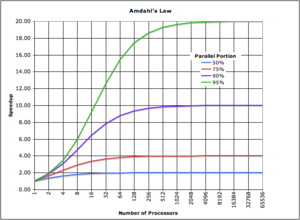
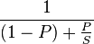

Perhaps the most important lesson I've learned while studying computer science is that of [Amdahl's law](http://en.wikipedia.org/wiki/Amdahl%27s_law "Amdahl's law"). \[caption id="" align="alignright" width="300" caption="Graph Illustrating Amdahl's Law (Photo credit: Wikipedia)"]\[/caption]  Amdahl's law is generally used to predict the maximum speedup by improving a single component of a system (say, a function or a database). But the implications are simple: _Improve the thing that will **actually** help._ As programmers, however, we would rather contemplate just what is [the fastest way to concatenate a string](http://www.codinghorror.com/blog/2009/01/the-sad-tragedy-of-micro-optimization-theater.html). Or whether [PHP](http://www.php.net "PHP") is much faster than Ruby. And just how much more traffic you can handle with 5 or 10 fcgi workers. And so on. The internet is riddled with these questions. And let's not forget the age old debate of speed improvements by using raw [SQL](http://www.iso.org/iso/catalogue_detail.htm?csnumber=45498 "SQL") instead of an [ORM](http://en.wikipedia.org/wiki/Object-relational_mapping "Object-relational mapping"). Once upon a time I even wrote a web framework where I made sure to _always use the fastest pattern of doing X in PHP_. I knew databases were slow, so I did a lot of the work regarding JOINs and such in PHP. Yeah.

## Optimizing where it matters

The other day I finally assembled all the bits and pieces for an [evolutionary algorithm](http://en.wikipedia.org/wiki/Evolutionary_algorithm "Evolutionary algorithm") in [Haskell](http://haskell.org "Haskell (programming language)"). I'm trying to print _[Hello World](http://en.wikipedia.org/wiki/Hello_world_program "Hello world program")_ by performing random changes on a population of strings - eventually I want to create an extensible framework for evolutionary algorithms that will let me [write poetry programmatically](http://swizec.github.com/Le-Thesis/). It took **27 seconds** to go 5 epochs. Just five generations.

      INIT    time    0.00s  (  0.00s elapsed)
      MUT     time   26.47s  ( 27.00s elapsed)
      GC      time    0.62s  (  0.62s elapsed)
      EXIT    time    0.00s  (  0.00s elapsed)
      Total   time   27.08s  ( 27.62s elapsed)

      %GC     time       2.3%  (2.2% elapsed)

      Productivity  97.7% of total user, 95.8% of total elapsed

Okay, it's definitely not a problem with memory access. 97.7% of the time is spent in computation, this is good, but slightly worrying. Let's do some profiling!

    COST CENTRE   MODULE           %time %alloc

    levenshtein   Evaluators.Basic  91.5  100.0
    levenshtein.d Evaluators.Basic   8.5    0.0

The [levenshtein distance function I implemented](http://swizec.com/blog/levenshtein-distance-in-haskell/swizec/4801 "Levenshtein distance in Haskell") costs 100% of [computation time](http://en.wikipedia.org/wiki/Time_complexity "Time complexity")! After replacing my function with [the implementation suggested by Reddit](http://www.reddit.com/r/programming/comments/w4gs6/levenshtein_distance_in_haskell/c5a6jjz) life instantly became much easier. It now takes just 0.03 seconds to compute 5 epochs of the algorithm. **27 seconds -> 0.03 seconds by changing a single function.** The problem I have now is anything larger than ~25 epochs makes my computer decide something funny is going and kill the program, which says I'm doing something terrible with memory. Then again, there _are_ 480195 population members at the 25th epoch ... I probably don't need that many. By the way, it's still not a memory problem per se (for 20 epochs):

      Total   time   10.72s  ( 10.80s elapsed)

      %GC     time      23.4%  (23.3% elapsed)

      Alloc rate    2,736,341,212 bytes per MUT second

      Productivity  76.6% of total user, 76.0% of total elapsed

    -----

    COST CENTRE    MODULE           %time %alloc

    lev'''.lev     Evaluators.Basic  61.5   58.8
    lev'''.levMemo Evaluators.Basic  17.3   31.4
    breedTwo       Operators.Basic    2.8    2.4
    breedTwo.(...) Operators.Basic    2.0    0.6
    breedTwo.(...) Operators.Basic    1.3    0.6
    breedTwo.(...) Operators.Basic    1.3    0.6
    select.\       Selectors.Basic    1.1    0.3
    lev'''.xa      Evaluators.Basic   1.1    0.6

###### Related articles

-   [Levenshtein distance in Haskell](http://swizec.com/blog/levenshtein-distance-in-haskell/swizec/4801)
-   [Jazoon 2012: Divide&Conquer: Efficient Java for Multicore World](http://blog.pdark.de/2012/06/29/jazoon-2012-divideconquer-efficient-java-for-multicore-world/)
-   [An elegant way to randomly change every list member in Haskell](http://swizec.com/blog/an-elegant-way-to-randomly-change-every-list-member-in-haskell/swizec/5060)
-   [How Vertical Partitioning and Deep Joins Kill Parallelism](http://blog.kejser.org/2012/07/16/how-vertical-partitioning-and-deep-joins-kill-parallelism/)
-   [Let them talk](http://plumbr.eu/blog/let-them-talk)
-   [10 Application Performance Tuning Tips](http://blog.codecentric.de/en/2012/07/10-application-performance-tuning-tips/)

