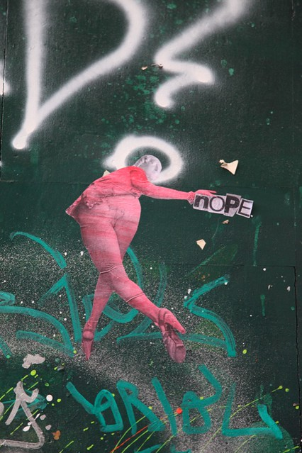

I can't pay for [Spotify](http://www.spotify.com/ "Spotify"). I am without music until the end of the month. I need music to work.

Because of reasons ... and my bank being silly. I _have_ money.

The unfortunate sequence of events starts with [a roadtrip](http://swizec.com/blog/a-roadtrip-first-leg/swizec/4906 "A roadtrip: First leg"). For whatever reason I decided to use my [VISA card](http://www.corporate.visa.com "Visa Inc.") to pay for petrol on the whole trip - spending roughly 150 euro. No biggie.

Some time later a friend asks me to buy him some tasty tasty Spotify gift cards because [I also have a UK credit card](http://swizec.com/blog/spending-money-online-is-crazy-hard/swizec/2479 "Spending money online is crazy hard!") via moneybookers. It's prepaid and I can only upload funds from VISA, not directly from my bank account.

Another 40 euro is spent.

The friend immediately refunds this to my [PayPal](http://paypal.com "PayPal") account.

A day later _my_ Spotify craps out because _"There have been problems with your credit card"_ - I'm guessing there wasn't enough balance on the prepaid UK card.

But I can't upload funds anymore because now my VISA has only got 1.5 euro of credit left.

## Banks are silly

To recap:

- bank account balance - _plenty enough_
- UK credit card balance - _juuust not enough_
- VISA credit - _1.5€_
- PayPal balance - _40€_
- Amount I need to pay - _12.7€_

If you've been keeping score, my VISA has only got 200 euro worth of credit per month. I cannot spend more than that. This was fine when I got the card at 18, but it's getting rather restrictive and I keep bumping into the limit almost every month.

\[caption id="" align="alignright" width="341" caption="Nope, by the euskadi 11"]\[/caption]

Clicky clicky on the e-banking thing and an _"I beg you to raise my credit to a **measely 400 euro**"_was sent to the bank. A few days later I get a call: _"I'm sorry mister Swizec, but you simply don't earn enough. I can see here that you've had an average monthly income of 900 euro this year, but it doesn't say_paycheck_so it doesn't count. Sorry about that."_

Ok sure, 900 euro is nothing to brag about, but it's fairly decent when most of your time is wasted on finishing up the last year of university. Especially considering two or three months out of that were practically without income because I was focusing on exams.

To add insult to injury, I tried transferring the money from PayPal to VISA and while it does show up as transferred it doesn't count towards my credit for the month because I sent it later than the 15th. It will show up next month when my _spent money_ will show as **-240** (yeah, a double negative).

## What I want in a bank

1. Freelance income counts as income
2. When I send money around, it should be instantly _useful_ not just visible (regardles of day-of-month)
3. I never want to have to set foot in the bank physically
4. No silly overdraft charges or anything (I don't have those now \\o/)
5. Gives me a debit card useful for paying
6. Gives me a credit card with decent amount of credit
7. Gives me a savings account of some sort
8. Effectivity of e-banking isn't limited to physical working hours

If you know a bank fitting this criteria, let me know!

I don't even care where in the world it is, I just want a new bank. (and for those wondering, I'm using Nova Ljubljanska Banka right now. Stick that in your SEO, bank)

###### Related articles

- [PayPal drops into McDonalds, begs meat-guzzlers to give it a bonk](http://go.theregister.com/feed/www.theregister.co.uk/2012/08/21/mcdonalds_paypal/)
- [Visa Online Bill Payment](http://www.answers.com/topic/corpus-answers-guides-visa-online-bill-payment)
- [CHASE Visa](http://www.cardhub.com/credit-cards/chase-visa/)
- [Differences Between Visa and Solo](http://www.differencebetween.net/business/finance-business-2/differences-between-visa-and-solo/)
- [Secure my money. But let me spend it too.](http://blog.julieng.me/post/29620353212/secure-my-money-but-let-me-spend-it-too)

