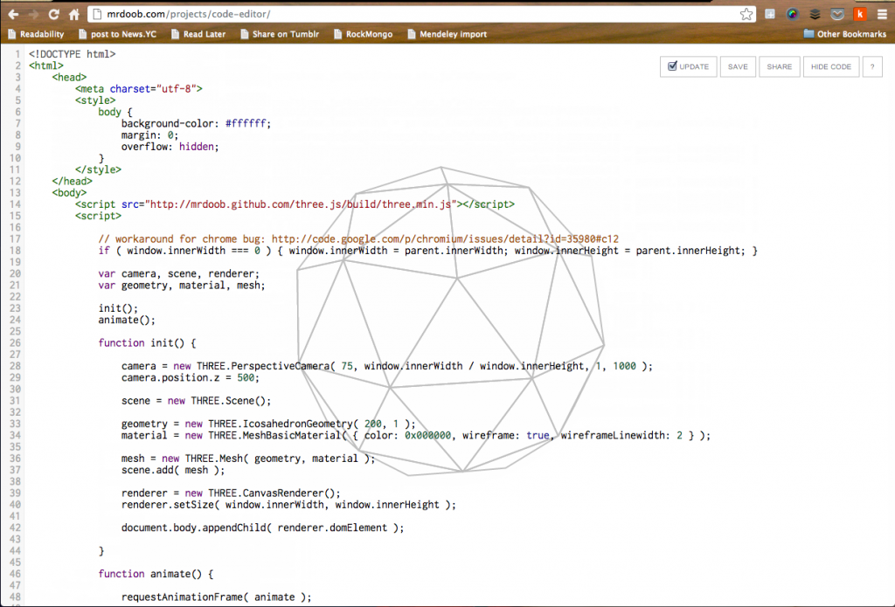

Last night I went to the first ever github drinkup in Ljubljana. Very fun, but I was left with a lot of thinking time today. After a lot of wandering my thoughts ended up on the _[World Wide Wasteland](http://www.zemanta.com/blog/world-wide-wasteland/)_ article I wrote for Zemanta a few weeks ago. A realization hit me - I suck at linking! Sure I try my best to cite sources, but there isn't nearly enough walking up to people and pointing them in an interesting direction. So I'm going to start posting one cool thing every week. That said, here's a cool thing I discovered some time ago: <http://mrdoob.com/projects/code-editor/> \[caption id="attachment_5301" align="alignnone" width="645" caption="Mr Doob's code editor"]\[/caption] Essentially, it's a code editor complete with syntax highlighting, but it also executes everything you type up and renders it right on top of the editor itself. This allows you to play around with the parameters for those three.js functions and immediately see what happens to the 3D model. Yeah, I know other live editor thingies exist for javascript+html, but so far this is the only one that doesn't eat up all my CPU and become useless after more than 20 lines of code. And I love that in an editor.

###### Related articles

-   [Copying Mr Doob's Code Editor for Fun and Phyics](http://japhr.blogspot.com/2012/09/copying-mr-doobs-code-editor-for-fun.html)
-   [Custom JSBin Code Editor Settings](http://www.elijahmanor.com/2012/09/custom-jsbin-code-editor-settings.html)
-   [Converting from Box2d to Physijs](http://japhr.blogspot.com/2012/09/converting-from-box2d-to-physijs.html)
-   [Turning video game sprites into 3D objects](http://hackaday.com/2012/09/19/turning-video-game-sprites-into-3d-objects/)
-   [Three.js Code Clean-Up](http://japhr.blogspot.com/2012/09/threejs-code-clean-up.html)

