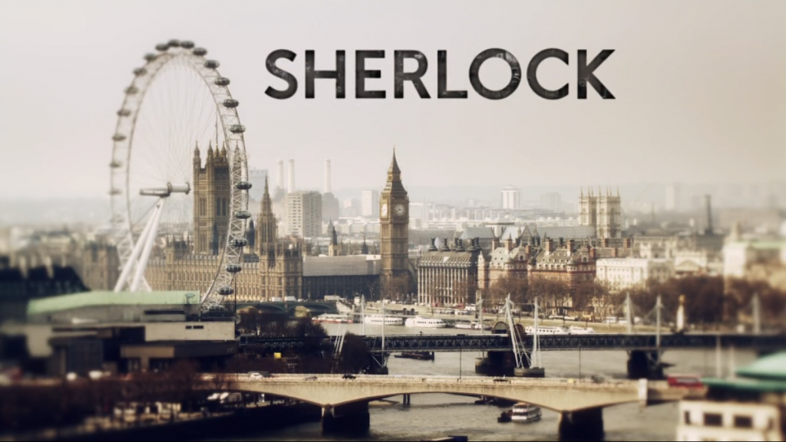
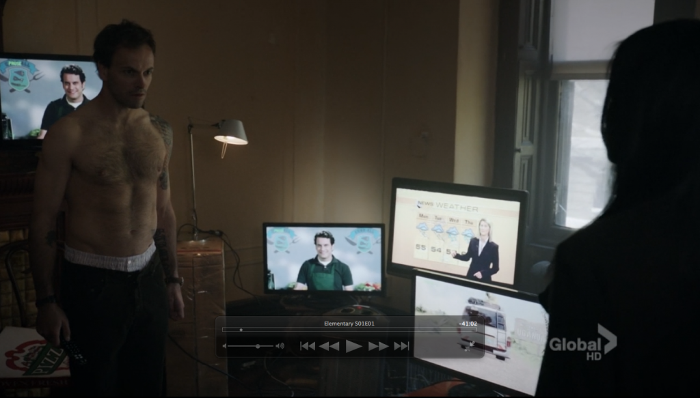

Being the paragon of originality, american television creators are doing yet another remake of an amazing [BBC](http://www.bbc.co.uk/ "BBC") series. This time they're taking a shot at [Sherlock](http://en.wikipedia.org/wiki/Sherlock_%28TV_series%29 "Sherlock (TV series)").

Unlike their usual efforts, however, they didn't mess this one up. I watched the season premier of Elementary this morning and I have to say it's good. Very good!

While the wikipedia page assures me this is not in fact a remake, but a completely independent production, there are still a striking number of similarities between the two. Possibly making a modernization of [Sherlock Holmes](http://en.wikipedia.org/wiki/Sherlock_Holmes "Sherlock Holmes") into the current time, simply looks very similar, it's nontheless obvious CBS was influenced by BBC's Sherlock.

That paragraph didn't make a lot of sense. I'm saying they're similar. Very similar.

For instance, look at the title screen - [establishing shot](http://en.wikipedia.org/wiki/Establishing_shot "Establishing shot") of the city and title of show. London in the morning, New York City in the evening.

Coincidentally, BBC's show is about a young Sherlock in his prime. [CBS's](http://www.cbs.com/ "CBS") Elementary is about Sherlock Holmes after a career as a Scotland Yard consultant who fled to Brooklyn to treat some manner of drug addiction.

Interesting.

Both shows feature great production values, awesome music, three episodes per season and terrific acting. Can I call two shows similar because they're both high quality?

Is that a thing? Have we really gone so far that "being well made" is a recognizable trait of a television series? That's sad ...

That said, Elementary features a lovely twist on the Sherlock Holmes universe - Watson is a woman. Played by Lucy Liu of all people. Marvelous! Don't worry, it's still going to be a bromance, except one of the bros is a girl.

Can't wait to see more.

\[caption id="attachment_5358" align="alignnone" width="614" caption="CBS's Sherlock Holmes"]\[/caption]

###### Related articles

- [How has Elementary - The American Sherlock - gone down with critics?](http://www.contactmusic.com/news/how-has-elementary-the-american-sherlock-gone-down-with-critics_3302739)
- [A New Twist On An Old Story of Sherlock Holmes-Elementary](http://brouhaha-access.com/2012/09/26/a-new-twist-on-an-old-story-of-sherlock-holmes-elementary/)
- [Sherlock Gets US Makeover With CBS Elementary](http://blog.films.ie/2012/08/sherlock-gets-us-makeover-with-cbs-elementary.html)
- [Elementary Premiere: Modern Day Sherlock Takes On NYC](http://www.rr.com/tv/topic/article/rr/51528047/75608447/Elementary_Premiere_Modern_Day_Sherlock_Takes_On)
- [New Sherlock Holmes Show "Elementary" Pilot Free on iTunes](http://www.geardiary.com/2012/09/28/new-sherlock-holmes-show-elementary-pilot-free-on-itunes/)

