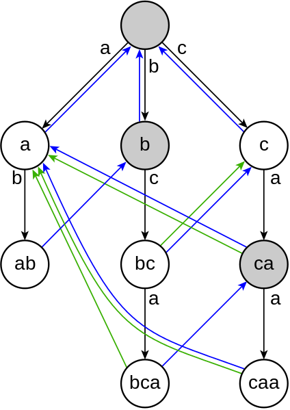

Let's say you have a large piece of text and a dictionary of keywords. How do you quickly locate all the keywords?


\[caption id="" align="alignright" width="297" caption="Aho-Corasick algorithm diagram"]\[/caption]


Well, there are many ways really, you could even iterate through the whole thing and compare words to keywords. But it turns out that's going to be very slow. At least _O(N_keywords \* N_words)_ complexity. Essentially you're making as many passes over the text as your dictionary is big.


In 1975 a couple of IBM researchers - Alfred Aho and Margaret Corasick - discovered an algorithm that can do this in a single pass. The [Aho-Corasick string matching algorithm](http://en.wikipedia.org/wiki/Aho%E2%80%93Corasick_string_matching_algorithm "Aho–Corasick string matching algorithm").


I implemented it in Haskell and it takes **_0.005s_** to find 8 different keywords in [Oscar Wilde's The Nightingale and The Rose](http://en.wikisource.org/wiki/The_Nightingale_and_the_Rose) - a 12kb text.


A quick naive keyword search implemented in python takes _0.023s_. Not a big difference practically speaking, but imagine a situation with megabytes of text and thousands of words in the dictionary. The authors mention _printing out the result_ as a major bottleneck in their assessment of the algorithm.


Yep, _printing_.

## The Aho-Corasick algorithm

At the core of this algorithm are three functions:


\[caption id="attachment_5377" align="alignright" width="296" caption="The three functions of aho-corasick algorithm"][](./img/blog-wp-content-uploads-2012-10-aho-corasick-algorithm.png)\[/caption]

- a parser based on a state machine, which maps _(state, char)_ pairs to states and occasionally emits an output. This is called the _Goto_ function
- a _Failure_ function, which tells the _Goto_ function which state to jump into when the character it just read doesn't match anything
- an _Output_ function, which maps states to outputs - potentially more than one per state

The algorithm works in two stages. It will first construct the _Goto, Failure_ and _Output_ functions. The complexity of this operation hinges solely on the size of our dictionary. Then it iterates over the input text to produce all the matches.


Using [state machines](http://en.wikipedia.org/wiki/Finite-state_machine "Finite-state machine") for parsing text is a well known trick - the real genius of this algorithm rests in that _Failure_function if you ask me. It makes lateral transitions between states when the algorithm climbs itself into a wall.


Say you have _she_ and _hers_ in the dictionary.


The _Goto_ machine eats your input string one character at the time. Let's say it's already read s_h_. The next input is an _e_ so it outputs _she_ and reaches a final state. Next it reads an _r_, but the state didn't expect any more inputs, so the _Failure_ function puts us on the path towards _hers_.


This is a bit tricky to explain in text, I suggest you look at the picture from the original article and look at what's happening.

## My Haskell implementation

The first implementation I tried, relied on manully mapping inputs to outputs for the _Goto, Failure_ and _Output_ functions by using pattern recognition. Not very pretty, extremely hardcoded, but it worked and was easy to make.


Building the functions dynamically proved a bit trickier.

```
type Goto = Map (Int, Char) Int
type Failure = Map Int Int
type Output = Map Int [String]
```

First off, we build the _Goto_ function.

```
-- builds the goto function
build_goto::Goto -> String -> (Goto, String)
build_goto m s = (add_one 0 m s, s)

-- adds one string to goto function
add_one::Int -> Goto -> [Char] -> Goto
add_one _  m [] = m
add_one state m (c:rest)
  | member key m = add_one (fromMaybe 0 $ Map.lookup key m) m rest
  | otherwise = add_one max (Map.insert key max m) rest
  where key = (state, c)
        max = (size m)+1
```

Essentially this builds a flattened prefix tree in a HashMap of _(state, char)_ pairs mapping to the next state. It makes sure to avoid adding new edges to the three as much as possible.


The reason it's not simply a prefix tree are those lateral transitions; doing them in a tree would require backtracking and repeating of steps, so we haven't achieved anything.


Once we have the _Goto_ function, building the _Output_ is trivial.

```
-- builds the output function
build_output::(?m::Goto) => [String] -> Output
build_output [] = empty
build_output (s:rest) = Map.insert (fin 0 s)
                          (List.filter (\x -> elem x dictionary) $ List.tails s) $
                          build_output rest

-- returns the state in which an input string ends without using failures
fin::(?m::Goto) => Int -> [Char] -> Int
fin state [] = state
fin state (c:rest) = fin next rest
  where next = fromMaybe 0 $ Map.lookup (state, c) ?m
```

We are essentially going over the dictionary, finding the final state for each word and building a hash table mapping final states to their outputs.


Building the _Failure_ function was trickiest, because we need a way to iterate over the _depths_ at which nodes are position in the _Goto_ state machine. But we threw that info away by using a HashMap.

```
-- tells us which nodes in the goto state machine are at which traversal depth
nodes_at_depths::(?m::Goto) => [[Int]]
nodes_at_depths =
  List.map (\i ->
                  List.filter (>0) $
                  List.map (\l -> if i < length l then l!!i else -1)
                  paths)
           [0..(maximum $ List.map length paths)-1]
  where paths = List.map (path 0) dictionary
```

We now have a list of lists, that tells us at which depth certain nodes are.

```
-- builds the failure function
build_fail::(?m::Goto) => [[Int]] -> Int -> Failure
build_fail nodes 0 = fst $
                  mapAccumL (\f state ->
                              (Map.insert state 0 f, state))
                  empty (nodes!!0)
build_fail nodes d = fst $
                  mapAccumL (\f state ->
                              (Map.insert state (decide_fail state lower) f, state))
                  lower (nodes!!d)
  where lower = build_fail nodes (d-1)

-- inner step of building the failure function
decide_fail::(?m::Goto) => Int -> Failure -> Int
decide_fail state lower = findWithDefault 0 (s, c) ?m
  where (s', c) = key' state $ assocs ?m
        s = findWithDefault 0 s' lower

-- gives us the key associated with a certain state (how to get there)
key'::Int -> [((Int, Char), Int)] -> (Int, Char)
key' _ [] = (-1, '_') -- this is ugly, being of Maybe type would be better
key' state ((k, v):rest)
  | state == v = k
  | otherwise = key' state rest
```

Here we are going over the list of nodes at depths and deciding what the failure should be for each depth based on the failures of depth-1. At depth zero, all failures go to the zeroth state.


An \\important part of this process was inverting the _Goto_ HashMap so values point to keys, which is essentially what the _key'_ function does.


Finally, we can use the whole algorithm like this:

```
main = do
  let ?m = fst $ mapAccumL build_goto empty dictionary
  let ?f = build_fail nodes_at_depths $ (length $ nodes_at_depths)-1
      ?out = build_output dictionary

  print $ ahocorasick text
```

A bit more involved than the usual example of Haskell found online, it's still pretty cool :)


You can see the whole code on github [here](https://github.com/Swizec/random-coding/blob/master/aho-corasick.hs).

###### Related articles

- [](http://debasishg.blogspot.com/2012/07/does-category-theory-make-you-better.html)[Does category theory make you a better programmer ?](http://debasishg.blogspot.com/2012/07/does-category-theory-make-you-better.html)
- [](http://swizec.com/blog/markov-chain-poem-trainergenerator-in-29-sloc-of-haskell/swizec/5310)[Show HN: Markov chain poem trainer+generator in 29 sloc of Haskell](http://swizec.com/blog/markov-chain-poem-trainergenerator-in-29-sloc-of-haskell/swizec/5310)
- [](http://www.zemanta.com/fruitblog/downloading-the-internet-with-a-single-machine/)[Downloading the Internet with a single machine](http://www.zemanta.com/fruitblog/downloading-the-internet-with-a-single-machine/)
- [](http://dave.fayr.am/posts/2012-10-4-finding-fizzbuzz.html)[FizzBuzz, A Deep Navel to Gaze Into](http://dave.fayr.am/posts/2012-10-4-finding-fizzbuzz.html)
- [](http://hughewilliams.com/2012/10/01/five-myths-about-hash-tables/)[Five Myths about Hash Tables](http://hughewilliams.com/2012/10/01/five-myths-about-hash-tables/)

[](http://www.zemanta.com/?px "Enhanced by Zemanta")