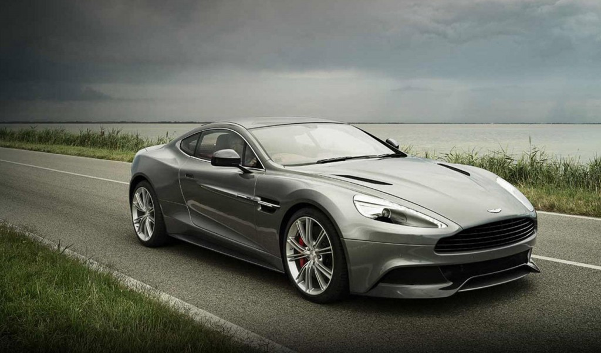

Six years ago I bought my first [Apple](http://www.apple.com "Apple") product - a MBP, the last version before unibody designs. The unboxing alone was enough to make me a fan. Apple was to other devices as [Aston Martin](http://www.astonmartin.co.uk/ "Aston Martin") is to other cars - classy, polished, perfect.  Sure, it's not the most powerful car out there - [Veyron](http://en.wikipedia.org/wiki/Bugatti_Veyron "Bugatti Veyron") does that, the equivalent of the bleeding edge gaming rig - it doesn't have the best cornering either, nor the best handling, best acceleration or a number of other things that are left for the Zondas, Lambos and Ferraris of the world. But that's a different playing field. While most other supercars are vulgar, tacky even, Aston Martin is exciting enough to make your heart stop, yet gorgeous. The first car maker to simply say _"It's gorgeous! Don't you want it?"._  Aston Martin doesn't sell specs, they sell the experience. The only supercar with taste. Beautiful exciting perfection. Until recently Apple was just like that. They were the Aston Martin of the gadget world - more powerful than the cheap alternatives, but not really competing on [CPU speed](http://en.wikipedia.org/wiki/Instructions_per_second "Instructions per second"), RAM size, screen size and so on. Pricier than most alternatives, a purchase you couldn't explain to many of your friends, but totally worth it. A perfect experience. Every time. The only laptop that doesn't creak when you grab it. The only laptop beautiful enough to act as the default movie laptop. The mp3 player with marketing of a simple silhouette. The phone that fits in your palm, looks stylish in every setting and never feels sluggish. Lately, though, Apple has become this.  A ricer car competing with their neighbourhood hooligans on how big their spoiler is, how low they can go, how wide are the rims and whether it's got 134 or 135 horsepowers. Apple just doesn't _get it_ anymore. At the end of the day, who really cares if their iPad mini is 5 or 7 millimetres thick? Or their iMac is 3 ounces heavier or lighter? Specs are easy to compete on. Incredibly so. See a competitor that's doing good? Just slap a bigger processor on your phone, make the screen 3 millimetres bigger and voila, the geek crowd is impressed! They will flock to your product and buy as many copies as they can. Simply because they can go to their friends in a bar and say _Hey, you suck! My phone is three milliseconds faster than yours! HA!_ Really? Is this what Apple has become? The only bastion of taste left in this geek dominated world, they too have fallen prey to the easy game. Except Apple has never been good at competing on specs, that's Samsung's territory. Competing on specs is the place where great experiences go to die in a sea of A/B testing, childish competition and poor taste. With Apple gone, where can I turn?

###### Related articles

-   [Aston Martin no longer coolest make - Confused.com](http://www.confused.com/car-insurance/news/aston-martin-no-longer-coolest-make-1917)
-   [A Beautiful Look Into James Bond's Aston Martin DB5](http://hypebeast.com/2012/10/a-beautiful-look-into-james-bonds-aston-martin-db5/)
-   [2013 Aston Martin DB9](http://www.werd.com/17088/2013-aston-martin-db9/)
-   [Cramer And Apple](http://seekingalpha.com/article/943771-cramer-and-apple?source=feed)
-   [Samsung Will No Longer Provide LCDs to Apple](http://hothardware.com/News/Samsung-Will-No-Longer-Provide-LCDs-to-Apple/)
-   [Here's The Big Question Apple Has To Answer About The iPad Mini (AAPL)](http://www.businessinsider.com/how-will-apple-market-the-ipad-mini-2012-10)

