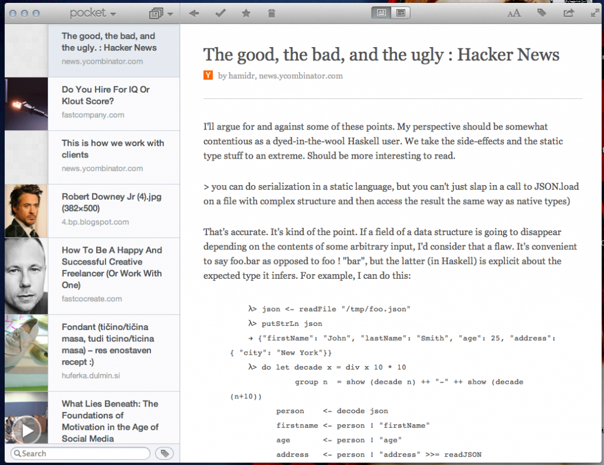
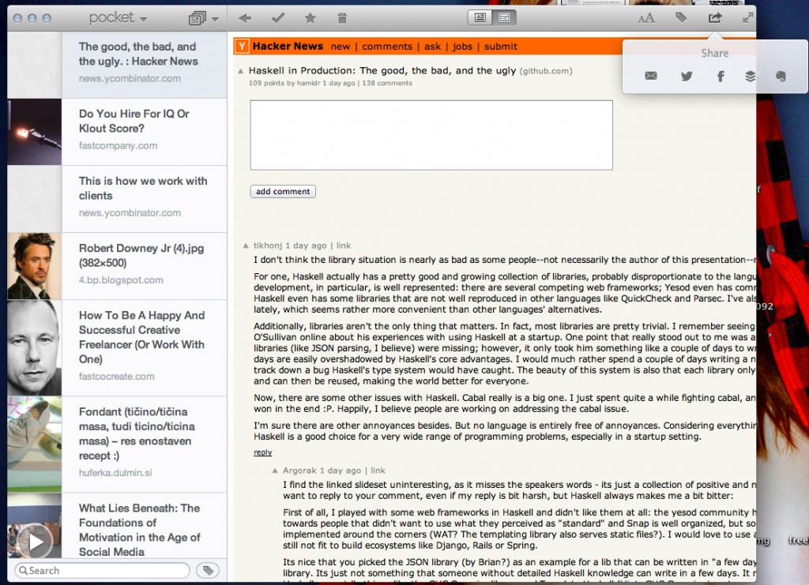

A few years ago I tried _[Read It Later](http://readitlaterlist.com "Read It Later")_ - a browser bookmarklet that let you defer reading long articles. When you discovered something you really wanted to read but didn't have immediately, you could just store it for later.

Imagine what happens next. Most of the articles languish, never to be opened again. After a few months I stopped using the service.

But! I never stopped using the behaviour.

\[caption id="attachment_5483" align="alignnone" width="614"] [Pocket](http://pocket.co) on [iPad](http://en.wikipedia.org/wiki/IPad "IPad")\[/caption]

As a voracious internetovore, the fearsome bane of unread content everywhere, I kept clicking every link with a semi-interesting headline I could get my grubby little paws on. Be it image, video or a metric fucktonne of text - I would open it.

Then realize I don't have time to read it.

Then keep it open for three hours.

A day.

\[caption id="attachment_5485" align="alignright" width="307"] Pocket on iPhone\[/caption]

A week.

Then my browser session crept up to fifty tabs spread over three windows ... on each computer (laptop+desktop). Things got slow, most of my RAM was on a hard drive and life was anything but ideal. Far from even remotely pleasant.

A while ago I rediscovered Read it Later, now rebranded as _Pocket_ and awesomer than ever.

No longer a bookmarklet, but a full-fledged [Chrome](http://www.google.com/chrome "Google Chrome") plugin with companion apps for both iPad and iPhone. Much shinier and friendlier than it used to be, there was now even a very useful html5'd website for my reading pleasure.

Last week they even released a [MacOS](http://en.wikipedia.org/wiki/Mac_OS "Mac OS") app.

Of course I still don't read most of the articles I save. The queue is still growing relentlessly, far quicker than I could read anything. But that's not the point. I've come to terms with the fact that Pocket is a tool for keeping memory usage low and browsers happy.

No longer do I store everything in forever-tabs. Push it to Pocket so it's out of mind, out of worry and out of RAM. Sometimes I'll actually get around to reading it, most often not. But at least both my inner internetovore and minimalist side are happy.

As an added bonus, Pocket is **magnificent** for easily sharing links between devices. Win!

\[caption id="attachment_5491" align="alignnone" width="614"] Pocket on MacOS with a cleaned up page\[/caption]

\[caption id="attachment_5492" align="alignnone" width="614"] Pocket on MacOS with native page and sharing widget\[/caption]

###### Related articles

- [Stay on top of the Web with read-later services](http://www.macworld.com/article/2012651/stay-on-top-of-the-web-with-read-later-services.html)
- [Pocket for Mac joins the Pocket family](http://www.tuaw.com/2012/10/25/pocket-for-mac-joins-the-pocket-family/)
- [Brand New Today: Pocket For Mac](http://www.cultofmac.com/198043/brand-new-today-pocket-for-mac/)
- [Instapaper isn't Instaworth it anymore - switching to Pocket](http://gravitationalpull.net/wp/?p=2160)
- [Simple, Slick, Superb: Pocket For Mac Does Save-For-Later Right \[Review\]](http://www.cultofmac.com/198122/simple-slick-superb-pocket-for-mac-does-save-for-later-right-review/)

