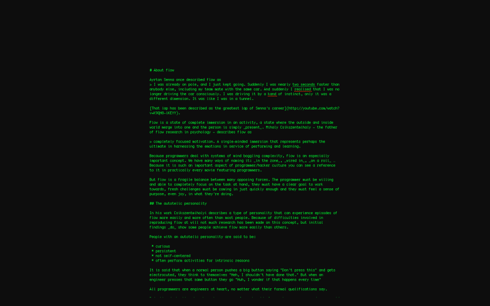
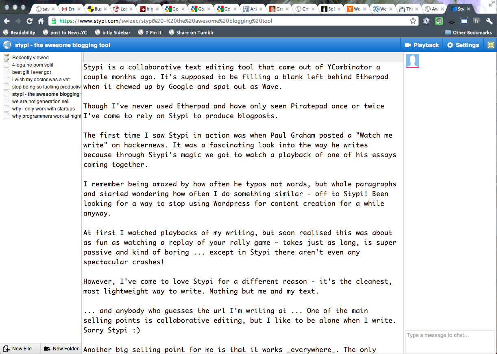
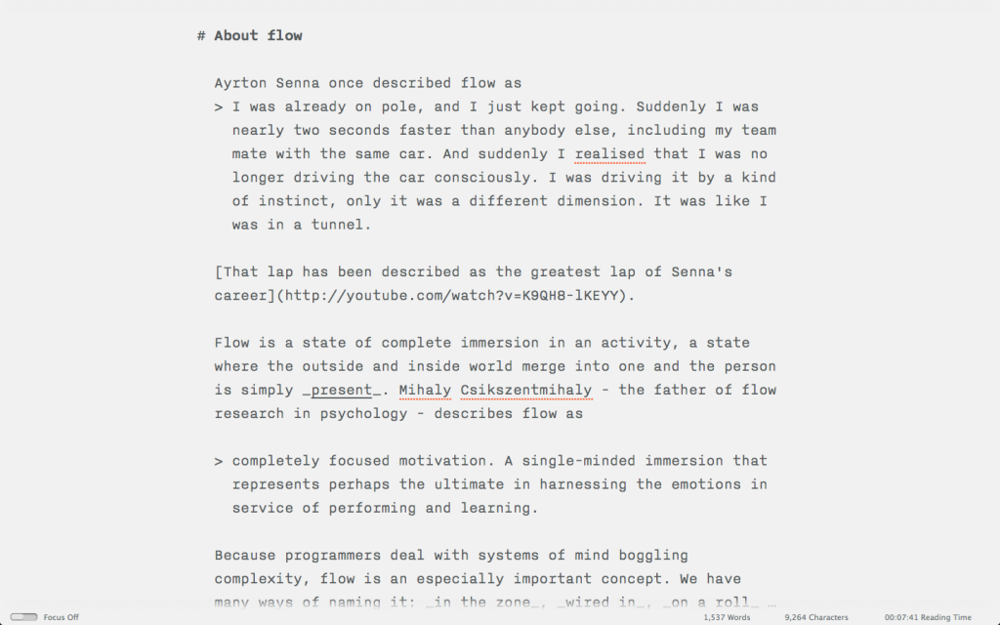

Having had writing aspirations my whole life - started my first big awesome epic novel that's going to be super awesome and everyone will want to read when I was 9 or 10 - I've gone through many writing tools. \[caption id="" align="alignright" width="342"] Best writing tool\[/caption] First it was notebooks that never got filled beyond the first five pages. Then we got a computer and I used [WordPad](http://en.wikipedia.org/wiki/WordPad "WordPad"), which was quickly usurped by [MS Word](http://en.wikipedia.org/wiki/Microsoft_Word "Microsoft Word") because it was _better_. I ended up playing with shiny fonts more than writing. Oh so many shiny fonts! Y'know I used to collect those ... In high school I went back to notebooks, this time I managed to fill them up with terrible prose and even worse poetry. It was writing utopia. The thing about a notebook is that there's nothing else. It's just a notebook. Its purpose in life is providing a big surface that you can scribble upon with your favourite pen. There are no toolbars on the side, no chrome up top, it doesn't even care about the font you're using. A notebook doesn't judge. There's no [word count](http://en.wikipedia.org/wiki/Word_count "Word count"), no reliable page count, no structure. But notebooks really _really_ **_really_**__ suck at editing.

## Good writing, on computers

A few years ago I discovered [WriteRoom](http://www.hogbaysoftware.com/products/writeroom). Oh it was wonderful, finally my writing could cover the whole string and there was nothing to distract me from getting completely lost in the words. \[caption id="attachment_5522" align="alignnone" width="614"] Writeroom\[/caption] After I got bored of the _OMG look at my screen! It's so geeky and just like those old terminals! wow_ I stopped using WriteRoom and went back to notebooks. Opening it right now almos tmade my eyes bleed. (granted, I have version 2.5.1 and the new one is 3.x.x, things have changed) [For a while I was using Stypi](http://swizec.com/blog/stypi-the-perfect-blogging-tool/swizec/3312) and thought that was the best thing since sliced toast prepared by a wonderful female. \[caption id="" align="alignnone" width="599"] My post on Stypi in Stypi\[/caption] Stypi, again, fell into disuses. Not sure why or how, just did. Then I remembered I had iA Writer installed on my [iPad](http://en.wikipedia.org/wiki/IPad "IPad").

## iA Writer

\[caption id="attachment_5531" align="alignnone" width="614"] iA Writer on my laptop\[/caption] iA Writer is one of those tools that is just perfect. It does everything I need and nothing more. When I started writing on [Why programmers work at night](https://leanpub.com/nightowls) I discovered something interesting - writing in [Emacs](http://en.wikipedia.org/wiki/Emacs "Emacs") is impossible. It's a wonderful markdown editor, great support, awesome [syntax highlighting](http://en.wikipedia.org/wiki/Syntax_highlighting "Syntax highlighting"), distractionless coding because there's no toolbars and crap and so on. I love you Emacs, you glorious bastard, but you suck for writing prose. The only place I feel comfortable enough to write is iA Writer. Somewhere between filling up my whole screen with writing, having a super huge font and juuust the perfect kerning and line spacing, iA Writer made me fall in love. Syncing across devices via [iCloud](http://en.wikipedia.org/wiki/ICloud "ICloud") or [Dropbox](http://www.crunchbase.com/company/dropbox "Dropbox") was just icing on the cake. I think my favourite feature is that once you start typing on a bluetooth keyboard all the controls disappear. Your iPad turns into a blank piece of paper and you're going to town on it. Really wonderful. Most \\importantly I can now write in the same environment in a coffee shop, up on a mountain or at my desk. \[caption id="attachment_5528" align="alignnone" width="614"] iA Writer on the iPad\[/caption] \[caption id="attachment_5529" align="alignnone" width="384"] iA Writer on [iPhone](http://en.wikipedia.org/wiki/IPhone "IPhone")\[/caption] \[caption id="attachment_5530" align="alignnone" width="461"] iA Writer on iPad once typing begins\[/caption]

###### Related articles

- [NaNoWriMo tools for Apple devices ... and a few hot deals on writing tools](http://www.tuaw.com/2012/10/31/nanowrimo-tools-for-apple-devices-and-a-few-hot-deals-on-wri/)
- [A Truckload of Desktop Apps for Writers](http://notes.envato.com/general/a-truckload-of-desktop-apps-for-writers/)
- [8 Apps Every Writer and Blogger Should Know](http://mashable.com/2012/11/06/writing-apps/)
- [Prose on the iPad: 3 Dedicated Writing Apps](http://www.wired.com/reviews/2012/09/writing-apps-ipad/)
- [Review: iA Writer](http://www.hopelesscom.de/2012/8/20/review__ia_writer.html)

