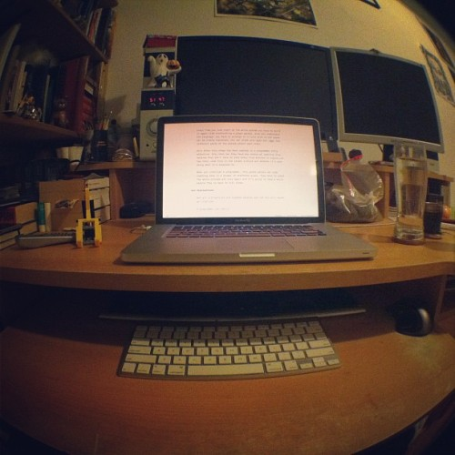

When I set out to write [Why programmers work at night](https://leanpub.com/nightowls) I knew it wasn't going to be a walk in the park, but hey, I've got plenty of writing experience. How hard can it be?

So far I've written 895 posts on this blog, [written morning words](http://swizec.com/blog/a-year-of-750words-com-with-shiny-graphs/swizec/4378) on 561 consecutive days amounting to just shy of 460,000 words. If that was a novel it would make the [list of longest novels](http://en.wikipedia.org/wiki/List_of_longest_novels "List of longest novels"). Clearly I am well prepared!

I had **_no idea_**.

Man, books are _hard_.

Screw startups, launching small businesses and fun web projects. Writing a book is the most mind bending experience you can have, with the possible exception of having sex for the first time. Startups are an emotional roller coaster, very tough on the psyche - writing a book isn't even a roller coaster.

It's [schlep work](http://paulgraham.com/schlep.html) through and through.

\[caption id="" align="alignnone" width="500"] My book is taunting me to write moar.\[/caption]

Most of the time you have no idea what you're trying to say, but you have to say it coherently. It's as if your thoughts on the subject are being revealed to you _while_ you write. The moment you're done with a subchapter you immediately need to rewrite it because now you know what you were trying to say and the initial paragraphs are all wrong.

Sure, you're not supposed to edit while writing, but this isn't editing. This is refining a mind dump into a first draft.

There's also a special kind of flow to the whole thing. Coding flow is easy, it's something I can go into almost instantly. But writing flow ... that takes time. And unlike coding flow, this one can't be paused. If you pause your flow, your writing will feel different when you get back. Readers will notice a break in the flow.

Very jarring.

So you do things like that \*points at previous line\* to make it seem intentional :)

At the end of the day, you feel great! Finally managed to have a whole day for writing, It was awesome. Marvellous Ecstatic! You got plenty done and the book is almost ready to have its first Minimum Viable Book version unleashed on the world.

You look at the time tracker - 4 hours. Just four actual hours spent writing. Because writing isn't coding and it's almost impossible to keep focused for more than an hour at time. Haven't built the stamina yet.

But you're getting somewhere anyway. The chapter you've spent two weeks working on, tens of hours, is finally shaping up.

Reading time 00:14:50.

###### Related articles

- [Learning lessons from other writers](http://victoria-writes.com/2012/11/09/learning-lessons-from-other-writers/)
- [Why Ride Roller Coasters When Writing Gives You The Same Thrills? - (Novel Update!)](http://lyricfire.typepad.com/lyric-fire/2012/11/why-ride-roller-coasters-when-writing-gives-you-the-same-thrills-novel-update.html)
- [Sometimes I'm A Bad Blogger (And Here Are Some Excuses For Why)](http://jaxibella.wordpress.com/2012/11/12/sometimes-im-a-bad-blogger-and-here-are-some-excuses-for-why/)
- [Looping Roller-Coaster Stairway You Can Actually Walk On](http://weburbanist.com/2012/10/22/looping-roller-coaster-stairway-you-can-actually-walk-on/)
- [What am I Writing?](http://writingpiecesofme.wordpress.com/2012/11/12/what-am-i-writing/)

