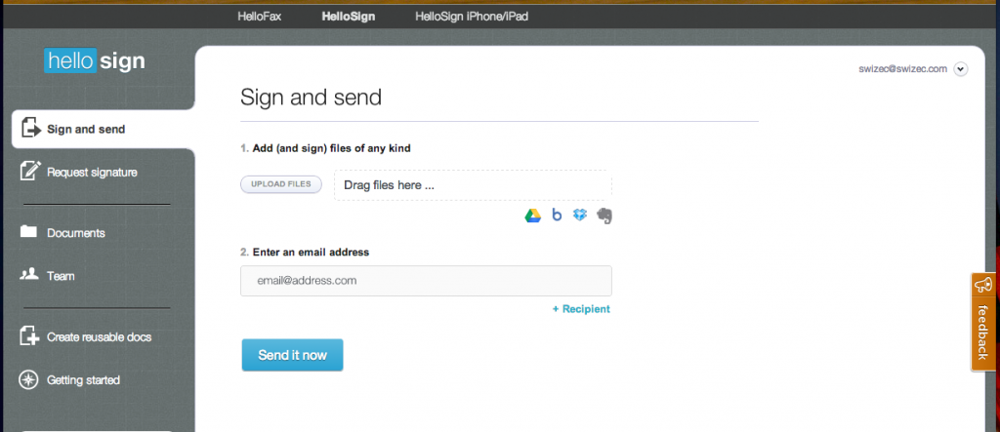

Almost everybody signs [contracts](http://en.wikipedia.org/wiki/Contract "Contract"). They might not amount to much more than a firm handshake when shit hits the fan, but they put people's minds at ease so it doesn't seem we'll be getting rid of them any time soon.

Signing contracts is annoying.

\[caption id="attachment_5568" align="alignnone" width="631"] [HelloSign](http://hellosign.com)\[/caption]

My [signature](http://en.wikipedia.org/wiki/Signature "Signature") never spells anything, it's just a squiggle. A different squiggle every time, sometimes it doesn't look remotely similar page to page. Hell, if it's going to be just a squiggle I want it to at least look good, but I can't even do that every time.

Not to mention how difficult getting busy people in the same room can be. Surely a 30 second signature isn't worth half an hour getting from one side of town to another?

Things only get worse once you start doing business abroad.

Somebody sends you a contract, you print it out, sign it, scan it back in, send it back and the other person must repeat this process. Then both of you get to print out the signedd contract to put in a file somewhere. Hooray for wasting time and paper. All those trees surely love us!

You could also send the whole contract via [snail mail](http://en.wikipedia.org/wiki/Snail_mail "Snail mail"), avoiding any qualms with _"I'm just printing, signing and scanning the last page of the document, so how well does this stand up in court anyway?"_ ... but who's got that sort of patience?

## Enter [HelloSign](http://hellosign.com) stage left!

It's a simple _free_ service that makes signing documents easy. You just upload a file, drag your signature on top, enter an email address and click send. Wonderful!

That's actually all I've ever used the service for. Even though it's also got [Dropbox](http://www.dropbox.com "Dropbox"), Google Drive and [Evernote](http://www.evernote.com "Evernote") integration. Plus there's an iPad and iPhone app nowadays, which sounds kinda cool. I should probably check it out.

Aside from making my life very easy HelloSign it also keeps a clean version of my signature stored, so I can be sure it always looks the same and doesn't have any strange scanning artefacts. All it took was uploading a photo of a signed scrap of paper and HelloSign took care of the rest.

I'm starting to feel bad I'm not paying for this ...

\[caption id="attachment_5569" align="alignnone" width="538"] HelloSign on iPad\[/caption]

\[caption id="attachment_5570" align="alignnone" width="538"] iPad version let's you sign with your finger\[/caption]

###### Related articles

- [HelloSign Integrates with Google Drive; Launches Unlimited Free Signatures from Google Drive](http://www.prweb.com/releases/prweb2012/10/prweb9926356.htm)
- [HelloSign API Enables Free, Secure eSignature Integration](http://blog.programmableweb.com/2012/11/07/hellosign-api-enables-free-secure-esignature-integration/)
- [Introducing the HelloSign API: Hassle-free eSignatures (YC W11)](http://www.hellosign.com/info/api)
- [HelloSign: Easy and free way to sign documents](http://www.techno360.in/hellosign-easy-and-free-way-to-sign-documents/)
- [App Spotlight: Sign documents on the go with HelloSign](http://www.macworld.com/article/2010909/app-spotlight-sign-documents-on-the-go-with-hellosign.html)

