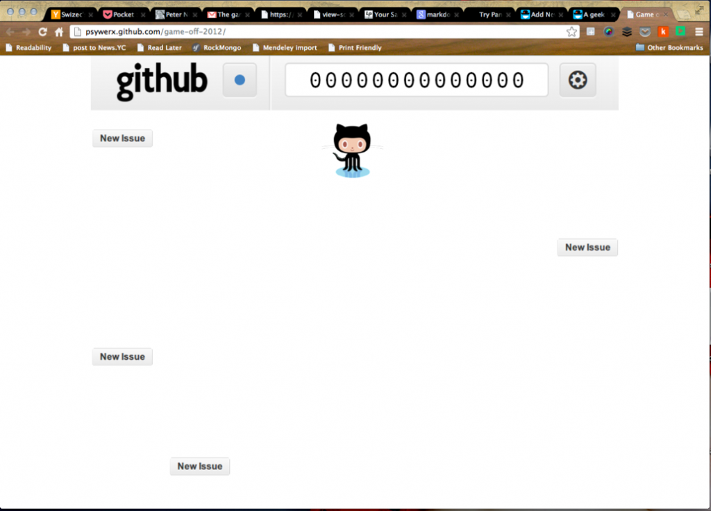

 _This is a guestpost from [@Smotko](http://twitter.com/smotko), he does cool things with code and runs my favourite irc channel._ I’ve started working on a simple game for the Github Game Off competition and I’d like to share my thoughts and findings on creating games with javascript and [Webgl](http://www.khronos.org/webgl/ "WebGL"). I will not go into Webgl details, as there is a great number of tutorials that do just that, instead I’ll talk about some of the concepts that I used to make my game. You give [the game](http://psywerx.github.com/game-off-2012/) a spin before you start reading, as I’ll be talking about how I implemented a few features and it will be easier for you to follow. First of all, why did I choose Webgl? We have canvas, which is full of awesomeness and really easy to use and understand. Webgl, on the other hand, is quite the opposite. There is no drawRect function and in order to draw a simple triangle you need to write ~100 lines of javascript plus a few lines of C like shader code. Drawing textures is not simple either, you need to understand uv texture mapping and concepts such as mipmapping. It’s not a walk in the park. But if you do all the heavy lifting you are rewarded with an application that can have complex 3D models, lightning and it all runs on your graphics card and is therefore insanely fast.

## Structuring your code

Most gl tutorials never ever tell you how to structure your code. The code is usually packed into a single file, which is OK for a tutorial, but fails miserably as soon as you’ll want to do anything serious. I’ve set up my project into 3 javascript files `main.js`, `game.js` and `drawables.js`. `main.js` sets everything up. It binds keyevents, creates the shaders, loads the textures and sets up the game object. `game.js` is where my game object resides. It holds a list of current objects on screen, a list of idle objects off screen and also variables spacifying its state (paused, playing, menu,..), score, gameSpeed (which increases over time) and so on. The `drawables.js` is where my object hierarchy is defined. I could use a new file for each drawable object, but because each .js file is a new http request (and I can’t be bothered with minifying and/or asynchronous loading) it seemed like a good compromise. At the bottom of the hierarchy I have a simple Square object. A Square has a position, a size, velocity and optionally a texture. Other drawable objects use the Square object to draw their components. As an example the Player object is made of two Square objects. One for the main player model and one for the fork. The fork object is hidden most of the time, but it shows up when the player gets the fork powerup.

## The draw and update functions

The most important parts of every gl application are the draw and update functions. The update function is where new positions and states of all the objects are calculated. In addition, collisions between objects are checked and user input is processed. All of my drawable objects have an update function. And this update functions is called one time per frame. The update function has one very important parameter - theta. Theta is the time difference between the previous frame and this one. This is necessary as the update functions is not going to be called as often on slow machines as on fast machines and without theta to balance things out, players on fast machines would see objects move faster than players on slower ones. This is why all position updates are being multiplied by theta - to insure all the players have the same experience. All of the drawables, unsurprisingly, have a draw function. The draw functions uses the current position of the object to draw the object on screen. As an example, the draw functions of the Square object initializes the vertex, color and texture buffers, sets the shader variables and draws the needed triangles (two of them) so that we get a square. It does all the hard work so all the other drawables don’t have to. Because all of my drawables are stupidly simple - made from just a few squares, their draw functions are trivial. Here is an example of the draw function in my Background object:

    topBar.draw(gl);
    score.draw(gl);

topBar is a Square object, while score is a bunch Square objects - one for each digit.

## Collision detection

I have made my life really simple in regards to [collision detection](http://en.wikipedia.org/wiki/Collision_detection "Collision detection"). All of my objects are essentially squares and I am only checking for collisions between the block objects and the player. This is the function that tells me if two of my objects are colliding:

    areColliding : function(a, b){
    	for (var i=1; i>=0; i--)
    		if(a.position[i] + a.size[i]*a.collisionModifier < b.position[i] - b.size[i] * b.collisionModifier ||
    		   a.position[i] - a.size[i]*a.collisionModifier >  b.position[i] + b.size[i] * b.collisionModifier)
    			return false;
    	return true;
    }

The collisionModifier is interesting because it allows me to make an object bigger or smaller than it actually is.

## Rendering text

\[caption id="attachment_5579" align="alignnone" width="512"] Sprites\[/caption] Printing text in [OpenGL](http://www.opengl.org/ "OpenGL") is not as easy as one would think. It’s usually done by creating a [texture atlas](http://en.wikipedia.org/wiki/Texture_atlas "Texture atlas") with all the characters that you intend to use. When you have your atlas texture loaded, you need to calculate the correct [uv coordinates](http://en.wikipedia.org/wiki/UV_mapping "UV mapping") for each character or sprite in the atlas. I’ve created a helper function that calculates the uv coordinates, I only need to specify the sprite offset and the size:

    getTextureUV : function(offset, size){
    	var textureWidth = [0.03125*size[0], 0.03125*size[1]];
    	var u = offset[0]/size[0];
    	var v = offset[1]/size[1];
    	return [
    		// Mapping coordinates for the vertices
    		(u + 1) * textureWidth[0],  v * textureWidth[1], 
    		 u      * textureWidth[0],  v * textureWidth[1],
    		(u + 1) * textureWidth[0], (v + 1) * textureWidth[1], 
    		 u      * textureWidth[0], (v + 1) * textureWidth[1], 
    	];
    }

And now that I can easily access each sprite in the atlas, I can easily draw a character. The size of a character is always one, and I get the position by calling the following function:

    fromChar : function(c){
    	var charIndex = c.charCodeAt(0) - 32;
    	return [(charIndex % NUM_SPRITES), Math.floor(charIndex / NUM_SPRITES)];
    }

## Fin

I’ve learned one more important thing while making this game. Creating games is way more fun than playing them. I got stoked when my game started working and I could move the my in game character across the screen. It’s an incredible feeling that every programmer should experience. You can take a look at the actual source code [here](https://github.com/Smotko/game-off-2012). If you have any questions feel free to ask me in the comments or on [google+](https://plus.google.com/u/0/109772113087805631318/posts) and please let me know if I did something horribly wrong, I want to learn from my mistakes and become batter at this crazy game development thing!

###### Related articles

-   [The promise of WebGL - O'Reilly Radar](http://radar.oreilly.com/2012/10/the-promise-of-webgl.html)
-   [Android: Drawables showing black rectangles](http://stackoverflow.com/questions/13325718/android-drawables-showing-black-rectangles)
-   [Building an HTML5 game? Don't shrug off atlases](http://www.gamasutra.com/view/news/177857/Building_an_HTML5_game_Dont_shrug_off_atlases.php)
-   [WebGL: Up and Running](http://www.i-programmer.info/bookreviews/6-graphics/4913-webgl-up-and-running.html)
-   [Hungry Hero goes Open Source](http://www.hsharma.com/games/hungry-hero-goes-open-source/)

