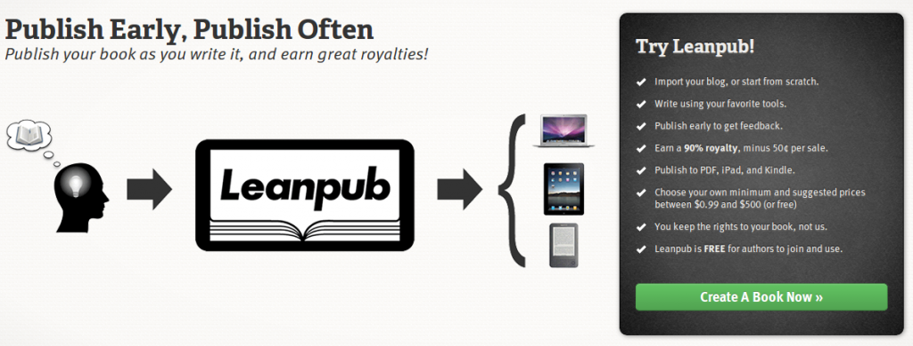

 The past few years have seen a venerable explosion of self-published [ebooks](http://en.wikipedia.org/wiki/E-book "E-book"). Might be that e-book readers are becoming ever more popular, or that _people actually buy ebooks_. Whatever it is, this is a good time to get your act together and write a book on something you're good at. Or even not good at. There's a guy who will research any suggested topic and write a book. Naturally, I can't find the link right now because _"I will write a book about anything"_ is a terrible search term. But what's a guy to do once a topic has been identified? Creating an ebook takes plenty of strange knowledge about file formats, layouting and making sure this book looks equally good on an [Android phone](http://www.t-mobile.com/shop/phones/?capcode=AGE "Android phones") as it does on an [iPad](http://www.apple.com/ipad/ "iPad") or a [Kindle](http://www.amazon.com/Kindle-Wireless-Reader-Wifi-Graphite/dp/B002Y27P3M%3FSubscriptionId%3D0G81C5DAZ03ZR9WH9X82%26tag%3Dageewitahat-20%26linkCode%3Dxm2%26camp%3D2025%26creative%3D165953%26creativeASIN%3DB002Y27P3M 'Kindle Wireless Reading Device, Wi-Fi, 6" Display, Graphite - Latest Generation'). Let's not forget the book will eventually need to be sold - you need a website, a [landing page](http://en.wikipedia.org/wiki/Landing_page "Landing page"), some marketing, optimizing conversion funnels, some way to send emails to buyers, processing payments ... Blah. All I wanted was to write a book! Plenty of services exist that help you out with everything _around_ your book, so you can focus on the writing (and marketing, self-publishing means you do the marketing). My google-fu revealed Leanpub as the best option. My experience so far tends to agree.

## Leanpub

[Leanpub](https://leanpub.com/) is an ebook self-publishing platform with an interesting twist - it encourages authors to treat their books as lean startups. The idea is to eschew all the crap that comes with writing a book for several months only to discover nobody wants to read it. Instead, you write the first nugget of a book and start selling. When you write more and the book matures, updates are pushed to all your readers for free. Essentially people are paying for a future full book, but getting a taste of it _now._ Two things happen:

1. You get continuous feedback and can adjust the course of your book at any point. In the end you will almost certainly have an awesome book.
2. The accountability of everyone watching you means you won't just give up after three chapters. A fate too many of my early book attempts have endured.

I also really like the book creation process. Writing happens in simple text files with markdown syntax. These are stored in a shared [Dropbox](http://www.dropbox.com "Dropbox") folder so when you want to generate a new preview or publish a new version, Leanpub will simply sync the files from your computer and do its magic. They also have great customer service - the founder is always prompt to answer any questions on their mailing list - the writer dashboard is marvelous and they let you download any data in a csv format so you can do whatever analysis of sales you might want. Oh and coupon creation and so on ... they also handle all the mailing. Seriously, everything you need _around_ your book, so you can focus on the writing. The real killer feature is their TOS. Authors retain full copyright, there are no restrictions about using other publishers, no restrictions about selling the book without cutting Leanpub into the deal and so on. At 90%-50c the royalties are also very generous compared to more traditional publishers. Compare this with a traditional [publisher](http://en.wikipedia.org/wiki/Publishing "Publishing") contract I read last night; give away all copyright, both moral and practical, only allowed to quote your book according to fair use, must always mention publisher when talking about book, 16% royalties, indefinitely allow them the use of personal trademarks like my name for any purpose they deem fit, and not even a promise I would always be mentioned in relation with the book in question etc. etc. ... No no, **_Leanpub is_** **_universes ahead of traditional publishers._**

###### Related articles

- [The eBook is the Stud in Your Content Marketing Stable](http://blog.slideshare.net/2012/11/12/the-ebook-is-the-stud-in-your-content-marketing-stable/)
- [I made $730 by selling an unfinished book for 3 days.](http://swizec.com/blog/i-made-730-by-selling-an-unfinished-book-for-3-days/swizec/5585)
- [What To Watch When Compiling A Kindle eBook in Scrivener](http://michaeljholley.com/2012/11/21/what-to-watch-when-compiling-a-kindle-ebook-in-scrivener/)
- [The Future of Books (Calm Down Edition)](http://blaiselucey.com/2012/11/21/future-of-books/)

