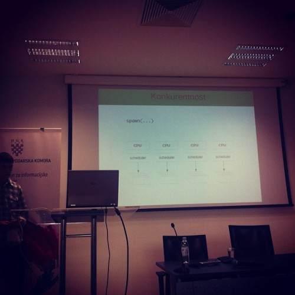
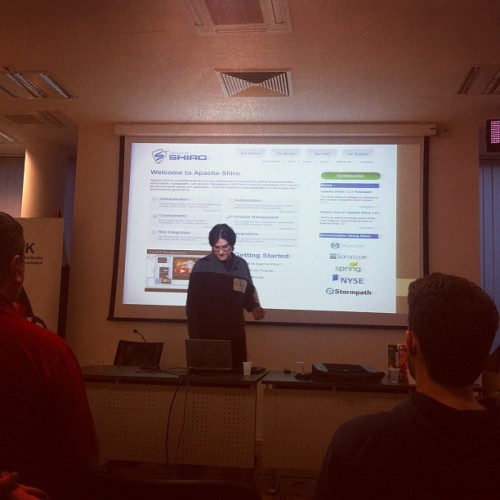

How do you get a hardened night owl to wake up before it's light out? You promise a cool geek event. \[caption id="" align="alignright" width="352"] Orange juice in lieu of tea\[/caption] On Saturday I went to Webcamp [Zagreb](<http://maps.google.com/maps?ll=45.8166666667,15.9833333333&spn=0.1,0.1&q=45.8166666667,15.9833333333 (Zagreb)&t=h> "Zagreb") with [@HairyFotr](https://twitter.com/hairyfotr) and two lasses who wanted to tourist around Zagreb while the boring geeks do their thing. After the [GPS](http://en.wikipedia.org/wiki/Global_Positioning_System "Global Positioning System") sent us to a strange settlement some 20 kilometers outside Zagreb, after stumbling around Zagreb for an hour we finally found the Webcamp. Only an hour late! The event was your usual barcamp with two tracks, a break room and a comically tiny hall between the two rooms. Gridlock after every talk! Started wondering if the talks were purposefully scheduled so that the people who would like a certain talk would almost definitely have to move ot the other room for the next one. At least that's what seems to have been happening ... Unfortunately, all talks save mine were in [Croatian](http://en.wikipedia.org/wiki/Croatian_language "Croatian language"). I _think_ I understood everything, but there's simply no way of knowing for sure. At one point it felt like the talks weren't technical enough ... I probably just set too high expectations in my mind when reading the Croatian descriptions. Only picking out the English buzzwords will do that to you. \[caption id="" align="alignright" width="350"] [Erlang](http://www.erlang.org "Erlang (programming language)"), like life, is made of tiny strings\[/caption] The best talk, the one that sticks in my mind as _"Wow, I learned something new!"_ was the Erlang talk by Saša Jurić. Apparently Erlang is very similar to node.js at its core - a single-threaded approach to concurrency via creating micro threads that are run in parallel by a scheduler. It all sounded a bit like somebody took the idea of node.js, added some steroids and a bit of computer craziness. And voila, Erlang - a system for [massively parallel](http://en.wikipedia.org/wiki/Massively_parallel "Massively parallel") web development. Another cool talk was about the insanity of doing everything on [bleeding edge](http://en.wikipedia.org/wiki/Bleeding_edge_technology "Bleeding edge technology") technologies. More of a cautionary tale than really educational, but the presenter did a remarkable job of keeping me interested without _really_ telling me much I don't know anyway. \[caption id="" align="alignright" width="350"] A hardened bleeding edge veteran\[/caption] The fact they're using [Scala](http://www.scala-lang.org/ "Scala (programming language)") in production put a bit of a damper on their message. Or made it into a good war story. Hard to say. As for my own talk, I think it went well. Considering my vision was swimming from a brain splitting headache and I could barely speak without slurring it went really quite remarkably well. And I only forgot one point I wanted to make. Success. All in all, 8/10, would go again! https&#x3A;//speakerdeck.com/swizec/why-programmers-work-at-night

###### Related articles

- [Croatian wonderkid Alen Halilovic produces one of the worst dives EVER](http://www.101greatgoals.com/blog/croatian-wonderkid-alen-halilovic-produces-one-of-the-worst-dives-ever/)
- [Croatia, next member of the European Union - Alessandro Virciglio](http://europeinside.org/2012/11/27/croatia-next-member-of-the-european-union-alessandro-virciglio/)
- [Erlang](http://the.taoofmac.com/space/dev/Erlang)
- [BigData using Erlang, C and Lisp to Fight the Tsunami of Mobile Data](http://highscalability.com/blog/2012/11/26/bigdata-using-erlang-c-and-lisp-to-fight-the-tsunami-of-mobi.html)

