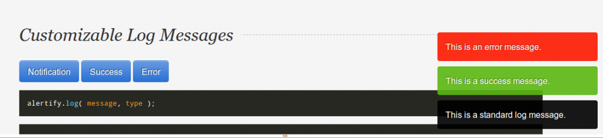

 Sometimes you come across a library so full of promise and amazingness that you have to write about it before even trying it out. [Alertify.js](http://fabien-d.github.com/alertify.js/) is a [javascript library](http://en.wikipedia.org/wiki/JavaScript_library "JavaScript library") that brings _alert()_ and _prompt()_ into the web world of 2012. No longer will you be forced to use some arcane instruction full of ugly windows and so terribly un-new it sends chills down your spine just thinking about using it. Really ... was anyone still using that for anything other than debugging? Besides ~~porn~~phishing sites I mean. \[caption id="attachment_5616" align="alignnone" width="442"][")](./img/blog-wp-content-uploads-2012-11-old-alert.png) The old alert()\[/caption] The difference between old way and new is realy quite amazing. While a normal alert() creates a whole new window and blocks javascript execution, alertify's [alert box](http://en.wikipedia.org/wiki/Dialog_box "Dialog box") is a lot easier on the eye, rolls nicely down from the top of the window and most of all _is customisable._ Although blocking execution would actually be kind of useful, alertify.js can fake this with careful use of callback soup and apparently manages to do something to at least prevent clicking on the page. So unless you get an event from a timer or a socket, you can rest assured nothing will happen while the alert is displayed. It also plays nice with us keyboard maniacs - you can use the _ESC_ key to make a Prompt or Confirm dialog go away. Another feature I really like are the logging facilities. It's a log you actually won't mind showing to your users! Wonderful. \[caption id="attachment_5617" align="alignnone" width="631"] Log messages\[/caption] Then again, for debugging I will probably still be using _console.log_ and ruining my sites for all [Internet Explorer](http://www.microsoft.com/windows/internet-explorer/ "Internet Explorer") users when I forget to remove debugging lines ... with alertify.js it's at least impossible to forget. Oh and another cool thing, Fabien Doiron implemented the whole thing without [jQuery](http://jquery.com/ "JQuery"), which I think is just impressive, these days I probably can't do anything without jQuery anymore ...

###### Related articles

- [Creating a Reddit Browser with Node.js and Twilio](http://blog.studentrnd.org/post/36041434495/tutorial-creating-a-reddit-browser-with-node-js-and)
- [Graphics and animation using HTML5 canvas libraries](http://magedfarag.wordpress.com/2012/11/28/graphics-and-animation-using-html5-canvas-libraries/)
- [The rise of JavaScript micro-frameworks](http://greatfinds.icrossing.com/the-rise-of-javascript-micro-frameworks/)
- [Heyoffline.js - A JavaScript Library To Warn Users When Their Network Goes Down](http://functionn.blogspot.com/2012/11/heyofflinejs-javascript-library-to-warn.html)

