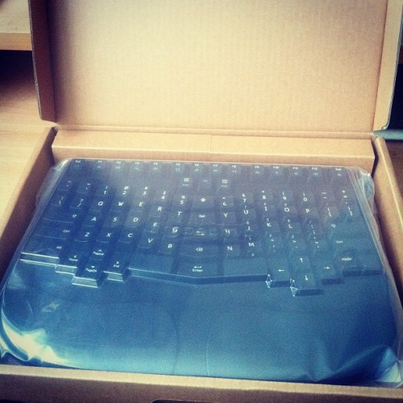
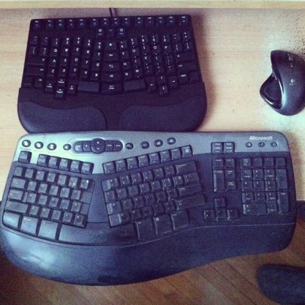

Between 12 hours a day behind a computer, 6 hours of boxing every week and some 800 [press ups](http://en.wikipedia.org/wiki/Push-up "Push-up") per week my wrists are really taking a beating. Sometimes literally. \[caption id="" align="alignright" width="360"] The new keyboard\[/caption] I've gotten so used to the constant pain I stopped noticing. Oh yeah, my hands feel a bit sore in the evenings and I have to be very careful about choosing just the right punching bag at practice and I can only do press ups on my knuckles. Completely normal right? Then I spent a week in Paris. Almost zero computer time. No blogging no coding, nothing. It was then that I realised just how big a problem my not-a-problem has actually become. Feeling no wrist pain whatsoever felt so refreshing, it was finally time to do something. Remembered I used to have a [Microsoft Natural Keyboard](http://www.microsoft.com/hardware/en-us/p/natural-ergonomic-desktop-7000/WTA-00001 "Microsoft Natural keyboard") in high school until it stopped working a few years a go. The temporary replacement was a donated [Logitech](http://logitech.com "Logitech") thing ... you know how temporary replacements work. Asked around and according to the expertise of one [@janhancic](http://twitter.com/janhancic) there were only two modern options - a [TypeMatrix](http://www.typematrix.com "TypeMatrix"), which looked kind of weird to me, or a [Truly Ergonomic](http://trulyergonomic.com/), which I fell in love with immediately. Last week I finally broke down and ordered. Yesterday it arrived. \[caption id="" align="alignright" width="350"] Old ergonomic compared to new\[/caption]

## Truly Ergonomic

Truly Ergonomic's biggest selling point for me was the size. It's a split keyboard and yet it's barely any wider than the [apple keyboard](http://www.apple.com/keyboard "Apple Keyboard"). This means you don't have to reach as far for the mouse _and_ you have more room to move around. Score! I can still remember how unwieldy my first ergonomic keyboard was ... plus this might help with my shoulder pain as well. Another point that's supposed to be really \\important is that many of the keys you press a lot - like the enter, backspace and tab keys - are usually found in a terrible position delegated to the poor pinky finger, which means you do a lot of wrist bending in all the wrong ways. These are now placed in the middle. Any idea how hard getting used to _that_ is? So hard I accidentally published this post when I tried to fix a typo - tab+enter ... yeah. Oops. \[caption id="attachment_5698" align="alignnone" width="662"] How fast I used to be\[/caption] They really aren't kidding when they say it **_will take time_**__ to learn how to type again. Feels like I'm learning to talk again ... it's really amazing to observe how much thinking slows down to adapt to typing speed. Especially frustrating because I was used to typing at the speed of thought. To the point it's often easier to retype than copy paste. But I'll get there eventually. I'm already in love, if frustrated to death, with the typing experience. Feels nice to discover how bad my [touch typing](http://en.wikipedia.org/wiki/Touch_typing "Touch typing") form has gotten. With a split keyboard, using the wrong finger you _will_ miss the key. Promise. \[caption id="attachment_5700" align="alignnone" width="656"] How fast I am now\[/caption]

###### Related articles

- [Best keyboards for tablets](http://www.news4jax.com/consumer-news/consumer-reports/Tablet-keyboards-for-easy-typing/-/1934720/17732106/-/1ox364z/-/index.html)
- [Logitech Wireless Backlit Keyboard, Trackpad for Mac](http://mobilityupdate.com/mac/logitech-wireless-backlit-keyboard-trackpad/)
- [Keyboards](http://blog.fsck.com/2012/12/keyboards.html)
- [The keyboard layout project](http://mathematicalmulticore.wordpress.com/the-keyboard-layout-project/)

