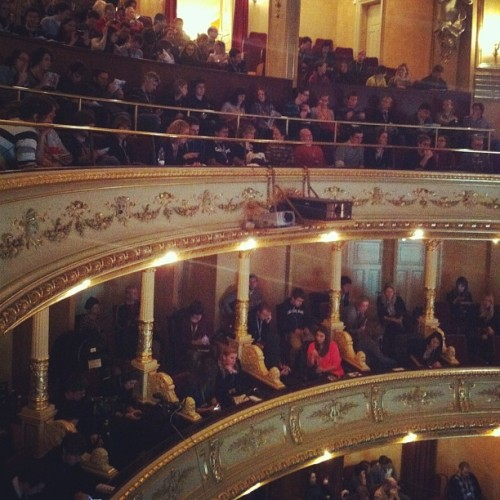
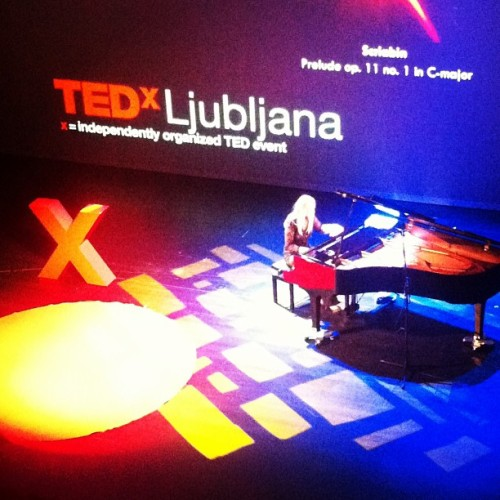

\[caption id="" align="alignnone" width="500"] A full opera house\[/caption]

On Sunday the [Ljubljana Opera House](<http://maps.google.com/maps?ll=46.0526333333,14.5008361111&spn=0.01,0.01&q=46.0526333333,14.5008361111 (Slovene%20National%20Opera%20and%20Ballet%20Theatre)&t=h> "Slovene National Opera and Ballet Theatre") came to life. Dress code casual, still more men in dress shirts than usual, no women in gala dresses. Plenty of make up to go around. Almost nobody in sneakers.

That's what happens when TEDxLjubljana is put in the opera house. Can't put on just anything to go there, feels wrong ...

And what an event it was!

Imagine a jam packed historical building, nearly six hundred people lucky enough to get their tickets in the minute or two it took for the tickets to run out. All of Ljubljana was there. Like something out of an old novel, where "the town society" gathers, acquaintances rekindled, old friendships affirmed, new ones formed. A sea of people, familiar faces popping out to say hello every couple of minutes.

Taking a breath before rushing for the free food was a grave mistake - šmorn ran out quicker than an English speaker could figure out how to pronounce the word!

I think my favourite talk was the surprise music performance by Saška Vipotnik, who performed an unplugged version of some Neomi songs. Turns out I really like their music and her voice, who knew!

Another talk that sticks to mind explained [classical music](http://en.wikipedia.org/wiki/Classical_music "Classical music"); it should really be called classy music because that's what it is. Classy and sometimes very modern ... must admit I don't really know what the talk was about, but I really liked the [grand piano](http://en.wikipedia.org/wiki/Piano "Piano") intermezzos Ana Šinkovec used to give examples for what she's talking about.

Don't think I've had the chance to hear a grand piano playing live before.

\[caption id="" align="alignright" width="350"] Ana Šinkovec playing the piano\[/caption]

Two talks contend for the title of best talk at the event, I think. One was [Ernesto Sirolli's Shut up and listen](http://www.ted.com/talks/ernesto_sirolli_want_to_help_someone_shut_up_and_listen.html) that we watched on the big screen, the other was about wolves. I'm not sure Miha Krofel had a bigger point or some agenda behind his words, but I was completely enthralled by everything that he said.

Wolves are amazing creatures, there's more of them practically in my back yard than I could ever imagine and they lead amazing lives. Did you know wolf packs in Slovenia have recognizable names and territories? That was really fascinating to me. He even showed us a map!

The wolf talk was a wonderful example of simply educating people without pushing an agenda or _The Point._Let everyone draw their own point or agenda now that they know what's going on. Very refreshing for a [TED talk](http://www.ted.com "TED (conference)").

Oh and, just so you know, wolves won't attack humans, or at least this particular researcher, even when they feel threatened.

All in all a magnificent event and I once again feel a fire burning right under my arse. Half of those speakers with awesome stories were my age!

###### Related articles

- [TEDx Ljubljana 2012](http://www.tablix.org/~avian/blog/archives/2012/12/tedx_ljubljana_2012/)
- [When we began promoting the idea last spring to our...](http://blog.tedx.com/post/37794863200/when-we-began-promoting-the-idea-last-spring-to)
- [Global phenomenon TEDx to hit Central Queensland](http://blogs.abc.net.au/queensland/2012/11/global-phenomenon-tedx-to-hit-central-queensland.html)
- [Christmas Lights galore - Ljubljana, Slovenia](http://blog.travelpod.com/travel-blog-entries/gemsandmalc/1/1355516529/tpod.html)

