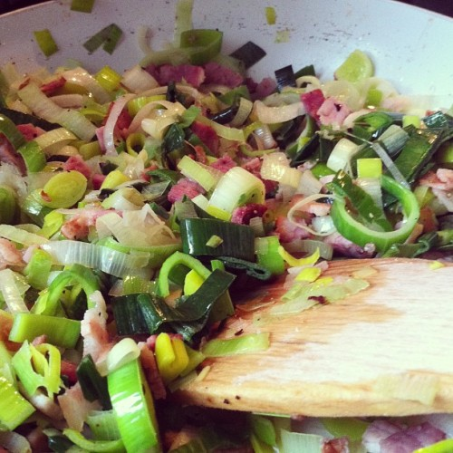
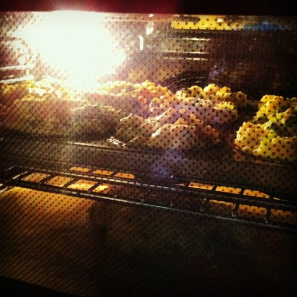

\[caption id="" align="alignnone" width="500"] BaconDoomsday [muffins](http://en.wikipedia.org/wiki/Muffin "Muffin")\[/caption]


Yesterday was doomsday. It didn't go to plan so we're still here. Hooray! \\o/


To celebrate doomsday we had a party with a bunch of mates last night, there was a geeky guaranteed-to-be-random double blind secret santa and food. Not a lot of food because the party was organised by guys, but food nonetheless.


Since I don't really eat sugar anymore I took it upon myself to bring something awesome instead. The only appropriate doomsday food I could think of were Bacon Muffins.


The original recipe is from [_Kitchen trial and Error_](http://kitchentrialanderror.blogspot.com/2011/04/mini-bacon-scallion-corn-muffins-with.html), found via Gojee. Despite or (maybe because of) some adjustments the muffins came out really good. The whole batch was gone before I managed to take my coat off. Should've made two batches, but alas at such low speeds time isn't stretchy.


My only fail was that I used too much [baking powder](http://en.wikipedia.org/wiki/Baking_powder "Baking powder") so the muffins were too crumbly and left a bit of an after taste. I'll know for next time!

## BaconDoomsday Muffins

\[caption id="" align="alignnone" width="500"] Bacon+leek\[/caption]


To make doomsday muffins you're going to need about an hour, a skillet, two big bowls and a strong right arm if you're too lazy to clean the kitchen power tool - Mr. Mixer.


Makes 12 muffins and a blob.


Ingredients:

```
6 slices bacon
1 leek
2 cups all purpose flour
1 cup cornmeal
1.5 teaspoons baking powder (I used a whole bag, that was too much)
1 teaspoon baking soda
0.5 teaspoon salt
2 eggs
0.25 cup sugar
1 cup butter (makes a quarter cup when melted)
0.75 cup sour cream (one small 180g cream was perfect)
0.5 cup milk
1.5 cups shredded edam cheese - any soft cheese will do
```

The original recipe asks for scallions, but my local store didn't carry them, leeks were a solid replacement. Onions wouldn't be pretty enough without the green bits. I also replace cheddar with edam cheese for similar reasons.


Not sure what the sugar is doing there, I used half the amount from the original recipe and probably won't use any at all next time.

1. Cut the bacon into strips and fry on a skillet. Don't use any oil to do this, there's enough in the bacon. Add thinly sliced leek (leaves and all) and warm it through once your kitchen smells like delicious bacon heaven. Sprinkle with a bit of salt and pepper
2. Preheat your oven to 200 celsius (use the fan if you have it). Liberally apply butter to the muffin pan with your fingers. Use plenty or they'll stick.
3. Take a big bowl and mix the flour, cornmeal, salt baking soda and baking powder in a big bowl. This is where everything will end up in, so do make it a big bowl.
4. In another bowl scramble the eggs, add the sugar and mix it together nicely. Use a microwave to melt the butter, then whisk it into the sugar egg mix in thirds. Add half the sour cream and milk and mix until consistent. Then add the rest of the sour cream and milk and mix again until the fluid is consistent. Now it's time to add the bacon mix and the cheese.
5. Flop the wet ingredient mix into your dry ingredients and stir together until no dry patches remain. This will produce a very pasty batter with glue-like consistency
6. Put into the pan. Keep in mind these muffins aren't growers like usual so fill the models right up.
7. Bake for about 12 minutes - until the muffins are light brown. Let cool for 5 minutes and pry them out with a cutlery knife.

And there you go, delicious doomsday muffins! The recipe sounds complicated written out, but I assure you it's pretty simple ... just keep an iPad or something for reference while cooking.


\[caption id="" align="alignnone" width="500"] In the oven\[/caption]


###### Related articles

- [](http://apronsandcammies.wordpress.com/2012/12/17/banana-nut-muffins/)[Banana Nut Muffins](http://apronsandcammies.wordpress.com/2012/12/17/banana-nut-muffins/)
- [](http://thesuburbansoapbox.com/2012/10/21/bacon-and-cheddar-corn-bread-muffins/)[Bacon and Cheddar Corn Bread Muffins](http://thesuburbansoapbox.com/2012/10/21/bacon-and-cheddar-corn-bread-muffins/)
- [](http://familyrecipebooks.wordpress.com/2012/12/06/bran-muffins/)[Bran Muffins](http://familyrecipebooks.wordpress.com/2012/12/06/bran-muffins/)
- [](http://cookingatzerodegrees.wordpress.com/2012/12/21/christmas-morning-muffins/)[Christmas Morning Muffins](http://cookingatzerodegrees.wordpress.com/2012/12/21/christmas-morning-muffins/)
- [](http://www.foodiecitymom.com/apple-muffins-recipe/)[Awesome Applesauce Apple Muffins Recipe](http://www.foodiecitymom.com/apple-muffins-recipe/)

[](http://www.zemanta.com/?px "Enhanced by Zemanta")