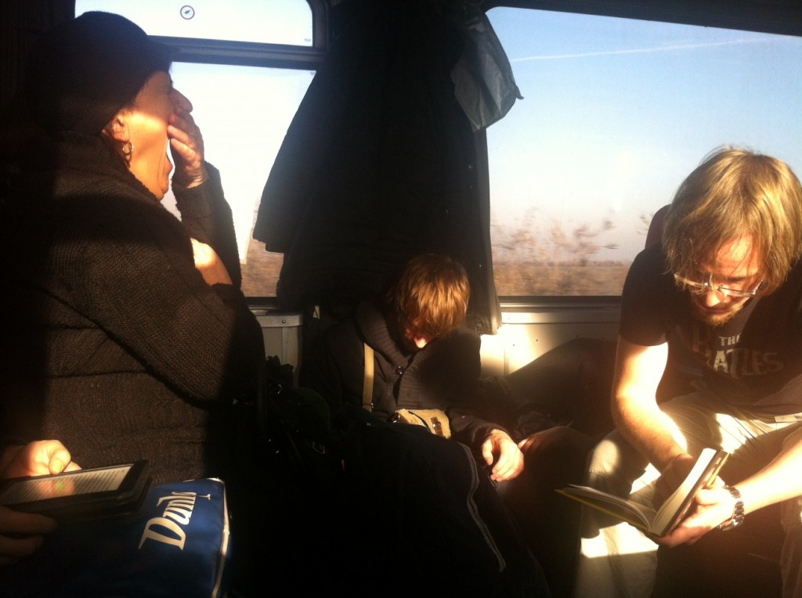
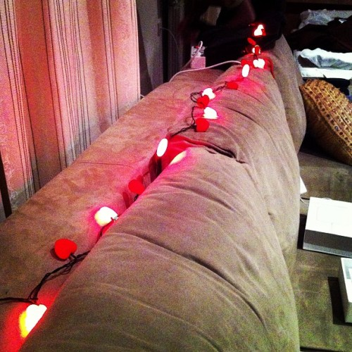
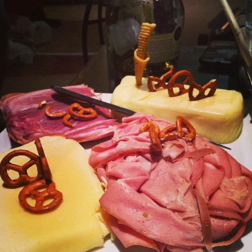
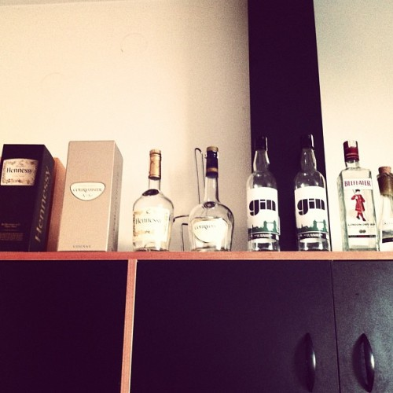
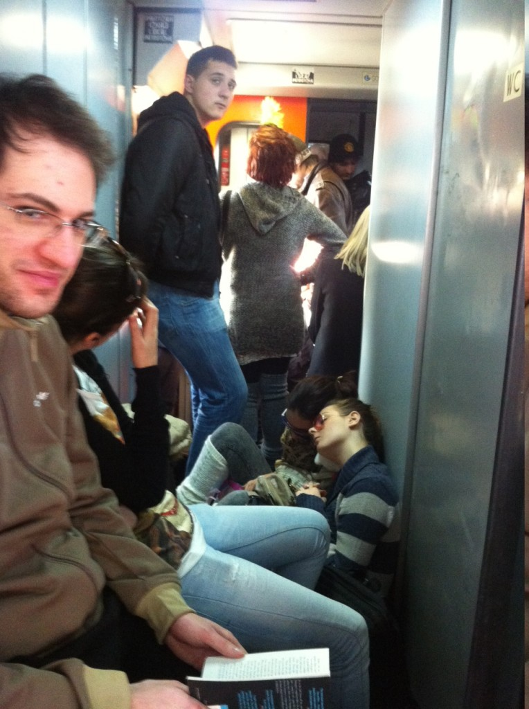

Last Friday I woke up ungodly early, groggily half slept through my morning workout, stuffed the electronics into my backpack, hopped on the longboard and rushed off to the train station.

Sweat trickling down my back despite sub-zero weather, I did not miss the train.

The six of us commandeered a compartment and rode to Belgrade like kings. Bored out of our minds kings. About ten hours later, we were already in a lovely apartment in downtown Belgrade, about two minutes from the main square by foot. Smack in the middle of [Knez Mihailova](<http://maps.google.com/maps?ll=44.8177777778,20.4569444444&spn=0.01,0.01&q=44.8177777778,20.4569444444 (Prince%20Michael%20Street)&t=h> "Prince Michael Street") street - the main shopping/pedestrian district.

At 15 euro per night, I think we got a pretty sweet deal. I've paid more for run down hostels ...

In fact, the apartment was so awesome, most of our partying happened there. After we started sipping the gin and cognac each evening with plans on going out later, we never quite made it out.

\[caption id="" align="alignnone" width="500"] Bought heart-shaped lights at local street market for 2 euro. Atmosphere!\[/caption]

Okay that's a lie, on Sunday we tried to go out but by the time we remembered we're in a foreign city and came there to party it was already way past midnight and we couldn't find anything open so we headed back home. Only to be snagged by the tiny bar next door that had officially closed four hours ago.

A few hours of banter and booze with the owner and his friends later we collapsed into bed.

[New Year's Eve](http://en.wikipedia.org/wiki/New_Year%27s_Eve "New Year's Eve") was off to a similar start.

Around 7pm I found myself wondering if we'd even remember to party. Everyone was taking a nap you see. Everyone except me and a dude reading books on his iPad. We were both half asleep as well. It was looking quite grim.

Luckily after an hour or two everyone suddenly woke up and the festivities could begin.

Before we knew it, somebody jumped up _"Guys! Midnight is in five minutes!"_Scrambling to put our coats on we ran down the stairs and into a very precarious lift. I missed the countdown by just a few seconds even though the big clock said it was another minute to midnight.

\[caption id="" align="alignnone" width="500"] Best looking festive food ever\[/caption]

That was odd. I don't remember seeing the fireworks either, but I'm told they were very disappointing. Boom. Boom. Splash. Over.

Five minutes after midnight we were already stuck in the lift. The bloody thing decided we were too heavy this time 'round and stopped mid floor. One of the guys bit the bullet and ran up the stairs while the rest of us rode the lift.

Through one of the windows you could see a thick lift wire stitched together with some duct tape, through the other the guy was zooming past us on every floor at exactly the lift's pace. Yes, it was a very old and scary lift. Stepping out you could look down through the gap to see all the way to the basement. The gap was about 2cm wide.

Around 2am we wound up at a club. Located in the basement of an apartment building the sound was surprisingly good and the music was magnificent. Shame about all the smoke and feeling like an ashtray when you get back home ... but that's Serbia, they still smoke inside and pretty much everywhere.

\[caption id="" align="alignnone" width="500"] Good bye Belgrade\[/caption]

Tuesday was spent nurturing our hang overs with a combination of food, waiting it out and the "Vitaminska Bomba" shake at our favourite restaurant [Via Del Gusto](https://foursquare.com/v/via-del-gusto/4dfd4d4c18a8eee4fe3ff936). Yes, we had a favourite restaurant and I am the foursquare mayor for the time being.

We also found out seven people got stabbed in the festivities at one of the squares ... makes me kind of happy we didn't go out much on account of the cold.

All in all, [Belgrad](<http://maps.google.com/maps?ll=44.8205555556,20.4622222222&spn=0.1,0.1&q=44.8205555556,20.4622222222 (Belgrade)&t=h> "Belgrade")e was super fun. When we weren't partying we were touristing around town. Saw stuff like [Skadarlija](<http://maps.google.com/maps?ll=44.8178,20.4643&spn=0.01,0.01&q=44.8178,20.4643 (Skadarlija)&t=h> "Skadarlija") street - the bohemian district - Tito's grave and a collection of the best youth relay batons he received (out of a total of 22k). Kalamegdan fortress was pretty cool as well, I only got to see it at night when I visited this summer and we saw a magnificent church thingy ([temple of saint Sava](http://en.wikipedia.org/wiki/Temple_of_Saint_Sava)) with room for 800 singers and 12,000 people. Seems to be in the midst of renovations so it was pretty barren inside.

Very surprised Serbs were still building churches that big in 1985. Explains all the concrete ...

This post would not be complete without mentioning the train ride back.

\[caption id="attachment_5807" align="alignright" width="366"] A packed train from Belgrade\[/caption]

At the Belgrade station we were surprised to discover four carriages were deemed enough for a train from Belgrade to Zurich. Then we discovered there were no compartments. Then we realised all the seats were full. Then we realised most of the standing area was full as well.

Lovely.

After two hours of sitting on the air conditioning vent a seat cleared up and we could share it between six people. I relocated to sitting on a bag for some reason.

Then the train sped off from the station. A river of urine and ... stuff ... poured out of the toilet and into the passenger compartment.

I was reduced to standing.

In Zagreb, some six or seven hours after departure, I could finally sit down. By now I was so knackered I couldn't even continue writing. Getting lost in writing the book was my only reprieve from that train.

I typed 981 words. Most of it using my thumbs on the touch keyboard.

12 iPhone screens of text felt a lot more productive ...

###### Related articles

- [7 Stabbed at Belgrade New Year Celebration](http://www.novinite.com/view_news.php?id=146478)
- [the Dorchol chronicles V: this is no Hollywood](http://arebelwithacause.org/2012/12/24/dorchol-chronicles-v/)
- [Belgrade Prepares To End 2012 With A Bang](http://www.eurasiareview.com/31122012-belgrade-prepares-to-end-2012-with-a-bang/)
- [Belgrade for the holidays](http://belgradestreets.wordpress.com/2012/12/18/4481/)

