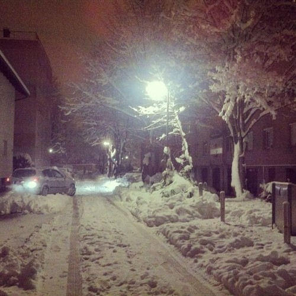

Two days ago I got sick. Nothing major, just a bit of fever and some coughing. Plus a generally lazy disposition, that's the most annoying part. Strange thing is, I can tell you exactly when it happened. \[caption id="" align="alignnone" width="500"] Winter wonderland\[/caption] On Monday I had to take out the trash. As a proper bloke, I didn't really put any clothes on other than adding a scarf to my attire of shorts and a sweater. Cold started nipping at me the moment I stepped out the door. I had made a huge mistake. It was about two degrees below freezing, but hey, I'm just taking out the trash, this won't take long. But there was fresh [snowfall](http://en.wikipedia.org/wiki/Snow "Snow"). Everything was so pretty. I just stood there. Watching, observing. Feeling heat escaping through my back, the uncovered part of my legs feeling very chilly indeed. But I just stood there and took a couple of photos. I love fresh snow. Before plows get to it. Before it turns into that disgusting brown muck. When I got back inside, I could feel a slight tingling in my chest. Just a hint of a brewing cough. I ignored it. Next day I had a coffee meet. Slipped my feet in the still wet shoes from yesterday's trash excursion - longboards eat shoes, make holes and I hate buying shoes - and hopped in a cold car. The steering wheel was so cold my hands hurt when I was driving. They didn't feel cold, they just _hurt_. Parked too far away. Walked through salty melting snow just long enough for my shoes to get proper wet ... by the time I got back home my feet had been freezing in wet shoes for almost two hours. Oops. I got back to work. It was going great. An hour later I start feeling cold. What the hell? I spend my winters turning down the heat and here I am, sitting not half a meter from the radiator, feeling like I'm freezing to death. Strangely so, I'm almost never cold and I often spend winters turning down the heat because it gets too hot inside. I was practically freezing. Then I noticed my brain starting to slow down. I was staring at code. Emacs glaring back at me, the blinking cursor just sitting there. Mocking me. Daring me to do something. And we started at each other. Two minutes. Five minutes. Ten minutes ... for the life of me I couldn't decide what I wanted to do. I was supposed to be [refactoring](http://en.wikipedia.org/wiki/Code_refactoring "Code refactoring"), making code prettier and easier to follow. Instead I just stared at the same piece of code and couldn't decide what I wanted to do to it. After a while I gave up and called it a day. Wrapped myself in a bunch of clothes, a duvet and a blanket. I was still freezing. Next day I woke up with a fever and the mother of all headaches. But I had to finish last night's work ... one of the problems of refactoring things touching a whole codebase is you have to finish, otherwise other people on the team can't get any work done. Luckily, we live in modern times! When the Daleron Cold 3 kicked in, I was fresh as a flower. Brain completely clear, fever all gone, not a hint of headache and I was getting work done like there was no tomorrow. It was amazing. \[tweet https&#x3A;//twitter.com/Swizec/status/291526183013732353] When it comes to light colds and silly viruses, Daleron is probably the best invention ever. Modern times are _awesome._ So much for the whole _"A cold lasts a week unmedicated and 7 days when medicated"_ nonsense, Daleron clears that shit up in an hour :D PS: the guy [did actually get an award](http://en.wikipedia.org/wiki/Harmon_Northrop_Morse)

###### Related articles

- [How to tell a cold from the flu](http://www.wfaa.com/news/health/How-to-tell-a-cold-from-the-flu-186353402.html)
- [Welcome to our Snowbank - or - What to Do For Fun When it is -20 Degrees Outside](http://www.tarasviewoftheworld.com/2013/01/welcome-to-our-snowbank-or-what-to-do.html)
- [Why refactoring?](http://brunopedro.com/2012/12/18/why-refactoring/)

