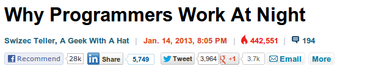

Eight days ago I get an email from a nice lady saying _"Hey I came across your blog and was wondering if you would let us syndicate it on our site? Why programmers work at night would be the first post."_

\[caption id="attachment_5888" align="alignnone" width="629"] Baffled. Completely\[/caption]

Her email said nice_lady@businessinsider.com ... why I looked at her email and not her 20 line signature I don't know.

Okay, so that's kinda cool. [Business Insider](http://www.businessinsider.com "Business Insider") is a bit of a big deal and I'm writing a book about this stuff ... _"Sure, you can syndicate, if you link to my book."_

Bam. Swizec featured on Business Insider. Now I can die happy. Maybe.

But it doesn't end there. Ever so slowly the article started picking up speed, it was seen by 30,000 people the first day, when I looked again two days later it was 200,000 and the damn thing breached 400k sometime yesterday.

\[tweet https&#x3A;//twitter.com/Swizec/status/293394762520731648]

Right now it's at **442,000**views ... I just ... I have no idea what's going on. I wrote that essay a year ago, I was a bit in a hurry, it isn't very well thought out and the writing is atrocious. It took me a while to accept the huge traffic the first three days, eventually I even stopped being crushed by the immensity every time I tried to write something ... but this is just getting silly.

In a whole year of collecting dust on my blog the article attracted 290,380 pageviews, add the 442,551 from Business Insider and that's some **732 _thousand_** people reading something I wrote. There are no words.

Well okay, there are the four hundred or so words I'm writing in this post, but there are literally no words.

Since the business insider incident, plenty of peopole have been asking me if they can repost in this or that publication. I grant permission to all. It's even gotten as far as some big name [New Zealand](<http://maps.google.com/maps?ll=-41.2833333333,174.45&spn=10.0,10.0&q=-41.2833333333,174.45 (New%20Zealand)&t=h> "New Zealand") IT professionals website. And the other day a guy used me as a reference to write a cool article about _[measuring](http://blog.ninlabs.com/2013/01/programmer-interrupted/)_[the effect of interruptions on programmers](http://blog.ninlabs.com/2013/01/programmer-interrupted/).

I need to write him an email actually, knew I forgot to do something last night.

There is one very good thing that's come of all this however -> record book sales! I'm up to $999.71 for this month. Hooray \\o/

Anyway, the biggest and most vocal feedback I got for the Business Insider post is that I am pissing off the internet by stealing [XKCD](http://xkcd.com/ "Xkcd") and I should not do that if I value my inbox. After explaining the story a bazillionth time I finally broke down, cried a bit, sent an email to the editor and got them to fix the attribution.

Why they thought I could draw such an awesome comic is beyond me.

###### Related articles

- [XKCD Continues Being Genius](http://coltmonday.wordpress.com/2013/01/22/xkcd-contintues-being-genius/)
- [Why programmers work at night: "Being tired makes us better coders"](http://www.whiteboardmag.com/why-programmers-work-at-night-being-tired-makes-us-better-coders/)
- [Why Programmers Work At Night](http://danlargo.com/2013/01/16/why-programmers-work-at-night/)
- [New York town baffled by fruit-throwing vandal who has damaged over a dozen cars](http://www.foxnews.com/us/2013/01/21/new-york-town-baffled-by-fruit-throwing-vandal-who-has-damaged-over-dozen-cars/)

