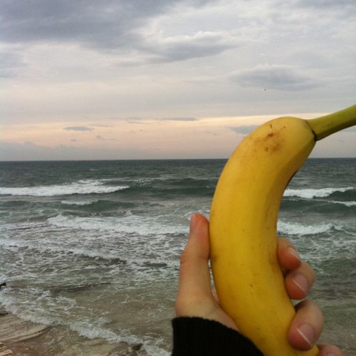
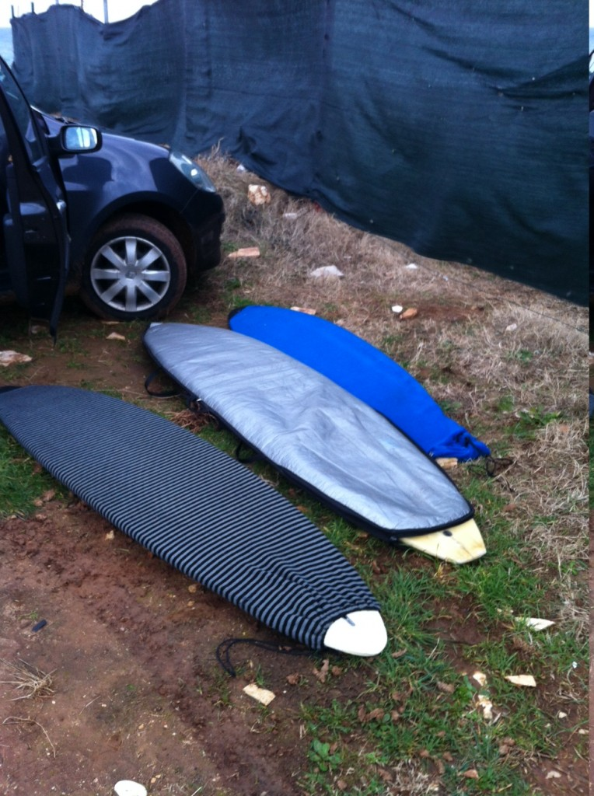
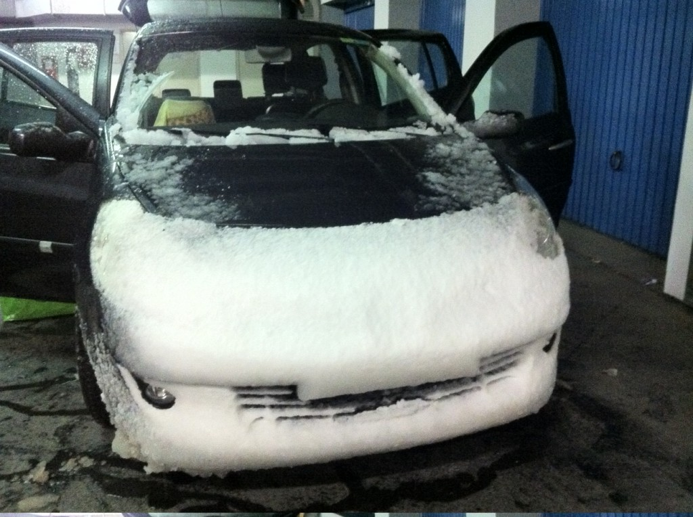

Late Friday afternoon two of my mates, @zidarsk8 and [@smotko](http://twitter.com/smotko), start talking about a Saturday [surfing](http://en.wikipedia.org/wiki/Surfing "Surfing") trip to the cold windy waters of [Medulin](<http://maps.google.com/maps?ll=44.8219444444,13.935&spn=0.1,0.1&q=44.8219444444,13.935 (Medulin)&t=h> "Medulin"), [Croatia](<http://maps.google.com/maps?ll=45.8,16.0&spn=10.0,10.0&q=45.8,16.0 (Croatia)&t=h> "Croatia"). They invite me along.

What the hell, I might as well go, been meaning to try surfing ever since I was in the US with [@zidarsk8](https://twitter.com/zidarsk8) in 2011. _Sure, I'll go!_

_Okay, we pick you up at 5am. Bring a towel and some sammiches._

I regretted the decision immediately.

> this is a perfect beginner spot /sarcasm
>
>
>
> chopy [waves](http://en.wikipedia.org/wiki/Wave "Wave") and sharp rocks and strong onshore. The good thing about this is, if you liked this, then it can only get better, because these were the least surfable waves you'll ever see, probably.
>
>
>
> ~ @zidarsk8, the next day

Later that night we talked about just how cold the water would be, how fun putting on a wet wetsuit would be in winds that make your knees shake when you've got a bazillion layers on and just how treacherous Medulin is for surfing - sharp rocks, current towards even sharper rocks, crap waves.

At this point I was 90% committed to chickening out.

As if by a miracle, I woke up at 4:55am. _Whyyyyyy am I doing this!? What the fuck is wrong with me!_ I tweeted that I'm chickening out.

But fuck it, I just couldn't let this go. Chickening out now, I'd never hear the end of it; and poor @zidarsk8 was running around [Ljubljana](<http://maps.google.com/maps?ll=46.0555555556,14.5083333333&spn=0.1,0.1&q=46.0555555556,14.5083333333 (Ljubljana)&t=h> "Ljubljana") until midnight to collect all the gear for me - surfboard, wetsuit, everything. Ten minutes later we were on the road.

Medulin.

\[caption id="" align="alignnone" width="500"] Banana for scale\[/caption]

There were waves! Scary rocks! No sun. Mud. _Cooooold_. Hopping out of the car I wouldn't be getting dressed quicker if there was a gun to my head! T-shirt, long-sleeve shirt, hoodie, winter coat, scarf, wool hat, hood. Still shivering.

Next time I saw my balls was Sunday morning. That's how cold it was.

Then the fun begins.

Amidst all this cold, you have to start undressing. Completely undressing. The only thing you can have on under a wetsuit is a pair of swim trunks ... or better yet, nothing. But I sure as hell wasn't going to be naked in some other dude's wetsuit.

As every fiber in your body **_SCREAMS_** at you in panic, you step into the water. An instinctive chill. Your whole body shudders.

Although, hey, this ain't so bad! This wetsuit stuff actually works. This is less bad than getting into the soup-like water during summer when it feels like you're about to freeze to death as you step in.

This is all right!

\[caption id="attachment_5940" align="alignnone" width="717"] Better view of the Medulin swell\[/caption]

Bravely I waddled into the tiny waves. It was all right. Everything is going to be okay. I'm already having fun!

The surfboard is a floatation device anyway, what could possibly go wrong?

I flop myself on the board and the absolutely tiniest of waves washes me off like a snowflake. I try again. The board wobbles and dances. Somehow I stay on.

_What, I'm supposed to paddle this thing? Through walls of water!? Just to get to the lineup? You must be daft, sir!_

The more I paddled, the less happened. Every wave was an insurmountable obstacle. Sometimes I'd get washed off to the side. Sometimes simply flipped over on my back and the surfboard would go boink against my head.

Fun times!

Sure, the swell was just half a meter. But when you're lying face down in the water, at the low point of a wave, there's a meter of water towering above your head. Just waiting to drown you. To pounce on the hapless victim stupid enough to dare nature.

It gets worse once you consider the water was _extremely_ choppy. That means waves in superposition. Two waves at once. More than a meter of water above your head ...

... it really does feel like a mountain was attacking you. Promise!

\[caption id="attachment_5942" align="alignnone" width="535"] Surfboards, mine was the middle\[/caption]

Eventually the waves calmed down, I sort of learned how to paddle, I almost learned how to sit on the board and wait for waves. There was no need to tow me around anymore. It was time to catch some waves.

Impossible.

Every single time I tried, the wave would simply outrace me. Paddle like a maniac, nose pointing down the slope of a wave. Yes, yes, I'm going to win! Woosh, the foam passes you. Your board points at the sky and you know you've lost. All that effort and now you have to turn around to paddle out to the lineup again.

Got a bit of help two times, got pushed into the wave a bit. That was the wildest ride of my lifeI Whooooosh and you're racing towards the shore! The wobbly bucking board suddenly completely still. You think about standing up. You're having so much fun you forget.

Before you know it, you're in ankle high water again and it's time to paddle back out in hopes of another ride.

Surfing, it sounds crazy, it sounds insane ... especially the part about putting on wet [wetsuits](http://en.wikipedia.org/wiki/Wetsuit "Wetsuit") in weather that makes you dream of a warm fireplace ... but it's possibly the most fun you can have with your clothes on!

I was hungover from exhaustion all Sunday.

Can't wait to do it again!

\[caption id="attachment_5943" align="alignnone" width="717"] We drove back through a snow storm, _with thunder_!\[/caption]

###### Related articles

- [R2-D2 and Walking Dead Surfboards Look Gnarly, Dude](http://technabob.com/blog/2013/01/22/r2-d2-walking-dead-surfboards/)
- [How To Learn To Surf](http://www.essentialtravel.co.uk/magazine/how-to/learn-to-surf.asp)
- [Surfer sets record at Huntington's Pier Paddle](http://www.ocregister.com/articles/event-479084-paddle-year.html)
- [Why I love surfing](http://www.ronnestam.com/why-i-love-surfing/)
- [cold water winter wetsuits for surfing](http://lunasurfshop.wordpress.com/2013/01/18/cold-water-wetsuits-for-surfing/)

