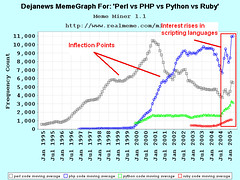

When [Rails](http://rubyonrails.org "Ruby on Rails") first came out, I was still a [PHP](http://www.php.net "PHP") guy. Slaving away at a web agency, pushing out website after website and letting designers have all the fun.

At the time I didn't even notice Rails existed.

When news of [Ruby](http://www.ruby-lang.org/ "Ruby (programming language)") and Rails finally did reach me, I was fully immersed in [Python](http://www.python.org/ "Python (programming language)") and [Django](http://www.djangoproject.com "Django (Web framework)"). I scoffed at the idea of anything being better. Them silly Ruby people, why on earth would I play with their toys when I can use a _real_ language such as Python?

Eventually I started loving the speed and flexibility of Javascript and particularly [node.js](http://nodejs.org/ "Node.js"). Django lay almost forgotten, Rails was that weird thing _those other people_ use. The idea of learning Rails did not cross my mind.

In part because node.js was really buzzing at the time (around version 0.3.x I think), in part because by then a lot of the big names in the startup world started abandoning Rails in favour of faster executing environments.

What really attracted me to node.js was the blistering speed of execution and the fact it was the new kid on the block. That exciting new thing everyone's looking at. _Of course_ you're going to learn node if you're going to look at a new tech stack.

Just like these days you'd probably look at Go or Scala if you were going to learn a completely new way of making web apps.

## A Javascripter starts using Rails

A few weeks ago somebody calls me up and says _"Hey, you seem to have a grasp on automated testing. Want to help us write tests for our Rails app?"_

_"Uh, sure, but I've never even looked at Rails before ..."_

_"No problem, I started the project off with zero Rails experience too. You'll figure it out."_

In stark contrast to how programmers are hired these days, somebody was willing to use a generalist instead of holding out for a specialist. Bloody awesome, if you ask me!

And so I was thrown into the dizzying world of Ruby and Rails and a whole new ecosystem of stuff that is completely beyond my comprehension.

## The really cool things

What struck me when I first saw Ruby code was just how readable it is. Even though I was looking at the language for the first time in my life, I could understand what everything is doing. I could follow the code and decide what tests need to be written.

Although a lot of the syntax is confusing - what's with all the colons? - I like the fact you can execute functions without using parentheses. As with [Haskell](http://haskell.org "Haskell (programming language)"), this often makes code more readable, but unlike Haskell can be very confusing when you're trying to discern functions from variables.

\[caption id="" align="alignright" width="240"] rails in de sneeuw (Photo credit: Gerard Stolk (vers le Carême))\[/caption]

I also like the truthyness test by just appending a question mark to a variable/property/thing.

Rails has _amazing_ support for writing tests. While Django makes it easy to write a bunch of unit tests and go so far as integration testing by calling the HTTP interface as a real browser would, Rails goes a step further by making it dead simple to test a real user's interaction with your website ... although I think that might actually be Capybara and not vanilla Rails.

Another thing I really like is that Rails is opinionated. Or maybe that's just the impression I got. Either way, it's a lot more mature than the node.js ecosystem so it is usually very easy to decide what library to use to do something. You pick Rails and you get this whole package of _stuff_.

Conversely, the most popular (perhaps even best) framework in the node.js ecosystem - express.js - can't even decide what template engine to use. Database? Ha, you're on your own, kid. Testing? Pick any of a million different testing libraries - you're on your own.

This happens a lot in Javascript. The whole ecosystem treats opinions as they were a bad thing. Freedom and the related paradox of choice run rampant.

## Things that suck

Ruby's most powerful feature - meta programming and the whole [domain specific language](http://en.wikipedia.org/wiki/Domain-specific_language "Domain-specific language") shebang, is also the most annoying for a beginner.

The project I'm working on just ... works. I have no idea where dependencies are coming from, I can't tell which gem file a function I'm calling is defined in and most of the time I am completely at a loss as to what is actually going on.

It's getting better, slowly.

\[caption id="" align="alignright" width="240"] Dejanews MemeGraph For: 'Perl vs PHP vs Python vs Ruby' (Photo credit: Premshree Pillai)\[/caption]

So far I've always been used to explicitly defining \\imports, explicitly calling a function from this library or that. You never do _\\import \*_ and yet with Ruby, that's all you get. _Everything_ is an \\import \* and more often than not, it redefines the behaviour of the language itself.

As such, I have no idea whether I'm learning how to use Rails, Ruby or any of the 30 something gems the project depends on. It's all rather confusing.

But what really ticks me off about Rails, or Ruby, possibly both, is just how _slow_ the whole thing is! It runs well once it gets going, but what the hell is it doing in those 5+ seconds it takes to warm up to a functioning state? Mindboggling.

Maybe node.js just spoiled me.

## Fin

All in all, I have to say I've grown quite fond of Rails. I love how simple it is to get started as a complete newbie and all the powerful tools are already giving me ideas for what I'm missing in node.js

Just a matter of finding some time to start bringing some of the cool concepts into node.js. Right now I doubt I'll be making a full switch to Rails any time soon.

###### Related articles

- [Ruby on Rails Receives the Third Security Patch in Less Than a Month](http://www.cio.com/article/727806/Ruby_on_Rails_Receives_the_Third_Security_Patch_in_Less_Than_a_Month?source=rss_security)
- [Forcing myself to learn RoR](http://blog.daemonl.com/2013/02/forcing-myself-to-learn-ror.html)
- [Node.js Hatred Reveals Significant Dysfunction In The Ruby Culture](http://gilesbowkett.blogspot.com/2013/02/nodejs-hatred-reveals-significant.html)
- [Our First Node.js App: Backbone on the Client and Server](http://nerds.airbnb.com/weve-launched-our-first-nodejs-app-to-product)
- [Why Choose Ruby on Rails](http://thinkinginrails.com/2013/02/why_choose_rails/)

