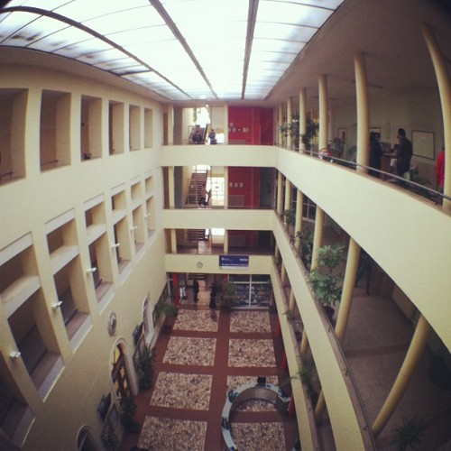
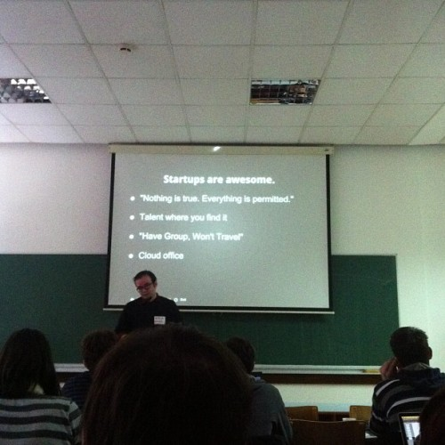
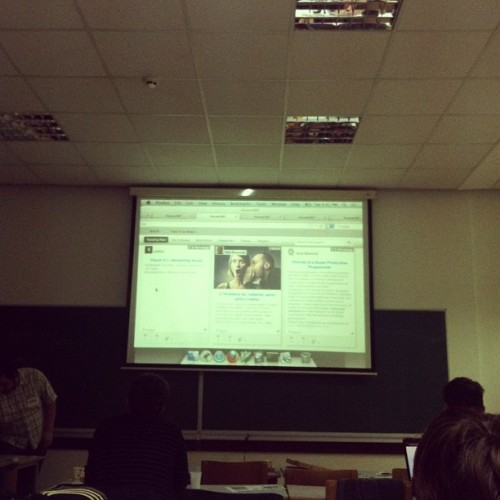
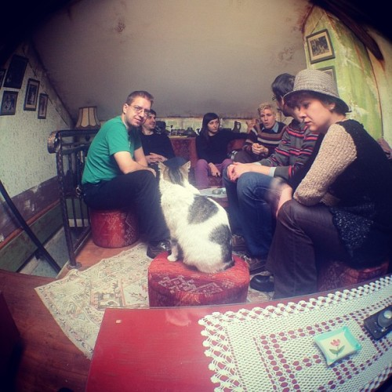

Three days ago Sarajevo saw its first ever Barcamp, organised in just five days. Hat's off to [@sidonath](http://twitter.com/sidonath), [@johnjoseph](http://twitter.com/johnjoseph), [@nesuss](http://twitter.com/nesuss) and [@neshill](http://twitter.com/neshill) for pulling it off! Impressive feat that. \[caption id="" align="alignnone" width="500"] Barcamp Sarajevo Venue\[/caption] The event itself was fantastic, a Barcamp going back to what a Barcamp is supposed to be - a bunch of people getting together, making an impromptu schedule at the event itself, most talks being hastily slapped together at the last minute because speakers still don't know what they'll be talking about before their morning coffee. Or maybe that was just me. Either way, Barcamps I've been to lately have been straying away from this ideal of an almost impromptu sharing of minds. They're becoming too much like full on conferences ... although I'm told it's impossible to have a homely Barcamp environment when 200+ people show up. With less than fifty people the Sarajevo Barcamp was just perfect. Plenty of new people to meet a completely new crowd, while still small enough to be manageable for even the most shy of speakers. Surprisingly few people were nervous however, good job speakers! Your presentations were pretty damn awesome and I had fun sitting in on _all_ of them. A benefit of the single-room format as there were not enough people for two tracks. \[caption id="" align="alignnone" width="500"] In a startup nothing is true\[/caption] The event wasn't very tech centric, so I learned a lot about the startup scene in [Bosnia](<http://maps.google.com/maps?ll=43.8666666667,18.4166666667&spn=10.0,10.0&q=43.8666666667,18.4166666667 (Bosnia%20and%20Herzegovina)&t=h> "Bosnia and Herzegovina") - of which there is more than I expected to be honest. It's looking pretty vibrant actually! We even got to see the launch of a new startup [Forum387](http://forum387.com). They claim it wasn't a launch and their website still asks for a password, but they promised we can start playing with the tech next week. A working product demo _done **live**_at a public event is a launch in my book. Their approach to reviving forum software is pretty intriguing too. Should give [Discourse](http://www.discourse.org/) a run for their money. They even have clients lined up! More than many startups can say for themselves. I also learned that the _unlocking is illegal_ fiasco we've witnessed lately has been long in the works by telephone companies. Way back in the early 50's you were not allowed to install a [hush-a-phone](http://en.wikipedia.org/wiki/Hush-A-Phone_v._United_States "Hush-A-Phone v. United States") on your device, but were advised to use your hand instead. Somehow that's better. \[caption id="" align="alignnone" width="500"] The future of forums\[/caption] The appearence of speaker phones and subsequent lawsuit also set precedent and enshrined in law that we are allowed to connect any device to the network. Making the internet possible! \\0/ And apparently spending 50% of your time working on opensource projects for free means you will never have money problems again. It's also all sorts of rewarding! Personally, I discovered that giving presentations without slides is quite fun. Much more flexible than keeping track of what slide you're on, it's easier to move around the "stage" and jump up and down. Or rather, it feels more necessary and it's something I should be doing anyway. But nobody will remember anything you say, which is a shame. Simple visuals help people remember important facts you wanted to convey. That said, one of the coolest things about this Barcamp was that no talk went without questions. Almost all of them had a discussion going half the length of the talk itself! That's amazing and I think something that only happens when audiences are kept small enough. It was truly an awesome Barcamp, definitely one of my favourites and I've been to many. The fact there was tea available is just icing on the cake. \[caption id="" align="alignnone" width="500"] 7 of us waiting for [Salep](http://en.wikipedia.org/wiki/Salep) with our hosts and a cat in the coziest tea place ever\[/caption]

###### Related articles

-   [Barcamp Omaha Recap: The Grasshopper Buzz team heads to the Mid-West](http://grasshopper.com/blog/2010/11/barcamp-omaha-recap-the-grasshopper-buzz-team-heads-to-the-mid-west/)
-   [This One Time - at Barcamp...](http://grasshopper.com/blog/2011/03/this-one-time-%e2%80%93-at-barcamp%e2%80%a6/)
-   [The World's Largest Barcamp is in Myanmar](http://www.techinasia.com/worlds-largest-barcamp-myanmar/)
-   [OpenCodeCamp - Where the best of HackDays and BarCamps come together](http://cristianobetta.com/blog/2012/05/08/opencodecamp-where-the-best-of-hackdays-and-barcamps-come-together/)

