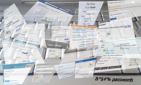

The idea of pass phrases in favour of [passwords](http://en.wikipedia.org/wiki/Password "Password") has intrigued me ever since I read the iconic [XKCD, Password Strength](http://xkcd.com/936/) comic. Munroe's argument goes that conventional wisdom about secure passwords is _stupid_ and _misguided._ Experts tell us to use a password that is at least 8 characters long - exactly a character longer than most humans can comfortably store in short term memory - contains mixed case letters and numbers. \[caption id="" align="alignright" width="300"][, showing SGML markup")](http://commons.wikipedia.org/wiki/File:OED-LEXX-Bungler.jpg) A fragment of the OED (1985), showing SGML markup (Photo credit: Wikipedia)\[/caption] Special characters are a good idea as well, but almost nobody uses them because more often than not services reject them on grounds that ... I don't know, I guess their databases don't support fancy passwords or something. Don't even get me on services with so many password rules the possibility space collapses into, like, 10. These passwords are impossible to remember. Meaning people use simple passwords instead. You're supposed to change your password every few months as well! People don't, because they're too hard to remember. You should use a different password everywhere! People don't, because they're too hard to remember.

## Passwords suck

To make matters worse, "secure" passwords aren't secure at all. An 8 character password considering common [alphanumeric characters](http://en.wikipedia.org/wiki/Alphanumeric "Alphanumeric") people use most often gives you 60^8 combinations. At 1000 guesses per second this is guessable in about 5000 years. Okay, that's impractical. You're better off using a different vector of attack ... like a good wrench to the wrist. Or those stupid security questions. But passwords aren't random sequences of letters! Remember, people can't memorise those. Most often they use a common word and capitalize the first letter, then add a few numbers at the end. Or possibly some numbers at the start. There are just 15,222 6 letter words in the English language, giving enough room to add two numbers. Accounting for capitalizing the first letter that gives us 25^2+15222+10^2 combinations. Guessable in about 15 seconds. Oops. Including common substitions - [1337 sp34k](http://en.wikipedia.org/wiki/Leet "Leet") - gives us a few more combinations and the usual password is guessable in about three days. And that's with a very secure looking password that is almost impossible to remember! Sure, we cheated a bit by using a [dictionary attack](http://en.wikipedia.org/wiki/Dictionary_attack "Dictionary attack"), but hey, anything goes! I'm sure real attackers have even more tricks up their sleeves.

## Pass phrases win

\[caption id="" align="alignright" width="240"] password hell (Photo credit: Ron Bennetts)\[/caption] Take pass phrases on the other hand. Using a combination of three or four [common words](http://en.wikipedia.org/wiki/Most_common_words_in_English "Most common words in English") is something you do every day. Your brain is hard wired to be great at memorising this stuff ... remember all those cool lines you're still referencing from movies made 40 years ago! Three is the number you shall count! The number of the counting shall be three! Khm, yes. The great thing about pass phrases is that they are usually long. Very long. An average english word is about 7 characters long, three words create a password with 21 characters. With a dispersion of 2 characters per word, your password will likely be 15 to 21 letters, adding spaces and you're at 17 to 23. Now, assuming you're using nothing but [lower case letters](http://en.wikipedia.org/wiki/Letter_case "Letter case") and spaces that still gives 26^17 combinations. Guessable in about 3 tera years. That's 3 and 13 zeros. Nobody's guessing that via a character by character attack. Let's look at a dictionary attack then, that saved us before, maybe it will help now. There are 171,476 words in the [Oxford English Dictionary](http://www.amazon.com/Oxford-English-Dictionary-Vols-1-20/dp/0198611862%3FSubscriptionId%3D0G81C5DAZ03ZR9WH9X82%26tag%3Dageewitahat-20%26linkCode%3Dxm2%26camp%3D2025%26creative%3D165953%26creativeASIN%3D0198611862 "The Oxford English Dictionary (20 Volume Set) (Vols 1-20)"). Using just 3 words, any words, gives you 3^171476 combinations. In other words, a dictionary attack at 1000 guesses per second would take so many years the number's got 81,804 digits. Eighty one thousand _digits_. That's longer than the expected death of the universe isn't it? Sure, not all combinations of words make sense, some words are more common than others. The vocabulary of an average college grad measures at about 17,000 words. That still gives you 3^17000 combinations, or an 8100 digit number of years to guess. Without funny symbols. Without numbers. Just simple lowercase words. I'm already switching all my passwords to pass phrases. You should too!

###### Related articles

- [How To Create A Strong Password & Keep Your Social Media Accounts Safe](http://www.simplyzesty.com/social-media/how-to-create-a-strong-password-keep-your-social-media-accounts-safe/)
- [What experts do to stay safe banking or buying online or by mobile](http://www.oregonlive.com/finance/index.ssf/2013/01/what_experts_do_to_stay_safe_w.html)
- [Warning: If You Don't Use a Secure Password, You Are At Risk](http://www.vikitech.com/14327/warning-secure-password-risk)
- [ssh with no password, with ssh-keygen key](http://www.garron.me/bits/ssh-key-keygen-login-no-password.html)
- [Password Security: The need for frequent change](http://radicaltype.wordpress.com/2012/11/30/password-security-the-need-for-frequent-change/)

