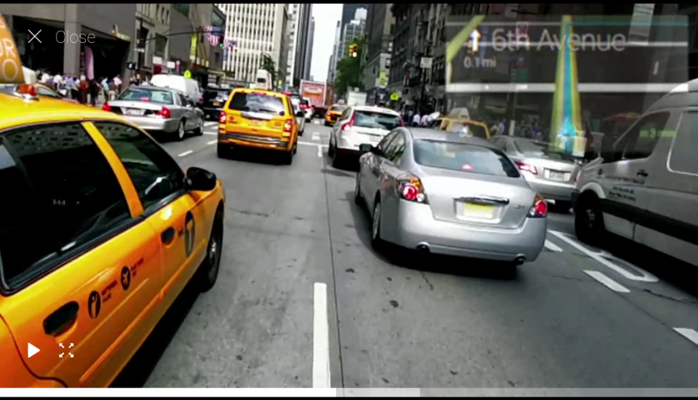
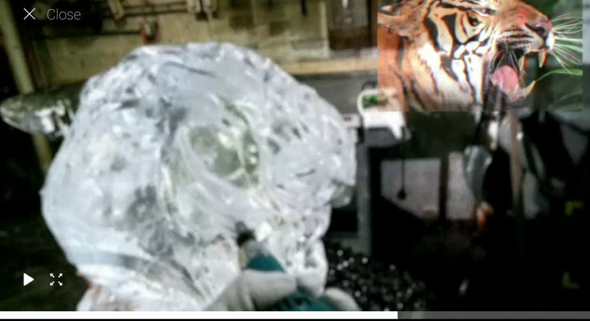

For about a year now [Google](http://google.com "Google") has been teasing us with its [wearable computing](http://en.wikipedia.org/wiki/Wearable_computer "Wearable computer") idea - Glass.

And for just as long, people have been making fun of the concept. Calling it anything from utterly ridiculous, to a despicable invasion into everybody's privacy. The [running joke](http://en.wikipedia.org/wiki/Running_gag "Running gag") on the internet is that you should walk up to anyone wearing Google Glass and shout _"Ok, Glass, google lemon party. Open all."_

Some have gone as far as calling it a useless idea that does nothing more than a [smartphone](http://en.wikipedia.org/wiki/Smartphone "Smartphone") can already do for you.

> No to throw cold water here but Is it really? It seems to be rather trivial integration of currently known and available technologies with bit of miniaturization efforts. Nothing that 5 year old iPhone can't do with albeit more convenience. Space elevators, 100% artificial life form, fusion reactor of the size AA batteries - now that, my friend, would be sci-fi stuff.

Which is just ridiculous, if you ask me. Glass isn't about being annoyed by notifications all day long, or about making calls without a phone (people with bluetooth headphones look ridiculous enough). Hell, Glass is pretty much useless in all but a few cases that Google shows in their [How Glass feels video](http://www.google.com/glass/start/how-it-feels/).

Ugh, life logging. Taking pictures. Remotely sharing moments. Boring.

Here's the stuff that might actually change the world as much as smartphones did a few years ago.

\[caption id="attachment_6036" align="alignnone" width="614"] Directions, while cycling\[/caption]

\[caption id="attachment_6037" align="alignnone" width="614"] Skiing directions\[/caption]

\[caption id="attachment_6038" align="alignnone" width="614"] Artist's reference\[/caption]

_That's_ what Glass is really bringing to the table. The ability to look at things without using your hands. There are countless smartphone zombies out there, walking through town, never looking up from their sci-fi slab of glass.

Sit on a bench some time and observe. Most people are either walking around like zombies, or randomly stopping in the middle of the street to look something up.

It's ridiculous.

## Sports, there's your future

The real advantage, however, will come for sports.

Ever used [Runkeeper](http://www.runkeeper.com/ "RunKeeper") or Strava to log your activity? Running with a smartphone in your pocket is a bit annoying, it keeps flopping about in your pocket and doesn't do a good job of communicating with you. Looking up your current pace, running time or whatever ... it's a pain.

Not only is running while looking down at your phone kind of dangerous, it also hurts your form, the phone is utterly disgusting and covered in sweat by now, and the screen is shaking so much that you can barely see anything without stopping.

Glass might solve that with a good enough app.

The situation becomes even worse when you're, for instance, longboarding.

Here you are, bombing down a hill ... no idea how fast you are going and no way of looking up safely, unless you know the track by heart you have no idea what the next bend is going to be like and so on. There isn't even an app for that because it would be useless, you can't just look at your phone while traveling 50mph down a hill on a thin piece of wood.

I mean you could, but please don't.

\[caption id="attachment_6044" align="alignnone" width="614"] A 3min mockup of the Glass Longboard App\[/caption]

The app I want to build would behave a bit like driving instructions in rally games. In a corner of your vision, neatly packed, information about the next curve, your current speed, possibly suggest good breaking/sliding points. Stuff like that.

That alone would make having Glass totally worth it for me.

And yes, I _would_ do adrenalyne sports with a $1500 piece of tech on my face. Especially if I could fit it on my normal glasses.

###### Related articles

- [What Would I Do #IfIHadGlass?](http://blog.tmcnet.com/social-spotlight/2013/02/what-would-i-do-ifihadglass.html)
- [#ifihadglass, the Things I Would Do...](http://blog.makezine.com/2013/02/22/ifihadglass-the-things-that-i-would-do/)
- [Google expands Glass pre-orders to 'creative individuals' with #ifihadglass competition](http://www.theverge.com/2013/2/20/4006748/google-project-glass-explorer-edition-pre-order)
- [Google Shows Off Google Glass UI And Launches #IfIHadGlass Campaign](http://www.besttechie.com/2013/02/20/google-shows-off-google-glass-ui-and-launches-ifihadglass-campaign/)

