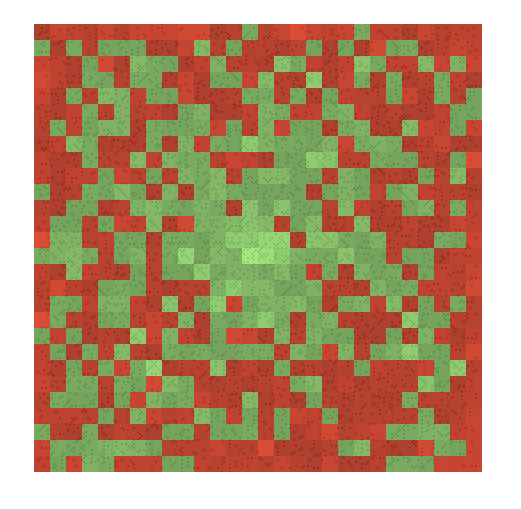
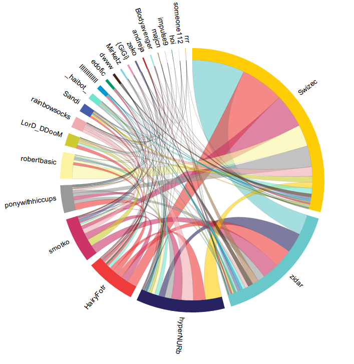

A lot of people will tell you writing a book is hard. I'm here to tell you it's not.

Solving the [Hamiltonian path problem](http://en.wikipedia.org/wiki/Hamiltonian_path_problem "Hamiltonian path problem") is hard, writing a book just takes some hard work and a bit of dedication. It's not hard when all it takes is plomping your arse down and refusing to get up until something happens. That's easy.

As [Hemingway](http://en.wikipedia.org/wiki/Ernest_Hemingway "Ernest Hemingway") put it in a movie, _"There's nothing to writing, you just sit down and bleed"_ Which is odd, since he liked to write standing up ... anyway.

\[caption id="" align="alignnone" width="417"] Example about distribution of primes along a spiral\[/caption]

After two months of plomping my arse down repeatedly I finally finished my [d3.js](http://d3js.org/) book. Or rather, I finished the first drafts, which would be a done book if I was self-publishing. Because there's a publisher involved, I'm now looking at two to three months of revision and editing.

To be honest I'm getting slightly sick of that book. Being able to step away and ignore its existence has been one of the most amazing feelings in the world. I am enjoying my new found freedom to the full. At least until reviewers come back with their _You idiot! That's not how you write that bit there!!_

Life can get really frustrating when you try to squeeze at least an hour of focused writing into every single day.

The final tally for the book is 179 pages, 30 examples, 66 days, 171 hours.

That means I spent about an hour per page including research, writing and coding a working example, and an average of almost 3 hours writing per day. All the while doing enough freelancing that my business grew by about 30% in terms of monthly income. \\o/

What surprised me is just how much work I had with examples. It is _insanely_ difficult to come up with an example that will exercise what you're talking about in a particular chapter, without depending too much on stuff you haven't covered yet and being thin on the stuff you've already covered and is now boring.

Then you have to get the examples working.

\[caption id="" align="alignnone" width="495"] IRC karma visualisation example\[/caption]

I didn't really know much about d3.js when I started out and it would often take me a whole afternoon to get a single example working. Like, you'd sit down, read the API documentation and get to work. Error.

Fix error ... blank screen.

Get a line on screen ... wrong line.

And so on for _hours_.

It would always be something stupid in the end, or I'd misunderstand what the documentation is telling me. Often I'd resort to looking at other people's examples myself so I could even get something working.

But then the _really_ fun part starts. When you do have an example, writing just flies. You sit down and start talking about the code, pasting code in the book, showing some pictures and before you know it, that simple example you spent three hours coding has turned into five pages of the book in just half an hour.

It really is quite amazing.

While there's always stuff you can fix in a book and the writing never seems polished enough, I hope there wont' be too much work with editing. My approach is very re-writing in itself and I often write the same sentence or paragraph several times before it sounds natural enough.

Yeah, who knew, making yourself sound natural takes [deliberate practice](http://en.wikipedia.org/wiki/Practice_%28learning_method%29 "Practice (learning method)"). You can't just dump your brain on a page and think it sounds natural. It doesn't

Right, you've kept reading, now you want a _The Point._ If you really want to learn something, write a book about it. It doesn't take long.

###### Related articles

- [Work Alone: Ernest Hemingway's 1954 Nobel Acceptance Speech](http://www.brainpickings.org/index.php/2013/03/21/ernest-hemingway-1954-nobel-speech/)
- [Why You Should Write Clean Code](http://www.brandonsavage.net/why-you-should-write-clean-code/)
- [Want to Write a Book? Start By Writing a Book Proposal.](http://www.cc-chapman.com/2013/want-to-write-a-book-start-by-writing-a-book-proposal/)
- [Writing rules](http://victoria-writes.com/2013/03/26/writing-rules/)

