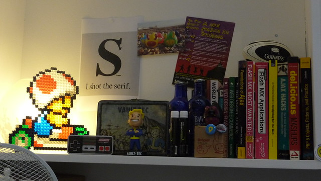

I have always seen myself as a stereotypical geek. Kind of introverted, not very athletic, infinitely excitable about the strangest of things, spends more time with people on the internet than talking face-to-face, prefers it even.

And I love being that. The infinite freedom that comes with being a geek is intoxicating.

While normal people have to worry about keeping appearances, about maintaining a fine-knit web of social interaction through a series of carefully maintained half truths, I can just be myself. Because I'm a geek.

People pretending they like certain things, pretending they care about this or that issue, just to fit in. Just so they'll be liked. As a geek I don't have to do any of that.

As a geek I can shout at the top of my lungs _"I don't understand football"_ at the height of football fever during a world championship. Nobody minds, nobody laughs, they just explain the game. _"Don't mind him, he's a geek you see, he doesn't get normal people stuff"_

When I was about ten years old I couldn't get enough of [The Famous Five series](http://www.amazon.com/Five-Treasure-Island-Famous/dp/0340796146%3FSubscriptionId%3D0G81C5DAZ03ZR9WH9X82%26tag%3Dageewitahat-20%26linkCode%3Dxm2%26camp%3D2025%26creative%3D165953%26creativeASIN%3D0340796146 "Five on a Treasure Island (Famous Five)") by [Enid Blyton](http://www.enidblytonsociety.co.uk "Enid Blyton"). Library copies were always tattered to bits and that just made them better. I don't remember much, but I do remember one character clearly - The Scientist. He was [George](http://en.wikipedia.org/wiki/George_Kirrin "George Kirrin")'s dad or uncle and his defining characteristic was that he was always kind of grumpy and locked up in his room where he was "doing science".

Not to be bothered. Not to be disturbed. Not to even be thought about too loudly. Lunch was often taken to his room because he would forget to eat.

Imagine that!

A guy who gets peace and quiet to work. All summer. In a house full of 12 year olds. That's the power of being a geek.

Geeks - the only people who get to truly be themselves even as adults. I love it! (said with my best Tennant impersonation)

It's all starting to unravel for me though. People are suggesting I might want to "grow up" ... whatever that means.

Just the other day someone mentioned I do a lot of sports. Ironically this happened at boxing practice; she spends 5 days a week there. A person who goes to practice 5 days a week thinks I do a lot of sports ... I have never been so confused.

A few days later I had a call with someone looking for "somebody older" to be a technical lead. An old sage to look over the rabble of Stanford grads he's built a team out of. I'M TWENTY-FIVE!

I hope it's not too late for me. Save yourselves! Be geeky!

