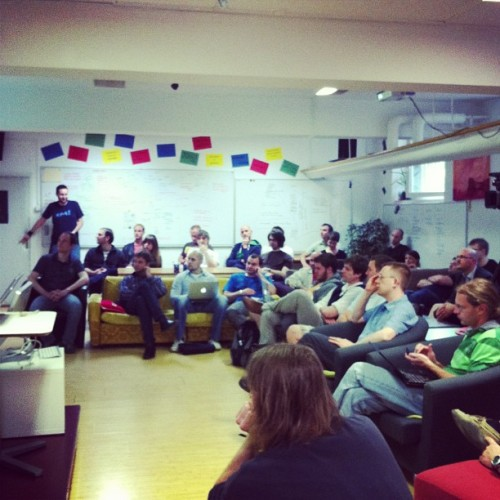

Tuesday evening saw the first [JavaScript](http://en.wikipedia.org/wiki/JavaScript "JavaScript") meetup in [Ljubljana](<http://maps.google.com/maps?ll=46.0555555556,14.5083333333&spn=0.1,0.1&q=46.0555555556,14.5083333333 (Ljubljana)&t=h> "Ljubljana") and I think it was a smashing success, if I do say so myself. Everyone who RSVP'd managed to make it despite the impending holidays next day.

Surprising how difficult it is to count people calmly sitting in place and not moving. I'd make a terrible guardian for children on a fieldtrip, but there were somewhere between 38 and 47 people based on my various counts.

All the speakers did a great job of presenting their topics and I was happy to see next to no smartphone and laptop [navel gazing](http://en.wikipedia.org/wiki/Omphaloskepsis "Omphaloskepsis") from the audience. Rare sight at these sorts of events.

We learned about writing performant JavaScript, where the biggest challenge is maintaining performance across browsers and devices. Apparently writing performant JavaScript for Chrome on a quad core desktop monster is much easier than a four year old smartphone running an outdated version of Android.

Then it was straight to an overview of using modern MV\* libraries and the difference between frameworks and libraries - a library is fairly open-minded and a framework is smarter than you so you have to obey.

The talk about [AngularJS](http://www.angularjs.org/ "AngularJS") deepened the subject by showing a few code examples with AngularJS. Looks like it's very easy to magically connect things on the screen, but step out of what Angular knows is best and you will have a bad time and likely way too much work.

In the end, the talk about [TypeScript](http://www.typescriptlang.org/ "TypeScript") explained what it looks like when you port Java to JavaScript. The most interesting part for me was observing the difference in style preferences. I honestly don't think TypeScript looks better than just using JavaScript ...

Either way, the videos are now online. Have a look.

- [Bare Metal Coding: Optimising Your Javascript for Leaner, Meaner, Performance](http://video.kiberpipa.org/jsmeet_slavic_performance_optimizing/)
- [MV\* Libraries](http://video.kiberpipa.org/jsmeet_bergant_mv_libraries/)
- [AngularJS](http://video.kiberpipa.org/jsmeet_zakrajsek_angularjs/)
- [TypeScript](http://video.kiberpipa.org/jsmeet_pirc_typescript/)

Unfortunately the videos don't convey the great job beer and cupcakes did of keeping everyone around for a nice geeky chat.

\[caption id="" align="alignnone" width="500"] Javascript cupcakes\[/caption]

