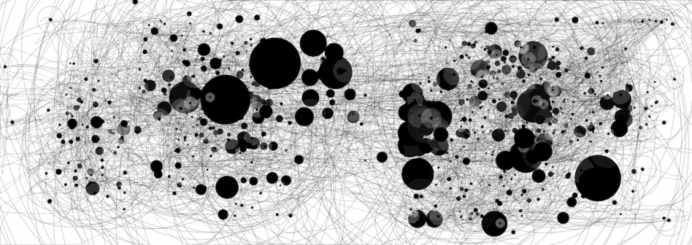
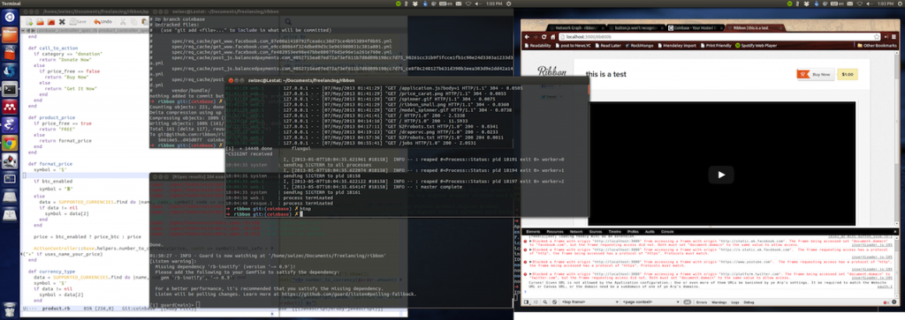

A few weeks ago I bought a fancy new [mouse](http://en.wikipedia.org/wiki/Mouse_%28computing%29 "Mouse (computing)") to replace my fancy old mouse. Sure it's nice and comfy, but how much do I actually use it? When you pay close to a hundred euro for something you want to make sure it's doing its job.

Yesterday I tried.

For the whole day, when the freelancing clock was running, so was [IOGraph](http://iographica.com/) - a handy tool for recording mouse movements.

I have dual screens, am running [Ubuntu](http://www.ubuntu.com "Ubuntu (operating system)") and use [Emacs](http://www.gnu.org/software/emacs "Emacs") to write code. Certainly the sort of environment that favours using your keyboard over your mouse and yet, the mouse gets used quite a lot.

The image above shows paths my mouse has taken through the day, dots show where the mouse has been standing still for a while - the bigger the dot, the longer the time - and I am honestly not certain what the circles around small black dots are. Clicks perhaps?

Other than the fact I use my mouse more than I thought, three patterns emerge.

1. There is a blank space roughly down the middle where I never place my mouse - the dividing line between two monitors. You can see the left is wider than the right.
2. Despite being used a lot, the mouse spends most of its time **standing still**. Most of the image is taken up by relatively few very large black dots. The largest two are right where I had two terminal windows that I often switched between (one running a server instance, the other used for git). The rest are mostly on the far right where I have my browser. Apparently I like to click around, then leave the mouse there when I go back to coding? Or maybe page loads are slow?
3. Emacs takes up the left half of the screen. I sometimes put my mouse here, but rarely for long because the cursor gets in the way.

You can also notice I spend a lot of time switching the last few tabs in [Chrome](http://www.google.com/chrome "Google Chrome"), possibly opening and closing them as I browse the interwebs for help with [Ruby](http://www.ruby-lang.org/ "Ruby (programming language)")? That's all the lines going to the upper right corner.

Here's a screenshot of the desktop as I left it last night. Most of the tabs already closed because I have to save memory, but you can still see the rough layout of the windows I worked with. Had I some photoshop skill I'd overlay IOgraph output over the screenshot.

\[caption id="attachment_6171" align="alignnone" width="819"] Workspace\[/caption]

Now I wonder if mouse patterns are different for other languages and technology stacks ... I have experimenting to do!

