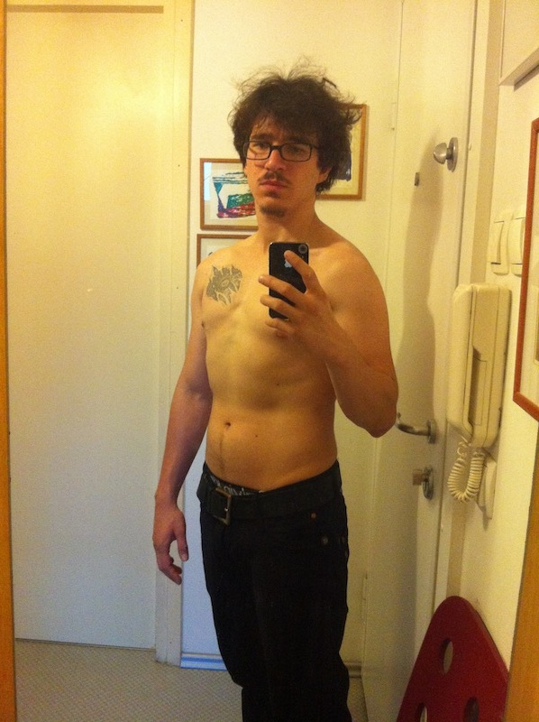
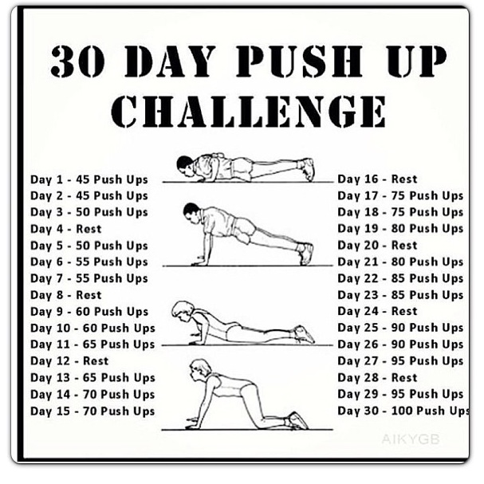
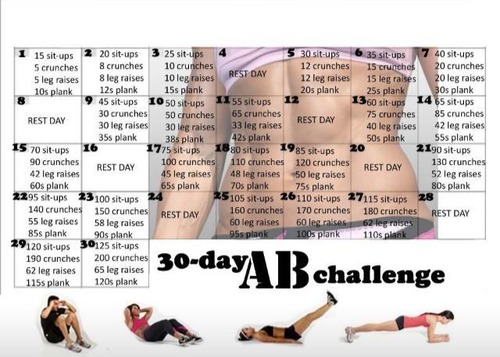
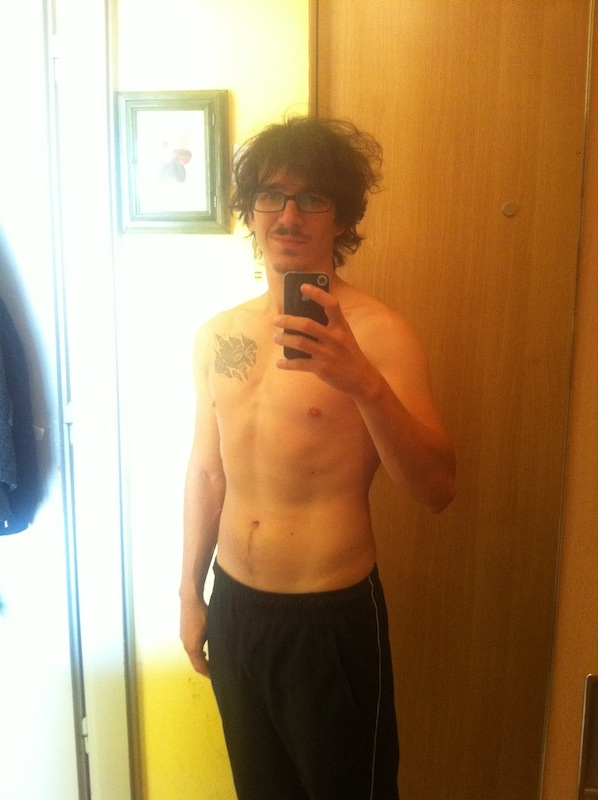

Over the last month I've been experimenting with a new fitness routine. Working out for an hour every morning was becoming too bothersome and I wanted to start my days earlier. On top of that, I was going to spend [a whole month roadtripping around Europe](http://swizec.com/blog/a-month-on-the-road/swizec/6317) and @robertbasic would strangle me if he had to sit around for an hour while I painstakingly went through a grueling workout regime every morning. \[caption id="" align="alignnone" width="598"] The before pic\[/caption] When I took that photo I had just spent a month running about 5km on most days of the week and doing one of the two hour-long routines set by [PumpUp](http://pumpup.co/) five days of the week. Every day I would do 20 minutes of core circuits and either upper body - 80 handstand pushups, 200 pushups - or legs - 200 lateral lunges, 200 reverse lunges. Sure, those numbers are kind of high, but when you break them into four sets with two minutes of rest, the routine becomes very doable. But it takes _forever_. It had also been a month since my last boxing practice. I missed those a lot. They're fun. At this point I had exactly 60kg, which was 3kg less than the fattest I've gotten this winter. Both the getting bulkier and then slimming down were on purpose. Don't you worry about that. The new routine was based on two challenges.   These sorts of "get ripped in a month" challenges float around the interwebs and become semi-popular now and then. A lot of people complain it's impossible to do 45 pushups or 15 situps without stopping, but it was the perfect starting point for me. Obviously I decided to do this routine three times a day. Because if once a day is great, then three times a day can only be greater still, right? I also wanted to know if working out three times a day for ten minutes is better than once a day for an hour. It might be, who knows? Worked for [Tom Hardy when he was getting buff for Warrior](http://www.cagepotato.com/check-out-tom-hardys-warrior-workout/) ... And so I worked out three times a day. Before breakfast, around lunchtime or in the evening if lunchtime didn't work when we were on the road, and once more around dinnertime or before bed depending on when I did the lunchtime thing. It was super easy at first. Pumping out some pushups and situps took me less than five minutes and I didn't even break a sweat. The final days got up to ten minutes of super grueling stuff that would leave me laying in a puddle of my own sweat. Mmmmm ... But it was fun. I can _feel_ that my abs are much stronger than they used to be. If light hits them just right, they even look a more defined. My triceps became legend. I even added five rounds of three minute shadow boxing with 3lbs weights to the morning workout. It's fun and I wanted to keep my boxing shape as much as possible. \[caption id="" align="alignnone" width="598"] The after pic\[/caption] But alas, there is less of me. Much less. The after photo is from yesterday morning. Officially a week after both 30 day challenges concluded, but I kept on doing the same thing they'd set for the last day. Even though I can now pump out a hundred pushups, my chest muscles just sort of aren't there anymore. My abs don't look like they have much more definition either, but a lot of that is probably the lighting. I promise I can see a small difference! At this point I had lost 2kg to the fact that I didn't track my calories very well on the roadtrip and ended up just eating what I felt like. But my fat percentage was 14.25% when I got back, which isn't too bad. Just wish I'd thought of measuring it before I went on the roadtrip. Have to start keeping track of that because apparently I have to get down to 8% if I want that sixpack. And I didn't keep much of my boxing shape either. Both times I went to boxing practice this week I felt like death afterwards. Next step is going back to PumpUp and setting it to three ten minute workouts. See what happens. Should be especially fun on the days I also have boxing ... Here is a gif of me shadow boxing. I'm not a cat but I do have wobbly hair. 