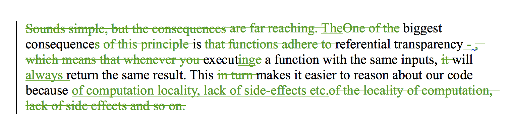

\[caption id="" align="alignnone" width="640"] Writing photo by Chapendra\[/caption]

Working with a publisher means you don't get full control. In fact you get surprisingly little control and everyone behaves like they know better than you about everything. Which they probably do.

One thing you get no control over is the format you're going to write your book in. But hey, the publisher churns out a new book every week and they've been doing this for years. If somebody knows the best tools to write a book, it's going to be them.

Naturally they ask you to write in `.doc`. [Word](http://office.microsoft.com/en-us/word/ "Microsoft Word") gives you marvelous [diffing](http://en.wikipedia.org/wiki/Diff "Diff") features, there's comments, you can do styling and layouting, and it's perfect for having multiple people working on the same document simultaneously.

Wait ... no it isn't. In fact Word _sucks_ at all of that!

My heart sank the moment I opened [LibreOffice](http://www.libreoffice.org "LibreOffice") to start working on [Data visualization with d3.js](http://www.packtpub.com/data-visualization-with-d3js/book) way back in January.

I can't use Word. Last I checked there still wasn't a linux version for my main computer and the pirated copy I have for my Mac crashes as soon as the software runs. Something about fonts.

LibreOffice isn't bad per se, but there are [better](http://swizec.com/blog/cool-thing-thursday-ia-writer/swizec/5517) [writing tools](http://swizec.com/blog/how-draft-got-me-to-pay-for-a-free-product/swizec/6186) out there.

Especially when it comes to code samples. Why am I dealing with code samples in .doc?

But that's what the publisher wants. They even have a fancy base template with all of their custom styles that tell the layouting team what to do. I imagine they export into a better format and work from there.

It's difficult to pinpoint why exactly working with this format has been so infuriating, but here are some issues I've run into:

Because of collaboration you have to turn on `record changes`. This lets the editors see what you've been up to. But it's slow without `show changes`. Suddenly you're working with paragraphs that look like this:

\[caption id="" align="alignnone" width="658"] A 2nd draft paragraph\[/caption]

This makes it very easy to miss a space here and there or have too many full stops in a row.

There's also a bug in Linux LibreOffice - not experienced by anyone else online as far as I can tell - that inserts a blank line after every paragraph with an edited last character. The new line is inserted every time you open the document.

Which makes editors cross with you and question your sanity.

And sometimes, randomly, when you change the styling of some text the styling would vanish somewhere between you and the editor.

Oh and no matter what format you send the document in (I liked `.odt` because it causes the least problems for LibreOffice) you will get it back as `.docx`.

A format LibreOffice's got _catastrophic_ problems with.

Last week I was happily editing away, acting on the technical feedback I'd gotten, and after a few days I open the document ... it was 5 pages long. Not the 38 it was supposed to be. Five.

Everything just up and vanished.

But I'm using [Dropbox](http://www.dropbox.com "Dropbox") so there's a backup every time I click Ctrl+S. I'm safe right?

The last working version was 37. Out of 131. I was pretty mad.

> Version 37 out of 131 is the last that LibreOffice didn’t corrupt. I am going to strangle [Packt](http://www.packtpub.com "Packt") for making me work in .doc
>
>
>
> — Swizec (@Swizec) [September 4, 2013](https://twitter.com/Swizec/statuses/375221837510492161)

Some 15 pages of editing went _poof_.

It happened again a few days ago. But I was more careful and only lost 5 pages. Then I converted all current versions to `.odt`. That seems to work.

The collaboration has been wonderful too!

Because we can't all work on the document at the same time, but have to resort to sending it around via email and working in sequence eeeeeverything draaaags oooout foreeever.

Packt promised I had 3 months to write and then there'd be a 3 month editing process.

We blew past that because I'm a slow writer, but in June I thought the book was done. We'd spent 3 months writing and 3 months editing.

Then in the end of August I got technical feedback. Oh yeah.

Yes editors are people too and they have other shit to do than care about my book and I'm really happy that one guy in particular ([@kmrhb](https://twitter.com/kmrhb)) has taken great care to leave a comment next to almost every single paragraph ... but still.

Apparently a big part of the main editor's job is merging all the documents everyone sends her.

:\|

I'm not sure how that works, but a lot of the comments I got in late August are dated to early July. Hm.

If you ever write a book, _please_ use a better tool. Write it in a textual format - markdown works well - and use something that shows diffs and helps you merge stuff and lets people comment without having to wait for you to finish.

Draft looks like it's got a lot of those features. I've had great results with Github for my other book. [_Readers_ have sent me typo fixes](https://github.com/Swizec/nightowls/pulls) that I can just merge!

Whatever you do, don't write a book in .doc.

