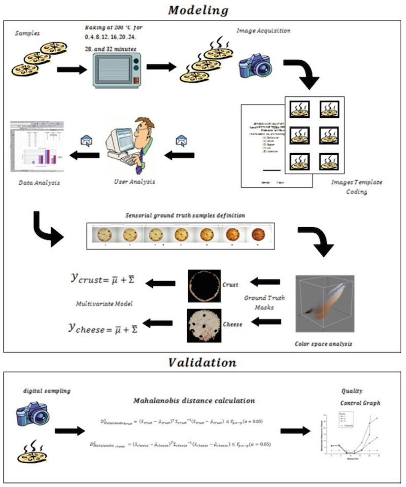
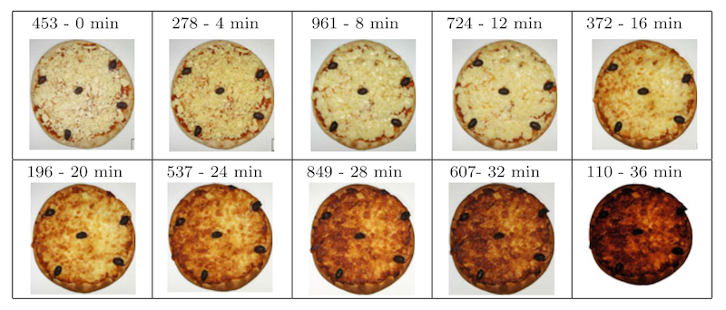
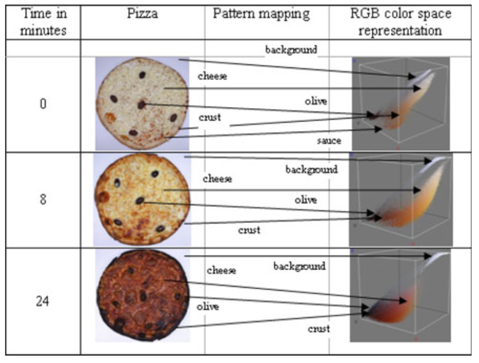
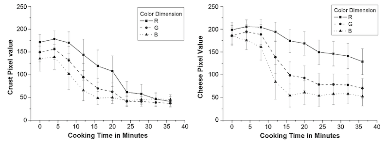

How do you check your pizza's done? You look at it. But what if you're mass producing pizza? You could have somebody look at every pizza. But people get tired. So you need more people. But then you have to train everyone and you might lose some consistency in what is The Best Pizza (tm). In [_Multivariate Bayesian cognitive modeling for unsupervised quality control of baked pizzas_](http://link.springer.com/article/10.1007%2Fs00138-011-0339-7) Neto, Aguiar, Santos and Wangenheim propose using computers specifically trained to look at a pizza and say _"Yup, perfect! Done."_ They improved on earlier research that focused on [pizza toppings](http://en.wikipedia.org/wiki/Pizza "Pizza"), cooking cheese, and baking bread. According to the authors earlier research relied mostly on reducing colour dimensions, even using greyscale to analyze the browning of bread, and thus could not achieve desired accuracy. More \\importantly, nobody before seems to have applied scientific rigor to the baseline - When do _humans_ think pizza is tastiest? \[caption id="" align="alignnone" width="640"] Experiment outline\[/caption] To that end the authors performed a pizza baking experiment with three mozzarella pizzas. Each was baked in an electric oven for 40 minutes at 200°C and a picture was taken every 4 minutes. These pictures were then sent to 68 untrained volunteers from the Mechanical Engineering department - seriously, an engineer _untrained_ in deciding when pizza looks tastiest? - who had to rate images on a Hedonic scale from 1 to 5. A hedonic scale is basically a scale used to answer "How much I like this". It's used in food science, there are even calibrated devices to measure these things called olfactometers. The data said the best baking time for a mozzarella pizza at 200°C is in the 8 to 16 minute range. Which sounds strangely familiar as something reading the box might have told them. But it's interesting to think this sort of rigorous approach can be taken to deciding whether a pizza looks good or not. \[caption id="" align="alignnone" width="640"] The pizza scale\[/caption] After the initial experiment in determining when pizza looks the tastiest the authors performed another baking experiment to analyze how colour values in the [RGB](http://en.wikipedia.org/wiki/RGB_color_model "RGB color model") space change when pizza is baked at 250°C. From what I understand higher temperature means shorter baking times and thus quicker experiments. Another three mozzarella pizzas were destroyed in the name of science. There are four colour elements you can observe when baking pizza: the background - discarded because it doesn't matter - olives, sauce, cheese, and crust. It seems that during the baking process olives remain black the whole time and the colour of sauce doesn't change significantly either. But cheese and crust do. \[caption id="" align="alignnone" width="640"] RGB colour space mapping\[/caption] Samples in that magic time range - 8 to 16 minutes - were averaged across the three pizzas to produce a graph of RGB value variation for cheese and crust over the whole baking process. The pixels that represent cheese and crust were chosen manually and troublesome pixels for the cheese were removed. The problem with cheese is that it generally browns slower than the crust, but can be very quick around the edges. \[caption id="" align="alignnone" width="640"] Browning evolution during baking\[/caption] Their bayesian model used [Mahalanobis distance](http://en.wikipedia.org/wiki/Mahalanobis_distance "Mahalanobis distance") to compare pizzas from the validation stage to the training set from the human subjects. Mahalanobis distance is a statistical measure that performs better than [Euclidean distance](http://en.wikipedia.org/wiki/Euclidean_distance "Euclidean distance") when you have distinct covariances in the target patterns. As expected, their experiment confirmed that pizza baked at 250°C will be done faster than pizza baked at 200°C - 7 to 16 minutes is the magic range according to their [Bayesian model](http://en.wikipedia.org/wiki/Bayesian_network "Bayesian network"). The beginning of the interval was very similar for all pizzas, but the ending varied greatly. The authors speculate this variability might have been caused by variances in cheese distribution on the pizza, which wouldn't exist in a mass production environment because robots can spread cheese very precisely. They also noticed cheese can fall below threshold values during baking, which they speculate might be the result of released grease being shiny and thus messing up RGB values. \[caption id="" align="alignnone" width="640"] Mahalanobis Distance during baking\[/caption] The real question now is who is going to use this research to install a camera in my oven and make it beep when pizza is done, not when some nebulous timer runs out? The world needs this! Home ovens that know when food is done regardless of the timer you set. Imagine the endless possibilities!

