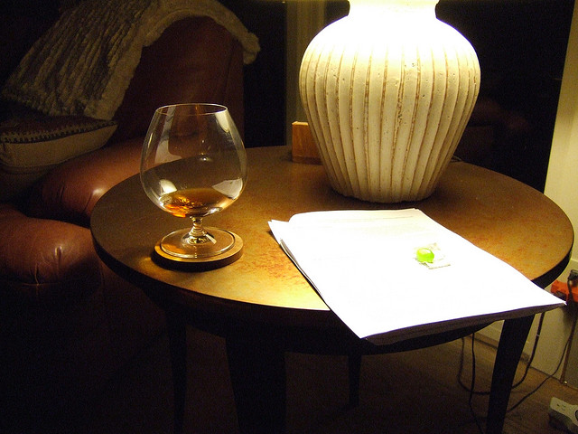

_\[This post started the challenge to understand 52 papers in 52 weeks. You can read the entries, [here](http://swizec.com/blog/category/52-papers-in-52-weeks) or get notified of new posts by [email](http://swiz.ec/52papers-list)]_

\[caption id="" align="alignnone" width="640"] Reading academic papers, by joebeone\[/caption]

[Jennifer Dewalt](http://jenniferdewalt.com/) recently finished her challenge and created 180 websites in 180 days. Kudos to her!

This got me thinking, what is that one thing I have always wanted to do, but haven't had the right motivation? I already [write](http://swizec.com/blog/a-year-of-750words-com-with-shiny-graphs/swizec/4378) and [exercise](http://swizec.com/blog/30-day-fitness-experiment-with-results/swizec/6326) every day so that's that for the obvious challenges.

But I don't read enough.

Sure I probably ~~spend~~waste upwards of two hours a day reading things online, but that's like fast food for the brain. Whenever I hit something deeply interesting that will take more than five minutes to read I just close the tab after five paragraphs.

I'm a terribly slow reader too. Last time I measured it took me half an hour to read 10 pages of Hemingway. Part of the problem is that I like reading books when I'm comfortable and then I keep dozing off no matter how much fun I'm having.

Books are out of the question then. I read three or four per year, start reading six, buy eight, and that's good enough.

But I've always loved reading academic papers. Those bastions of bleeding edge research, the ten page blogpost of a scientist and their team, written in that loving academic drone of a voice, with all the chest-thumping fancy words so you don't even think to doubt the author's intelligence.

In my experience it takes some three to four hours of furrowed eyebrows and meaningful grunts before you understand a serious academic paper enough to explain it. Six if it's not from your field. Eight if it's biology.

Biology is hard okay.

But it's effort well spent! I have never walked away from an academic paper without having learned something deeply interesting and insightful.

The challenge: Read and explain one paper per week for a year. 52 papers, 52 weeks.

Simple.

I am going to read papers from all fields. Sometimes this is going to mean extended research to figure out the backstory, other times it will be simple. But I don't know where to find all those papers.

If you have an interesting paper you've been meaning to get to, but just haven't found the time. I am your man! Send me an email: [swizec@swizec.com](mailto:swizec@swizec.com)