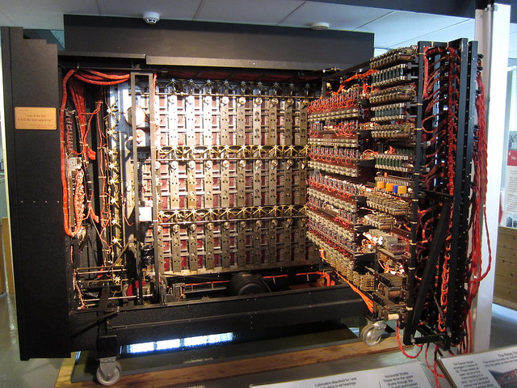
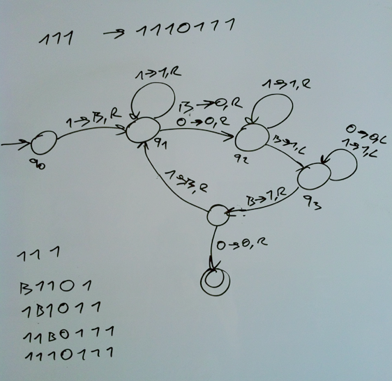

_\[This post is part of an ongoing challenge to understand 52 papers in 52 weeks. You can read previous entries, [here](http://swizec.com/blog/category/52-papers-in-52-weeks) or get notified of new posts by [email](http://swiz.ec/52papers-list)]_ \[caption id="" align="aligncenter" width="640"] Turing's Bombe machine\[/caption] What better way to start the 52 papers challenge off than the paper most computer science is based on - [Alan Turing's](http://en.wikipedia.org/wiki/Alan_Turing "Alan Turing") [On Computable Numbers, With an Application to the Entscheidungsproblem](http://classes.soe.ucsc.edu/cmps210/Winter11/Papers/turing-1936.pdf)? There are two main takeaways from this paper:

- a hypothetical machine can be constructed that can solve any solvable problem using simple rules (turing machine)
- the entscheidungsproblem is unsolvable in the general case

The third, despite being discussed off-handedly in the paper, has massive implications as well: Church's lambda-calculus is no more or less powerful than turing machines. What [Turing](http://en.wikipedia.org/wiki/Turing_machine "Turing machine") states as "obvious" later developed into the [Church-Turing thesis](http://en.wikipedia.org/wiki/Church%E2%80%93Turing_thesis "Church–Turing thesis"), which stipulates that all systems of computation are equal in their power. If a problem can be solved by one system, then it can be solved in another, and vice-versa. Despite many attempts to find stronger computation system, all have eventually been proven to be equal to all the rest. If memory serves, the jury's still out on quantum computation. But let's start from the beginning.

## The Entscheidungsproblem

In 1928 Hilbert posed a challenge to the mathematical community - create an algorithm that takes as input a statement in [first-order logic](http://en.wikipedia.org/wiki/First-order_logic "First-order logic") (with possibly a finite number of additional axioms) and answers _"Yes"_ or _"No"_ whether it is universally valid. That is, valid in every structure that can be translated into the basic axioms. Having such an algorithm would mean that there is no such thing as an [unsolvable problem](http://en.wikipedia.org/wiki/Undecidable_problem "Undecidable problem"). You could construct an algorithm to solve any problem you can state using first-order logic - logic statements with predicates. `∀x(C(x)→¬D(x))`, where `C(x)` means "x is a cat", and `D(x)` means "x is a dog". The statement then reads _"for every x, if x is a cat then x is not a dog"_ Can we have an algorithm that tells us whether this statement is universally valid and nothing can be both a dog and a cat? To answer the question Turing had to begin by formally defining both computability and algorithm.

## Computing machines

Turing states that [computable numbers](http://en.wikipedia.org/wiki/Computable_number "Computable number") are those numbers whose decimals can be computed in finite time. His justification is that human minds are limited and a number that takes infinitely long to compute isn't very useful. He bases his computational machine on the model of a person solving a problem.

- a **machine** is a device that can have a finite number of m-configurations or states (think of this as memory)
- the machine will be provided a **tape**, which is infinite and divided into squares that can hold a single symbol (the equivalent of paper)
- a symbol can be **scanned** from a square or **printed** to a square (the equivalent of reading and writing)

An **automatic machine** (a-machine) is a machine whose motion at each stage is completely determined by the configuration. When an a-machine prints only two types of symbols, where first type (figures) consists only of `0` and `1` and the second type are help symbols, it is called a **computing machine**. The **complete configuration** of the machine is completley defined by its current m-configuration, the scanned square's number and the [complete sequence](http://en.wikipedia.org/wiki/Complete_sequence "Complete sequence") on the tape. What it does next is called a **move** (m-configuration change, printing, changing the active square). A **computable sequence or number** is any sequence produced by a circle-free computing machine. That is, a machine that reaches its end state in a finite amount of time. Turing used a table format to define examples of machines where the first column defines the m-configuration, then the other columns specify actions based on the read symbol and finally which m-configuration the machine should transition to. Personally I found the graphical notation we used at college easier to follow.  One interesting convention Turing establishes is only writing solutions on alternative squares called F-squares and the other squares, called E-squares, are used as a sort of scratch pad. We didn't use this convention, but it can help you write shorter algorithms. The introduction of **m-functions** (machines expressed as functions) is more \\important since it means you can define a computing machine in terms of other computing machines. He called these "skeleton tables" because they were the basis for writing more advanced machines. An m-function is defined as a triplet `f(q, r, x)`, where q is the initial state, r the final state, and x the first symbol to start the function on. These functions can be nested and combined at will, but it is \\important to always write out _exactly_ what is the machine each function represents.

## Enumeration of computable sequences

To make working with computing machines even easier, Turing proposes they should be enumerated. Describing whole machines as numbers will be particularly useful when we want machines to process other machines as input. The first step is standardising notation: m-configurations will be qi, with q1 always being first. Symbols will be Sj, in particular _blank = S0, 0 = S1, 1 = S2_. Each line of the table can then form an expression like qiSjPSkLqm, which reads _"After reading Sj in state q1, print Sk, move left, and change to state qm"_. We can write down all lines of the tables into a single expression where lines are marked with semicolons (qiSjPSkLqm;qiSjPSkRqm;...) If we then agree to codify all qi as the letter _A_ repeated _i_ times, and Sj as _D_ followed by j _C_'s, we can write down every machine with a sequence of 5 letters (A, C, D, L, R, N) and semicolon - the **standard description**. We can further replace these with numbers; _A_ is _1_, _C_ is _2_, ..., _;_ is 7, to come up with a **[description number](http://en.wikipedia.org/wiki/Description_number "Description number")** _n_, which describes a computing machine uniquely. A machine described by _n_ will be called `M(n)`. Since a computable sequence can be described by at least one description number, but a description number can only correspond to one computable sequence, it follows that computable sequences and numbers are enumerable. (can be listed)

## The universal computing machine

The universal machine is a machine that can compute any computable sequence. When given as input some standard description of machine _M_, the universal machine _U(M)_ will compute the exact same sequence as _M_. Universal machines are a particularly \\important tool in solving the entscheidungsproblem, because Turing will be able to rely on a single tool to talk about all computable numbers. It is somewhat obvious that given a machine _M_ you can construct a machine _M'_ that would print all of its complete configurations in the standard form on a tape. From that we can assume that there is enough room left on the tape to use the rules of _M_ to perform its computations. Turing goes on to fully write down the description table of the universal machine, which I will not do here. Instead let me show you a [Turing machine I wrote in 133 bytes of Javascript](http://swizec.com/blog/a-turing-machine-in-133-bytes-of-javascript/swizec/3069). Another example of such a machine is your browser (which executes web programs) and your computer (which uses a program to execute other programs). The \\important thing to remember is that universal machines are no more powerful as normal computing machines and do not increase the extent of computable numbers. This is obvious when you think of them as simulators of computing machines.

## Can a machine tell if a machine is circle-free?

Turing uses the process of diagonalization to show that we cannot construct a process that will take the standard description of a machine and tell us whether it is circle-free or not. That is to say, whether it ever produces a result. This is otherwise known as the halting problem. Let's say we can construct a process _D_ that will take a standard description and mark it with _u_, if it represents a circular machine, and with _s_ if the machine is circle-free. If we take _D_ and _U_ (universal machine), we can create a process _N_, which computes sequence β, whose n-th figure is φn(n). _N_ first evaluates writes down integers up to `N-1` and tests them with _D_. Some have been found to be description numbers of circle-free machines. Then the machine tests the number _N_. If it is the description number of a circle-free machine then _R(N)_ equals `1+R(N-1)` and the first _R(N)_ figures of the sequence for _N_ are tested and written down as parts of sequence β. Otherwise the machine goes on to step `N+1`. We can see that _N_ is circle-free - each section of β is computed in finite steps, because we assumed _D_ is computable in a finite number of steps. But let's say _K_ is the description number of _N_. We know _K_ is satisfactory since we assumed _N_ is finite, but for _N_ to verify this it would have to compute the first _R(K-1)+1_ figures, then for the _R(K)_-th figure it would have to to repeat it all over again. Thus it gets stuck in a loop and we reached a paradox. Therefore there can be no such machine _D_. This can further be expanded to show that there can be no such machine that determines whether a given machine will ever print a particular symbol. Turing gives a formal proof, but I will appeal to your intuition: Until the symbol appears, how do you know if the machine is stuck in a loop, or you have to wait a bit longer?

## Possible processes carried out in computing a number

Any proof showing that computable numbers as defined in Turing's paper encompass all numbers naturally regarded as computable, would boil down to an appeal to intuition, which isn't mathematically interesting, so Turing just assumes this is the case. Computer science has so far been unable to prove this is not, in fact, the case. Once you assume this much, one of the more interesting consequences is that if there is a general process to prove that a function in Hilbert calculus is provable, then it can be carried out by a machine. This is what Turing is building towards in this whole paper - proving the entscheidungsproblem. There will be three types of arguments made:

- a) a direct appeal to intuition
- b) a proof of the equivalence of two definitions
- c) giving examples of large classes of computable numbers

### I \[type a]

Computation is normally done by writing symbols on paper. We can assume this paper is split up into squares and it is trivial to imagine calculating on one-dimensional instead of two-dimensional paper. It is also trivially to imagine that we can only use a finite number of symbols before running out of space in each individual square. Not that that matters much since we can always write down more than one symbol to represent things that don't fit on a single square. It can further be assumed that at any stage of the calculation the next step is wholly determined by the sequence of symbols on the paper and the computer's state of mind. Since we can only make a machine so big, the number of states of mind must be finite, but we can always replace missing states with writing more symbols on the paper. Therefore it is possible to simplify any process of computation down to the most basic units that cannot reasonably be torn apart further:

- a) changing the symbol on one of the observed squares
- b) changing one square's symbol into a different square's symbol

Either of these can involve changing the state of mind. Such a machine can obviously be constructed, and will perform similarly to the computing machines defined earlier.

### II \[type b]

If we systematise the notation of Hilbert's calculus, we can construct a machine _K_ that will list all provable formulae of the calculus. I don't fully grasp the proof of equivalence given here, but it boils down to having a sequence _a_, a function _Ga(x)_ which means "The x-th figure of _a_ is 1" and its negative - "The x-th figure of _a_ is 0". If we then also have _N(x)_, which means that x is non-negative, and _F(x,y)_ meaning _y=x+1_, then we can have a formula _U_, which defines _a_. _U_ must also include the necessary Peano axioms. Essentially _U_ must behave as we expect functions to behave. U(x) equals U(x), if U(x) equals U(y), then x equals y and so on. Then for each _n_ either _An_ (U&F(n) → Gn(u(n))) or _Bn_ (U&Fn → ¬Gn(u(n))) will be provable. Where _F(n)_ stands for \*F(u, u') & F(u', u'') & ..F(u(n-1), u(n)). We can then easily construct a machine _Ka_ that will compute _a_, which can be modified into a more general _K_. Essentially the machine must go through formulae that satisfy _U_ and compare them to _An_ and _Bn_ then print either 0 or 1 on the tape accordingly. Eventually the machine will write out the whole sequence _a_.

## Examples of large classes of computable numbers

Turing begins here with a description of a computable function of integral variables, then lists some theorems of computability and proves two of them. We won't go into the proofs, but a rigorous definition of a computable function is useful. Let's say γ is a computable sequence that prints 0 infinitely often, and _n_ is an integer. Then let's define ε(γ, n) to be the number of 1's between n-th and (n+1)-th 0 of γ. Then φ(n) is computable if, for all _n_ and some γ, φ(n) = ε(γ, n). We can't define computable functions of all real numbers, since there is no general way to write down a real number, but a class of computable numbers is, for instance _an = tan(π(γn - 1/2))_. As long as γn doesn't equal 0 or 1, in which case an will be 0. There are 10 theorems of computability.

1. a computable function of a computable function is computable
2. any function defined recursively in terms of computable functions is computable
3. if _φ(m, n)_ is computable function of two integers, then _φ(n, n)_ is computable
4. if _φ(n)_ is a computable function whose value is always 0 or 1, then the sequence whose n-th figure is _φ(n)_ is computable
5. is a reconstruction of Dedekind's theorem using computability instead of real-ness. It states that if _G(a)_ is a propositional function where there exists an α and a β where _G(α) & ¬G(β)_ (G of α and not G of β) and _G(α) & (¬G(β)) → (α&lt;β)_ (if G of α and not G of β, then α is less than β, then there is a computable limit to the section where a computable number falls. This means a computable bounded sequence of computable numbers might not have a computable limit.
6. if _α &lt; β_ and _φ(α) &lt; 0 &lt; φ(β)_ where φ is a computable continuous increasing function, then there exists a number that _φ(n) = 0_ and _α &lt; n &lt; β_
7. a power series whose coefficients form a computable sequence of computable numbers is computably convergent at all computable points inside its interval of convergence
8. the limit of a computably convergent sequence is computable
9. the limit of a uniformly computably convergent computable sequence of computable functions is a computable function
10. the sum of a power series whose coefficients form a computable sequence is a computable function inside its interval of convergence

From these theorems we arrive at some interesting results. Using 8 we can deduce that π is computable where _π = 4(1-1/3+1/5-...). From \*e = 1+1/2!+1/3!+..._ we can see that e is computable. Using 5 we can show that all real algebraic numbers are computable and with 6 and 10 we can deduce that the real zeros of the Bessel function (a famous differential equation) are computable.

## Application to the Entscheidungsproblem

After constructing all this scaffolding, Turing finally got to the ultimate point of this paper - answering the entscheidungsproblem. He provides the rigorous proof over some three pages, but the basic idea is simple: For each computing machine _M_ we construct a formula _Un(M)_ and show that, if there is a general method for determining whether it is provable, then there is a general method for determining whether _M_ ever prints 0. We already know from earlier that there is no such method since we would have to wait infinitely long to make sure. Turing then constructs two Lemmas:

1. If _S1_ appears on the tape in some complete configuration of _M_, then _Un(M)_ is provable.
2. If _Un(M)_ is provable, then _S1_ appears on the tape in some complete configuration of _M_.

I don't understand the proofs for these two lemmas well enough to provide a summary that doesn't introduce errors, so I'm not going to do that. The end result is that the entscheidungsproblem cannot be solved and it is impossible to construct such a machine that would take as input a statement of first-order logic and answer "Yes" or "No" whether it is universally valid.

