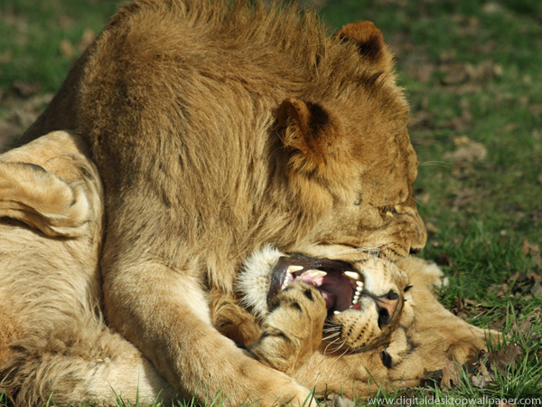
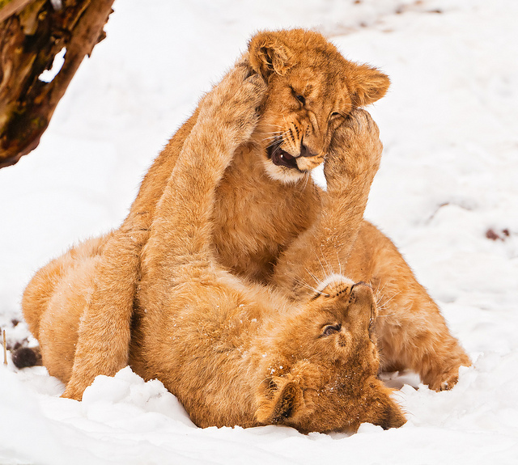
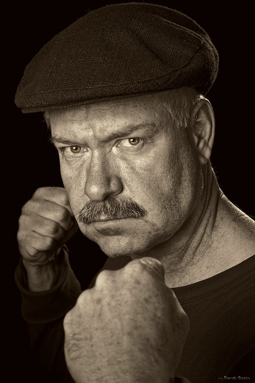
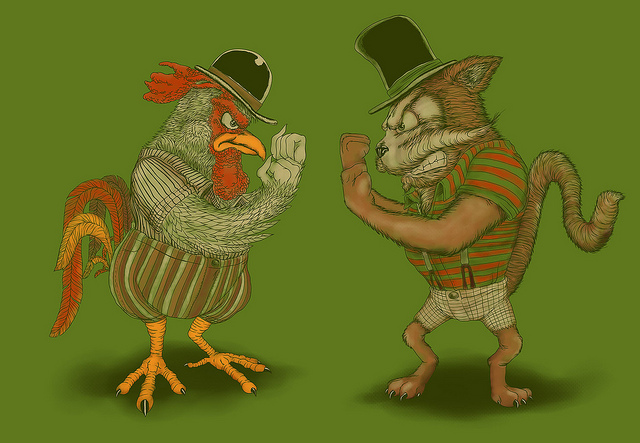

_\[This post is part of an ongoing challenge to understand 52 papers in 52 weeks. You can read previous entries, [here](http://swizec.com/blog/category/52-papers-in-52-weeks) or get notified of new posts by [email](http://swiz.ec/52papers-list)]_

Blanchard's [_Of Lion Manes and Human Beards: Some unusual effects of the interaction between aggression and sociality_](http://www.ncbi.nlm.nih.gov/pmc/articles/PMC2814555/) was the perfect start to no shave November. The paper talks about the effects of lion manes and human beards on sociality. Particularly how the existence of manes and beards makes it possible to live in multi-male groups we can punch each other in the face without dying. Most of the time.

\[caption id="" align="alignnone" width="490"] Adult male with one half of his beard removed\[/caption]

## Aggression, Social Systems and Evolution

Aggression is one of the oldest evolved traits. The [adaptive trait](http://en.wikipedia.org/wiki/Adaptation "Adaptation") of aggression is most commonly believed to be resource control wherein winning means you get something, and losing means you don't. Think lions and hyenas fighting over food, or rams butting heads for access to females.

Resources and their availability have the biggest affect on evolution and more \\importantly, it seems that highly variable environments produce species with a greater flexibility of adaptation both physically and socially. Such as for instance mice, which evolved as human cohabitants.

Most other mammalian species, however, evolved in more stable environments. For example, [California ground squirrels](http://en.wikipedia.org/wiki/California_ground_squirrel "California ground squirrel") that developed an immunity to rattlesnake poison took thousands of years to weed out this trait after rattle snakes disappeared from their environment.

Complex social behaviors appear to take a particularly long time to evolve. The paper gives an example of zebras, where one species lives in female groups that act as harems for the males where the environment holds an abundance of food and water. A different species living in a rougher environment has evolved large territories, guarded by males, through which female zebras then roam when looking for food and water.

In both cases, the male attempts to control access to fertile females by exhibiting aggression towards other males.

## Felids

\[caption id="" align="alignnone" width="600"] Don't touch my food again!\[/caption]

At the very beginning of the study of evolution Darwin asked _Why do lions have Manes? Is it because they're the only felids living in groups?_

The question is particularly interesting because lions have two features distinct from other members of the [felid](http://en.wikipedia.org/wiki/Felidae "Felidae") family:

- lions are the only felids that live in social groups
- lions are the only felids with manes

Even more interestingly, lions appear to be the only animal species that exhibits manes - abundant hair growth around the head and neck area that only appears in males during puberty.

Most felid species lead solitary lives and rarely interact with other adult members of their species. When they do, attacks are often lethal or leave the loser gravely injured. This is usually achieved through bites to the neck and blows to the head.

Interestingly, felids do not appear to have a submissive behaviour to avert physical injury and even a submissive cat will roll on its back and confront the attacker with claws on all paws. If the attacker isn't careful, disembowelment is a distinct possibility.

However, it is rare for felids to even want to fight. The only opportunity for fighting to be highly adaptive is during mating where even running away unharmed will greatly reduce chances of mating. The solitary lifestyles ensure there is little chance of fighting over prey.

## Lion Social Systems

\[caption id="" align="alignnone" width="640"] Lion cubs fighting\[/caption]

Modern lions are the youngest of felid species and appeared in Europe as early as 10-15,000 years ago. Cave paintings indicate that their predecessor, the cave lion, did not have manes and while food abundance suggests they _might_ have lived in groups, there is no direct evidence of this.

Therefore it is likely that manes evolved in unison with the social behaviour of modern lions.

The common hypothesis is that manes make death and great injury less likely from fights between lions. This makes sense because, if living in groups is adaptive, then members leaving the group or becoming unable to actively defend the group, is maladaptive. Particularly \\important for lions since pride take-overs from nomadic males result in infanticide of every subadult in the pride.

Youtube and nature documentaries have made it obvious in recent years just how frequent and vicious fights between lions can be. They will attack each other frontally and the only time a lion shows his back to another is when they are running away. Even then, they will turn around and confront the attacker head-on when contact is imminent.

These fights can result in death, particularly from bites to the nape and neck.

## The Mane as Protection

Recently, the belief that manes serve a protective function has been challenged by observing attacks on dummies and examining wounds on living and dead lions.

Target sites were classified into four regions: neck/shoulder (delienated by the mane), face, trunk, and legs. In subadults and females wounds were equally distributed over all four regions, but in males they were less numerous in the neck and shoulder region. Strangely enough, females and subadults were equally likely to survive wounds to these sites as male lions.

This is particularly interesting in light of the fact that the only three direct observations of killings between lions resulted from bites to the nape in two cases, and the third was a bite to the lower back. It seems then, that these areas, if reached, can be particularly lethal.

But targets and successful attacks are not made equal. Considering the face is much smaller than the other areas and receives the same amount of damage that makes it a far more frequent target. This likely results from how lions defend themselves - facing the attacker with their teeth to protect the nape and neck.

Another observation relates to approach behaviors of females.

When exposed to a dark- or light-maned dummy they approached darker maned dummies more frequently than lighter maned dummies. This might have had to do with the sexual selection features of manes - they honestly advertise health - or simply because they wanted to assess possible danger to their pride.

## Sociality in Maneless Lions

When studying the influence of manes on lion social systems, care must be given to consider two groups of lions which exhibit lessened manes. Lions from the [Gir forest](<http://maps.google.com/maps?ll=21.1355555556,70.7966666667&spn=0.01,0.01&q=21.1355555556,70.7966666667 (Gir%20Forest%20National%20Park)&t=h> "Gir Forest National Park") of India have scant manes due to high humidity and [Tsavo lions](http://en.wikipedia.org/wiki/Tsavo_lion "Tsavo lion") from Keny have no manes at all because of the intense heat.

If manes serve a permissive function in multi-male prides, what happens to sociality in Gir and Tsavo lions?

In the Gir regions the manelessness of lions results in even less association between males and females. Prides are composed completely of related females and subadults, with male lions forming male-only nomadic prides.

This shows a striking difference from normal lion behavior where a pride will have somewhere from 2 to 4 males. Strangely enough, the lack of manes does not affect association between males or females exclusively, but shows a strong influence on how males and females socialise in multi-sex situations.

Crucially, it has been observed that prides without males in constant attendance failed to raise any cubs at all due to infanticide by roaming males and pride takeovers.

The observation seems to indicate that manes enable multi-male groups of lions to exist because of the lessened possibility of lethal fighting. While the amount of male-male fights occurring in courtship situations is disputed, it has often been observed that a lack of clear social hierarchy often leads to fighting indiscriminately over food.

All of this seems to indicate that manes act as a permissive function in male-male contests:

- fatal injuries in lions often involve the head and nape
- lion fighting involves frontal confrontation
- when manes are reduced, multi-male mixed sex prides are vanishingly rare
- females approached heavily-maned dummies more than did males
- mane quality is a sensitive index of health in lions

## Lions and Men

\[caption id="" align="alignnone" width="427"] Pre-fight stare\[/caption]

Like lions, humans also have two sexually dimorphic patches of hair that grow indefinitely. The beard in particular only appears in human males during puberty and becomes thinner in old age.

Could they serve a similar function as they do in lions?

When humans fight they are capable of inflicting deadly force on one another and aim at the face and neck in particular. Attacks on these areas are particularly deadly and the "glass chin" effect is well known in boxing. Interestingly, even pre-school children who have not been trained to fight, will try to punch each other in the face during a confrontation.

If left to grow, hair will eventually cover the back and side of the neck, and protect ears as well. Only males have beards, which consist of harder hairs than elsewhere on the body and cover the side of the face and front side of the neck.

While it might not seem like a beard will do much in a fight, international boxing rules do prohibit beards in competitive fighting. Thus it seems the protective features of a beard are effective against punches, but may also help protect against the kind of blunt-force weapons used by early hominids.

The similarities between human beards and lion manes begs the question: Why don't other mammals with lethal weapons have manes?

They are obviously less necessary in solitary species, but other social species have evolved different protective weapons - antlers. They are used as a weapon, attack target and a protective feature, which makes manes far less necessary.

Interestingly, canids, which form large social groups and don't have manes, have evolved submissive behaviors that protect them from lethal attacks from other members of the group. Strict social hierarchies also prevent most fights from occurring in the first place.

While humans do have social hierarchies, they are far more fluid and prone to change than in other social animals.

All of this seems to indicate that when lions evolved sociality and humans evolved lethal weaponry in recent times, evolving a mane was quicker than evolving complex social behaviors that would permit males to coexist. But a definitive answer to whether this is indeed the case can only come through extensive ethological and genetic experimentation.

\[caption id="" align="alignnone" width="640"] Bare knuckle barn fight\[/caption]

