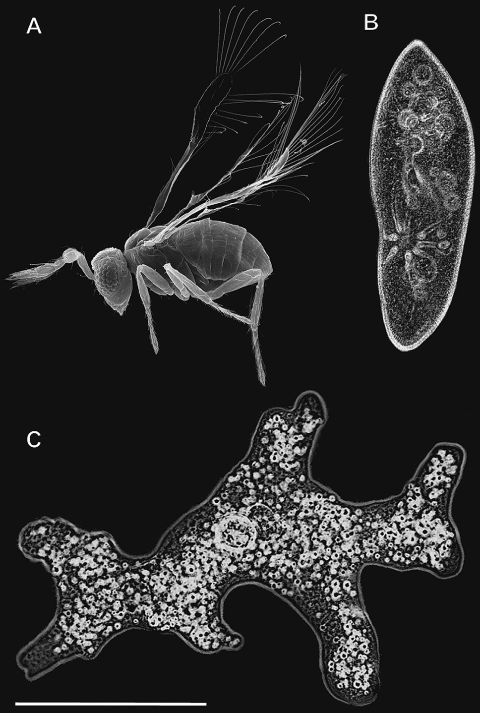
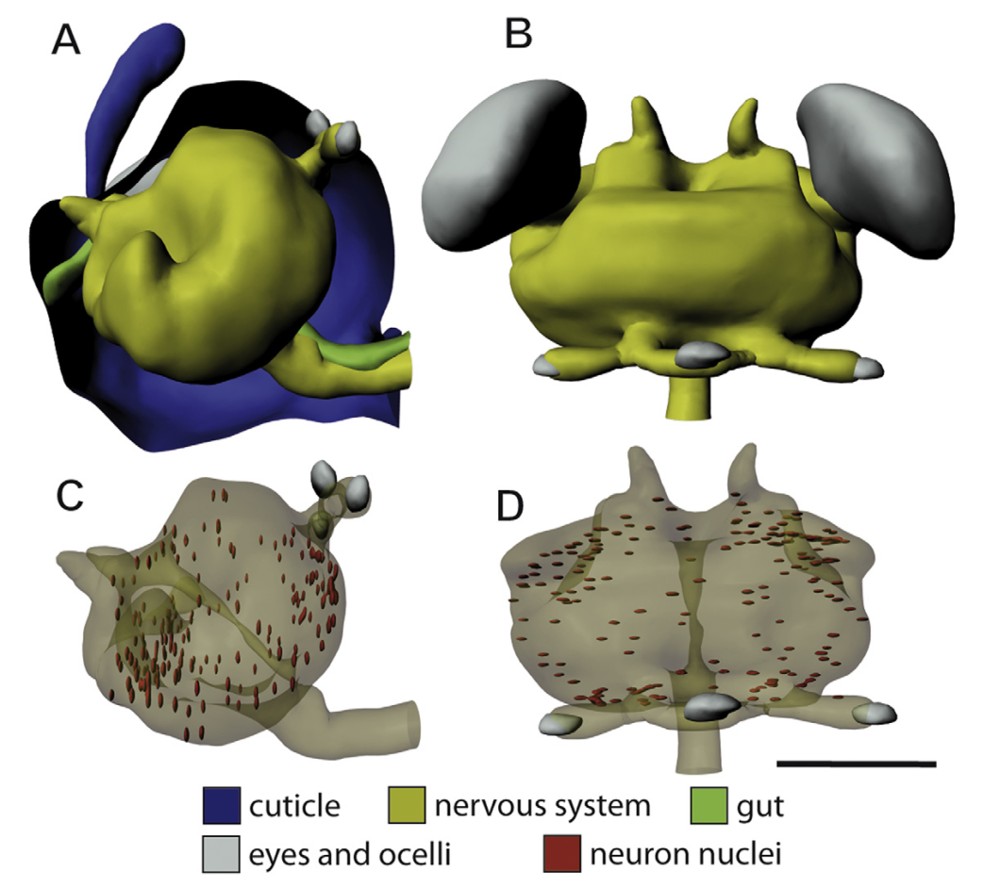
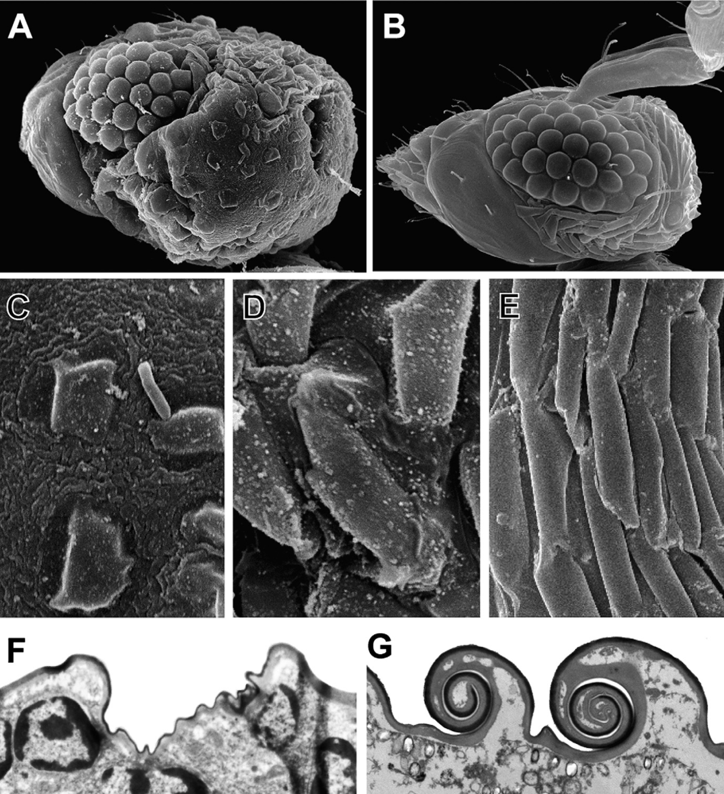

_\[This post is part of an ongoing challenge to understand 52 papers in 52 weeks. You can read previous entries, [here](http://swizec.com/blog/category/52-papers-in-52-weeks), or subscribe to get notified of new posts by [email](http://swiz.ec/52papers-list)]_ There is a species of [parasitic wasp](http://en.wikipedia.org/wiki/Parasitoid_wasp "Parasitoid wasp") smaller than an amoeba or a paramecium. Imagine that, a whole wasp smaller than some [single cell organisms](http://en.wikipedia.org/wiki/Microorganism "Microorganism"). Sure amoebas and parameciums are some of the biggest single cell organisms, but that's still amazing. Alexey A. Polilov's [The Smallest Insects Evolve Anucleate Neurons](http://entomology.ru/archiv_text/polilov/Polilov%202012%20Megaphragma.pdf) talks about one of the adaptations [Megaphragma mymaripenne](http://en.wikipedia.org/wiki/Megaphragma_mymaripenne "Megaphragma mymaripenne") evolved to become the tiniest flying animal in existence. \[caption id="" align="alignnone" width="581"] The wasp compared to an amoeba and a paramecium\[/caption]

## Miniaturization

Vertebrates achieve miniaturization by changing their skeleton and organ size, but invertebrates get into some real trouble because when tiny insects become even tinier there just isn't a lot of space left. In particular, the [nervous system](http://en.wikipedia.org/wiki/Nervous_system "Nervous system") isn't something that can just magically become smaller. Some species of microscopic ants move parts of their brain out of the head and into other parts of the body. This happens during the [pupa](http://en.wikipedia.org/wiki/Pupa "Pupa") stage of metamorphosis - between the larva and an adult animal. In butterflies this would be the cocoon, which comes between the caterpillar and butterfly stages. But wasps have very articulate heads and there isn't enough room in their neck to have a multi-part brain. This causes problems at the [cellular level](http://en.wikipedia.org/wiki/Cell_%28biology%29 "Cell (biology)") and means they have to do something pretty amazing. Most of the neurons lose their nucleus.

## Research

The researchers compared pupa and adult stages of two closely related microscopic wasps - the Megaphragma mymaripenne and the larger [Trichogramma evanescens](http://en.wikipedia.org/wiki/Trichogramma_evanescens "Trichogramma evanescens"). Specimens were fixed in formaldehyde and sliced into 1µm slices. Using these slices they created 3D models of the specimens, which helped them calculate volumes of different tissues. Later on the slices were coated in gold so they could be looked at under an electronic microscope. The research and methodology section isn't very interesting in general, but the detailed info on software and equipment used might help you reproduce the experiment. You know, because you have that Jeol JEM-1011 microscope just lying around and don't know what to do with it.

## Results

\[caption id="" align="alignnone" width="636"] Nervous system inside the head and brain with sporadic nucleae\[/caption] Megaphragma mymaripenne's nervous system undergoes a significant change during the pupa stage. Much greater than other insects. Most of the ganglia merge to form single ganglia for specific parts of the body. The abdominal ganglia merge into a single one and so on. This saves a lot of space, but that pesky brain occupies most of the head. That's why 95% of neurons also undergo lysis, which basically means parts of the cells disintegrate. In this case, they lose the nucleus so the adult wasp has only 339 to 372 nuclei in its whole nervous system, 179-253 of which are in the brain. Compared to normal wasps' 37,000 [nucleated](http://en.wikipedia.org/wiki/Cell_nucleus "Cell nucleus") neurons that's not a lot. In fact, 2.9% of this tiny wasp's volume is taken up by the nervous system. Considering normal insect brains take up only 0.35% to 1.02% of the owner's volume you can say something really special is going on here. The discussion section mentions this wasp might have hit the lowest possible size limit for an animal with a nervous system. Reducing size further would introduce problems on the chromosome level, and would have to include removing whole neurons. Which is apparently something that doesn't just happen. According to volume calculations the adult M. mymaripenne has got the same number of neurons as the pupa stage, but makes them smaller with the nucleus trick. Interestingly, the M. mymaripenne is completely typical during the pupa stage. Not only does it have the normal number of neurons, even their volume percentage is typical - 19%. \[caption id="" align="alignnone" width="713"] Changes to the head\[/caption] Better still, the M. mymaripenne retains all functions you'd expect from an adult wasp. Despite the low number of nucleotal neurons it can still fly around, find hosts, and lead a normal life for the five days it's supposed to live. Pretty amazing if you ask me. One thing I didn't find in the paper is the exact significance of neurons without nuclei, it was assumed readers understand that much of biology. From what I could gather elsewhere, the nucleus contains cell [DNA](http://en.wikipedia.org/wiki/DNA "DNA") and regulates gene expression, which tells the cell what to do. So I'm guessing all those anucleate neurons aren't doing much to help the wasp's life. But there you have it, the animal that needs the least brain power to fly. Amazing.

