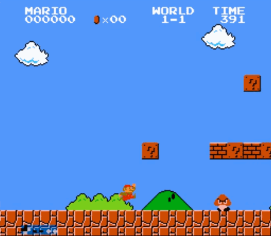
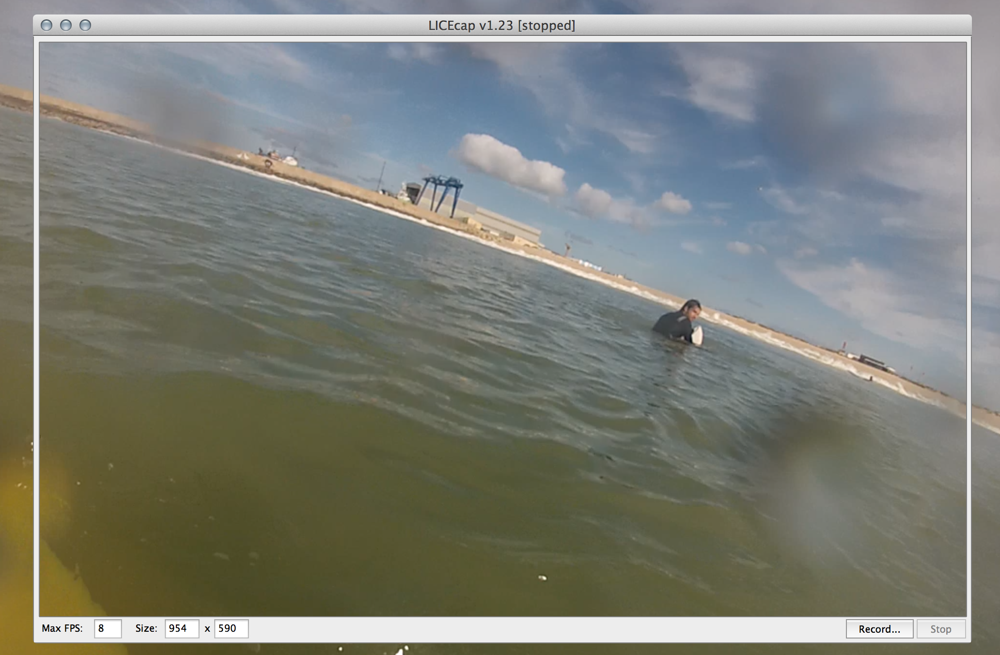
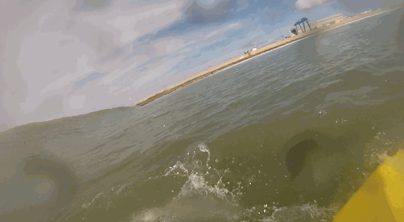

 Typing under pressure from a [screen recorder](http://en.wikipedia.org/wiki/Screencast "Screencast") is really hard. Kudos to everyone who makes educational screencasts to help people learn programming. But [LICEcap](http://www.cockos.com/licecap/) really is the best screen recorder I've ever used. Definitely the simplest. The best example of doing one thing and doing it well. Turn your screen into a GIF. That's it. That's all you can do with LICEcap. It won't help you create the next [Railscasts](http://railscasts.com/ "Railscasts") or [Coursera](http://https://www.coursera.org/ "Coursera"), but if you want to make something move in your slides when giving a talk, you need a GIF. If you want to simply embed some moving parts into your blogpost - GIF. For example, I used LICEcap to make those gifs of Super Mario playing with himself for Week 2 of the 52papers challenge. \[caption id="" align="alignnone" width="453"] Naive Super Mario\[/caption] It also came in handy for the talk I gave about d3.js a few weeks ago where I wanted to show people animated graphs, but didn't want to keep jumping in and out of the presentation and fumbling around with a thousand windows. That never goes well. My favourite part of using LICEcap is that it's simple. You open the app, put it over the content you want to record, click a button and away you go. The app will automatically save an animated GIF file when you're done recording. No fumbling around with selecting regions and hidden control windows. No worrying about sound or converting the recorded video into GIF form. \[caption id="" align="alignnone" width="743"] LICEcap in use\[/caption] Sure, it sucks that video on the web and in presentation is still not a very well solved problem and takes more fumbling around than necessary. But with today's broadband speeds, [GIFs](http://en.wikipedia.org/wiki/Graphics_Interchange_Format "Graphics Interchange Format") have become perfectly viable. Love it. \[caption id="" align="alignnone" width="673"] My surfing wipeout\[/caption] Although you might still want to use [Photoshop](http://en.wikipedia.org/wiki/Adobe_Photoshop "Adobe Photoshop") to convert real videos into good GIFs ...

