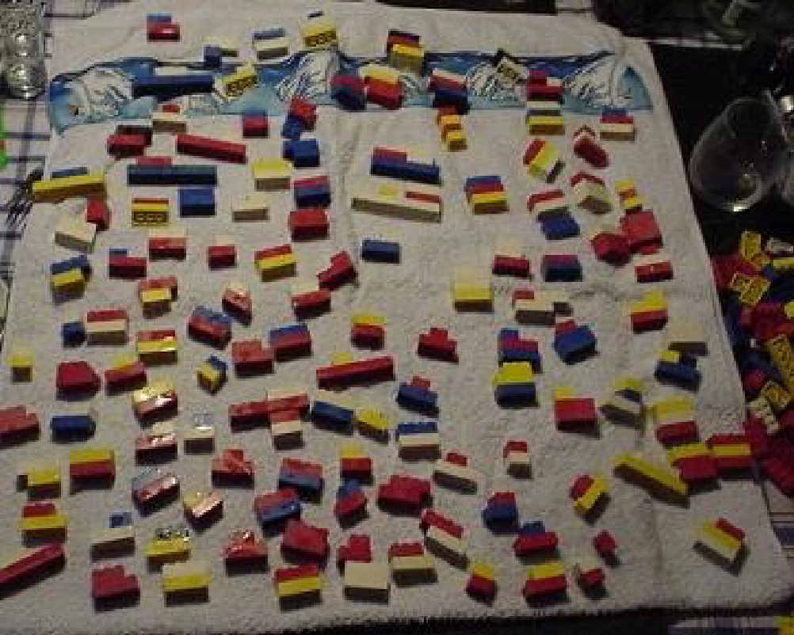
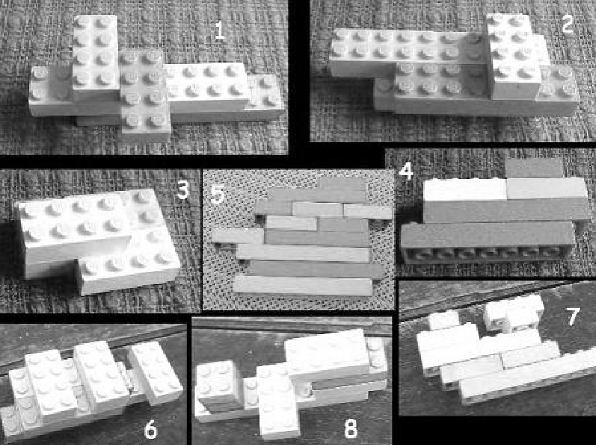
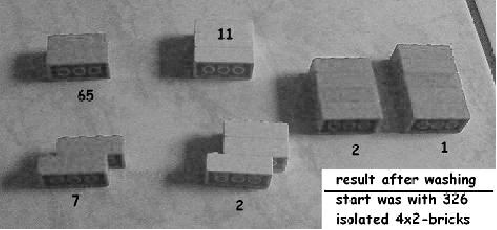

_\[This post is part of an ongoing challenge to understand 52 papers in 52 weeks. You can read previous entries, [here](http://swizec.com/blog/category/52-papers-in-52-weeks), or subscribe to get notified of new posts by [email](http://swiz.ec/52papers-list)]_

[Ingo Althöfer](http://www.althofer.de/) recently discovered that you can build random structures by loading a washing machine with many single LEGO bricks and turning it on. He wrote an interesting paper about it called, [_Random Structures from Lego Bricks and Analog Monte Carlo Procedures_](http://www.althofer.de/random-lego-structures.pdf).

There is nothing profound to be discovered by spinning LEGO bricks in a washing machine, but it's _interesting_. You can play a number of games, and the results can be interpreted through the eyes of different fields. The experiment can be everything from a [random generator](http://en.wikipedia.org/wiki/Random_number_generation "Random number generation"), to a model of biogenesis.

Most of all, you can and should try this at home. In over 50 cycles Althöfer's washing machine was not damaged, but the bricks' clutching power did diminish after a few cycles.

\[caption id="" align="alignnone" width="601"] Results from a washing run at a party\[/caption]

## Games to play

There are several games you can play with a wonderful random generator like this.

For example, you can play LEGO washing roulette. Every player builds a complex of bricks they think will be generated, then everyone whose structure is found amongst the results wins. Of the winners, the one with the most bricks is _the_ winner.

When the author tried this at a party, none of the proposed structures were generated.

\[caption id="" align="alignnone" width="748"] Complexes people think will be generated\[/caption]

Another interesting game is to try adding enzymes to the pool and seeing if they help generate more interesting structures. Every player gets 50 bricks to build one or more enzymes, if the enzymes survive a wash cycle undamaged, that player wins. If in addition, the cycle produces many relatively beautiful complexes, that player gets bragging rights to boot.

## Related work

As silly as these games might seem, others before have played with [LEGOs](http://www.lego.com/ "Lego") to get interesting results.

A similar set of experiments was done using [Duplo](http://duplo.lego.com/ "Lego Duplo") bricks in January 2013, called Duplo DNA. Another experiment used evolutionary experiments to tackle the "LEGO layout problem": Given a 3D shape, how can it be built out of LEGO bricks?

M. Abrahamsen and S. Eilers showed that you can combine 6 4x2 bricks into 915,103,765 different combinations. A stark contrast from the subset of stable structures a washing machine produces.

## More interpretations and experiments

\[caption id="" align="alignnone" width="736"] Stable complexes\[/caption]

Considering six bricks alone can produce over 900 million different complexes, just imagine how many combinations there are in a load of some 300 bricks. Boggles the mind!

But in a more practical sense only six different combinations survive the wash cycle. That's because the inside of a washing machine is a somewhat hostile environment what with all the tumbling and shaking going on. Only stable complexes make it the whole 70 minutes, which implies that an equilibrium between generation and decay is reached at some point.

What the equilibrium looks like will of course depend on how used up your bricks are. Over the course of several experiments it became obvious that new bricks have too much clutching power to form interesting complexes and mostly 2-brick layouts are generated. But the more experiments you reuse the same bricks in, the more decay becomes a problem.

In a similar experiment 65 towers of 5 bricks were used and none of them survived the washing cycle. But one completely new 5-brick tower was generated as identified by the colour combination. Which is interesting, if you ask me.

The paper offers no real interpretation of this.

But that's the gist of the [Monte Carlo method](http://en.wikipedia.org/wiki/Monte_Carlo_method "Monte Carlo method") of solving problems. Taking repeated random samples of a process and building a probabilistic model as you go. In this case, even though bricks coupling together is completely random, you can predict with great certainty which complexes will come out of the machine.

This has practical implications to, for instance, biogenesis. Similarly to how random bricks produce predictable results, so maybe elements mixing together produced the building blocks of life, which eventually built cells and so on via similar mechanisms.

In fact, in a popular study from 1953, Miller used a mix of water, methane, ammonia, and hydrogen exposed to heat and stirring to produce aminoacids. The building blocks of life.

## Fun teaching aid

You can even use the LEGO washing machine to simulate evolution. Run the cycle for a bit. Pick out interesting complexes, possibly replicating them, rerun the cycle. Continue this until a complex is generated that satisfies your idea of interesting, or you give up.

In this case the washing machine is performing the generation function, and you are performing the fitness function deciding what survives and what doesn't. It's a pretty powerful feeling I'd imagine.

Either way, you might not discover the secrets of the universe by throwing LEGOs into a washing machine, but it's _interesting_. And interesting is the best type of science!

Furthermore, this is the most fun and obvious way of showing someone that [random processes](http://en.wikipedia.org/wiki/Stochastic_process "Stochastic process") _can_ have predictable results. And that you _can_ throw randomness at a problem until a result falls out.

