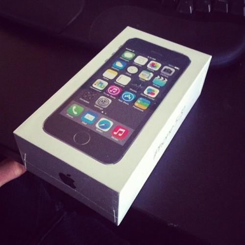

\[caption id="" align="alignnone" width="500"] My new iPhone\[/caption] I bought my old iPhone in late 2010. Had to traveled all the way to the US to get a good deal since they were stupidly expensive in Europe and simply unavailable in Slovenia. Back then factory unlocked iPhones weren't a thing yet. Just like the dark ages, only a select many had access to the best toys. But buy one I did. Hackers had promised the firmware and OS are already unlocked, they're just waiting for Apple to release [iOS](http://www.apple.com/ios/ "IOS") 4 to make sure the bug doesn't get fixed. Just a week or two and I'd be able to use the phone back home. The bug got leaked. I bought the phone a week after a firmware upgrade came out that fixed the unlock bug. Then the internet decided to just never break that particular firmware. Something about a new iOS coming out anyway with new firmwares and whatnot ... they just didn't bother with this particular version. Here I was, stuck with a very expensive iPod Touch that could make calls and receive texts on an AT&T network. We don't have an AT&T network in Slovenia. It was a huge problem at first. 21st century, can't even make a phone call or text somebody in a pinch. Can hardly make arrangements with friends because everyone just says _"Yeah let's meet up tomorrow night"_ and works the details out later. I couldn't do that. I also couldn't ask for instructions when I got lost, I couldn't stray far at a busy music festival, I couldn't leave the group at all when traveling. All those little things everyone takes for granted, I just couldn't do. But man was it peaceful. Phones are super disruptive. Your phone rings, you pick up, and just like that the person on the other end is the most \\important thing in your universe. Impossible to focus on anything else, they own you. Usually, though, they don't have anything _that_ \\important to say. I'm a programmer, not an ambulance driver. The amount of times somebody needs my full attention Right Now! is infinitesmall. 90% of the things I have to do in life can be handled via email, twitter, or Skype. Asynchronously. Without a fuss. In Slovenia this worked very well. The nearly ubiquitous wi-fi coverage in Ljubljana meant people could contact me as soon as I sat down somewhere. I could always look stuff up online by taking a few steps to the nearest wi-fi, and people got used to making concrete plans with me. Instead of _"Yeah let's go out tomorrow."_, it was _"Let's meet at 8:13pm at so and so"_. This solves two problems:

1. People are less likely to flake out
2. Concrete plans mean you can concretely plan your day

I like having my day mapped out so I'm not guessing what to do with myself hour to hour. But I'm in the US now. All these crazy kids ever do is text each other. Nobody is ever available on Skype or on FB messenger or Twitter or email. Most of them don't even have a Twitter account! There's no wi-fi anywhere either. Or rather, you have wi-fi in random grocery stores, but not in coffee shops. Of the three places I went to in [San Francisco](<http://maps.google.com/maps?ll=37.7833333333,-122.416666667&spn=0.1,0.1&q=37.7833333333,-122.416666667 (San%20Francisco)&t=h> "San Francisco") last week not one of them had wi-fi. Must be some new hipster thing. Oooh we're too cool for wi-fi, we want you to actually talk to the people around you. Humbug. So this week I got a phone. I've been planning a new iPhone for a while, but these crazy Americans broke my resolve and I got a phone number as well. Unlimited everything for $70 a month. It's pretty nifty. Having an internet in your pocket at all times comes handy more often than I thought. I no longer have to plan routes in advance, I don't have to remember to look things up before stepping out the door, I no longer get angry at coffee shops without wi-fi. I even have tethering! But ... they wouldn't let me have a phone with just internet. I have texting as well. It's taken three times longer than usual to write this post because I keep texting with a girl instead. Meeting her in SF tomorrow. We're figuring the plan out later ... _sigh_

