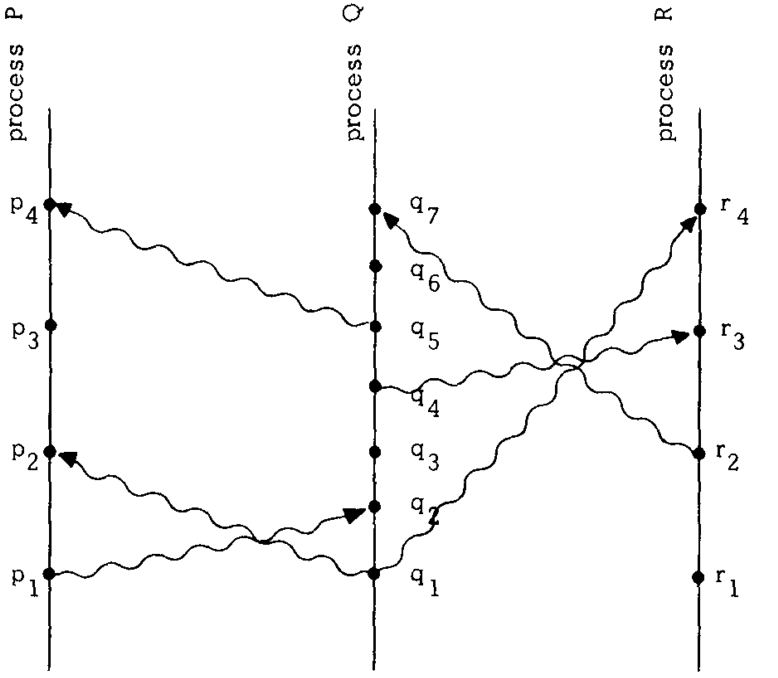
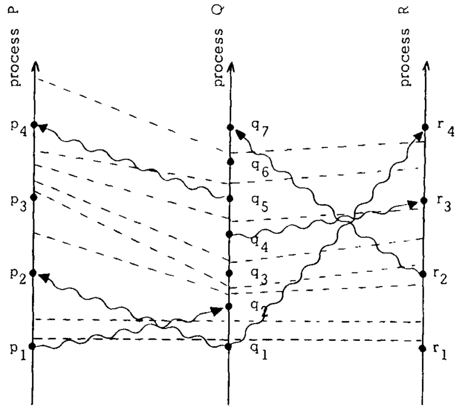
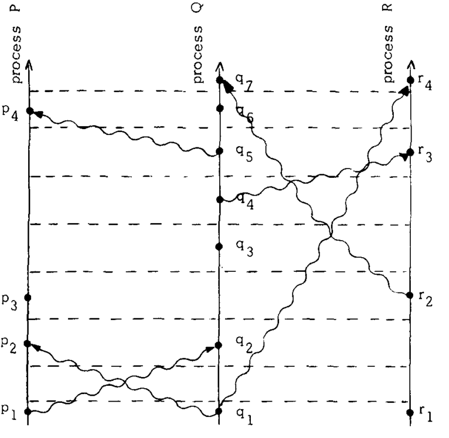

_\[This post is part of an ongoing challenge to understand 52 papers in 52 weeks. You can read previous entries, [here](http://swizec.com/blog/category/52-papers-in-52-weeks), or subscribe to be notified of new posts by [email](http://swiz.ec/52papers-list)]_ Have you ever wondered what it takes tell which event [happened before](http://en.wikipedia.org/wiki/Happened-before "Happened-before") which in a distributed system? Neither have I, but it's a problem Leslie Lamport solved in 1978 with his paper [_Time, Clocks, and the Ordering of Events in a Distributed System_](http://www.stanford.edu/class/cs240/readings/lamport.pdf). The paper even won the Dijkstra award in 2000.

## The problem

Our lives revolve around the notion that events have an inherent ordering. That some events happen _before_ other events. An airline ticket booking should only be granted if it happens _before_ the flight departs. It's 3:15 if the clock doesn't read 3:16 yet and so on. But in a distributed system the idea of "happened before" fast becomes hazy. When you have spatially separated processes that can only communicate through messages, they can't tell what in the system happened before something else. We usually look at the clock to decide whether _a_ happened before _b_, but a well defined system can only rely only on information within the system. That's why Lamport defined "happened before" without using real clocks. \[caption id="" align="alignnone" width="545"] Distributed system\[/caption] In the image, each line represents a process, a dot is an event and a squiggly line is a message being sent between two processes. Sending a message and receiving a message are both events as well. Time as we think of it goes from bottom to top, but isn't strictly defined. In this picture you can't compare relative positions of dots in separate processes to determine order. The relation "happened before", or → for short, between a set of events is the smallest relation that satisfies three rules:

1. If _a_ and _b_ are in the same process and _a_ comes before _b_, then _a → b_
2. If _a_ is sending a message and _b_ is receiving it, then _a → b_
3. If _a → b_ and _b → c_, then _a → c_

We assume events can't happen before themselves because that doesn't make sense in our physical reality (although it could in others, but it'd break a bunch of other stuff as well). Using these rules, you can follow the progress of time by following process and message lines. If you draw time borders with a dashed line, you'll get a diagram like this: \[caption id="" align="alignnone" width="549"] Diagram with time\[/caption] You can look at → through the lense of causality: _a_ happens before _b_, if it can affect _b_. In this case, process _P_ at time _p3_, can't know what _Q_ is doing in _q3_ until the message from _q5_ is received in _p4_. It can only guess what _Q_ intends to do. This goes right at the gist of our problem: it is not immediately obvious how one can put events in correct order without an external observer.

## Logical clocks solution

To elegantly solve the problem Lamport introduces logical clocks, now known as [Lamport timestamps](http://en.wikipedia.org/wiki/Lamport_timestamps "Lamport timestamps"). Simple counters that assign numbers to events. Every process _Pi_ is going to have its own clock function _Ci_ that assigns a number _Ci(a)_ to any event in that process. We assume these clocks aren't tied to the physical concept of time, so all it takes to make this system of clocks correct are a few rules.

1. If _a_ and _b_ are events in _Pi_ and _a_ comes before _b_, then _Ci(a) &lt; Ci(b)_
2. If _a_ is sending a message from _Pi_ to _b_ in _Pj_, then _Ci(a) &lt; Cj(b)_

You'll notice these two rules are essentially saying that if _a → b_ (a happened before b), then _C(a) &lt; C(b)_ (its timestamp is lower than b's). This is called the Clock Condition. It doesn't take much to create a system of clocks that satisfies these rules. And that's just what Lamport's timestamp algorithm is, simple.

1. A process _Pi_ advances its clock _Ci_ between successive events
2. Every message must contain a timestamp _Tm_ of when it was sent and when a process receives the message, it advances its clock to be greater than _Tm_

And that's it. A system of clocks that ensures you can always tell the order of two events in the system. When two events can't influence each other through messages they are considered concurrent despite their ordering in [physical time](http://en.wikipedia.org/wiki/Time "Time"). We can now use these timestamps to order all events in the system using an arbitrary ordering when timestamps are ambiguous. It's \\important to note that while the [partial ordering](http://en.wikipedia.org/wiki/Partially_ordered_set "Partially ordered set") from before is unique, the [total ordering](http://en.wikipedia.org/wiki/Total_order "Total order") depends on clock choice and the arbitrariness of ordering events where no [causal link](http://en.wikipedia.org/wiki/Causality "Causality") exists. Lamport then goes on to describe how to use clocks to design a system that can organise itself without relying on external data to order events. But this part isn't so interesting, and you can figure out your own example well enough. The \\important part is that a distributed algorithm can execute the events in its state machine in the correct order, because each process is meticulous about updating the timestamps that define event and message ordering. \[caption id="" align="alignnone" width="536"] A more organised diagram\[/caption]

## Anomalous behaviour

Despite our best efforts, the system can have anomalies where events are ordered differently than a user expects. Let's say we have a global system of connected computers (not unlike the internet, but the best Lamport had at the time was [ARPAnet](http://en.wikipedia.org/wiki/ARPANET "ARPANET")) and a asks computer _A_ to fulfill request _R(A)_. Then they immediately call computer _B_ with the request _R(B)_. As far as the user is concerned, A happened before B and should be fulfilled first as well. But because the events aren't causally connected, the system has no way of knowing. It might give B a lower timestamp than A. One solution is to require the user to manually resolve anomalies by appending timestamps to requests. We don't want that. A better solution is to introduce the Strong Clock Condition. The paper feels fuzzy here, because the only difference between the Strong Clock Condition and the Clock Condition is that the strong version's → symbol is a bold version of the normal → symbol. But Lamport promises that due to how special relativity works, it is possible to use physical clocks that stay in sync regardless of time-wimey things.

## Adding physical clocks

Adding physical clocks to the mix looks simple. Just replace the logical timestamps from before with readings from a clock that measures physical time. The problem, however, is that you can never have a perfect clock and without synchronization clocks in separate processes are going to drift further and further apart until the system becomes useless. Physical clocks must satisfy two conditions:

1. There exists a constant _k &lt;&lt; 1_ such that for all i: _|dCi(t)/dt -1| &lt; k_
2. For all i, j: _|Ci(t) - Cj(t)| &lt; ε_

That is, the derivative of a clock's period must always be smaller than a very small constant (the clock is precise) and the absolute difference between any two clocks must always be smaller than ε (the clocks are synchronised). Because no two clocks will ever run at the same rate on their own, we need an algorithm that synchronises a process' clock with other clocks in the system. We derive it from the logical clocks algorithm, which means that a process never needs to know the state of any clocks other than its own and message timestamps. As always in this paper, we follow two rules:

1. For every _i_, if _Pi_ does not receive a message at _t_, then _Ci_ is differentiable at _t_ and _dCi(t)/dt > 0_
2. A message _m_ sent from _Pi_ at _t_ contains a timestamp _Tm = Ci(t)_. When receiving said message at _t'_, _Pj_ sets _Cj(t')_ to the maximum _(Cj(t' - 0), Tm + μm)_

Essentially the same as before, but with more symbols. Between every two events in a process, the clock's readout is differentiable and bigger than 0 (time passes continuously). When a message is received, the process sets its clock to the maximum of its own clock and the timestamp in the message plus a known delay of receiving the message. This ensures that the whole system stays in sync at all times and because we are now using physical clocks that run regardless of what's going on, we have removed the anomalous behaviour from before. Wonderful.

## Fin

Lamport concludes that he has shown that "happening before" is merely a partial ordering in the system, but can be extended to a somewhat arbitrary total ordering. He also showed that a logical system and an external observer can disagree about the order of events, which he proposes to fix with physical clocks. He also gave a theorem about the lower bound for how long it can take for clocks to become synchronised, but the maths was completely impenetrable to me, so I can't really get into the appendix part of the paper. Better luck next time. My favourite part of the paper was its simplicity and relative obviousness. Now that I've read it, the paper makes complete sense and everything is just "d'oh", but coming up with these solutions from scratch required some serious insight. No wonder this is one of the most cited papers in computer science.

