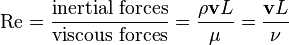
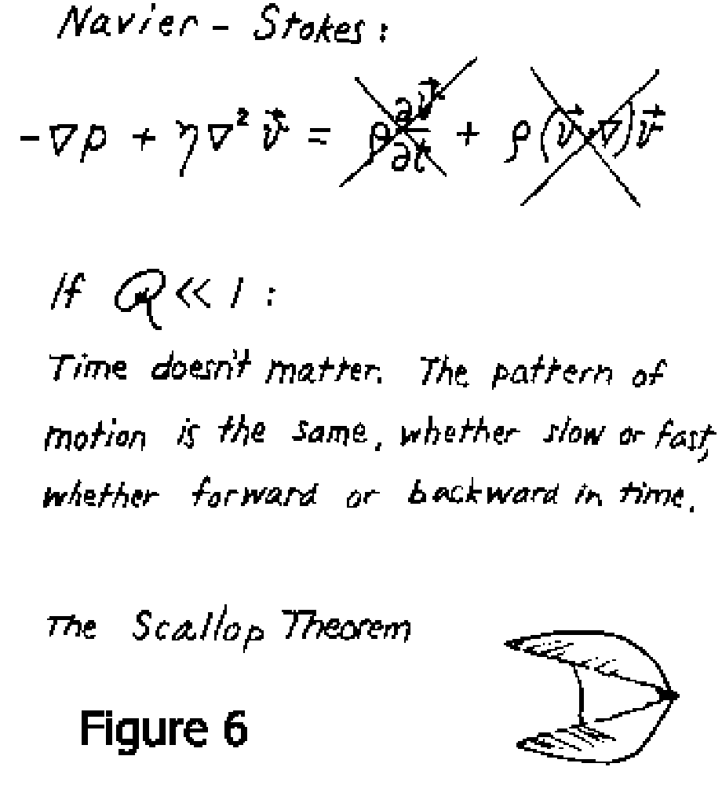
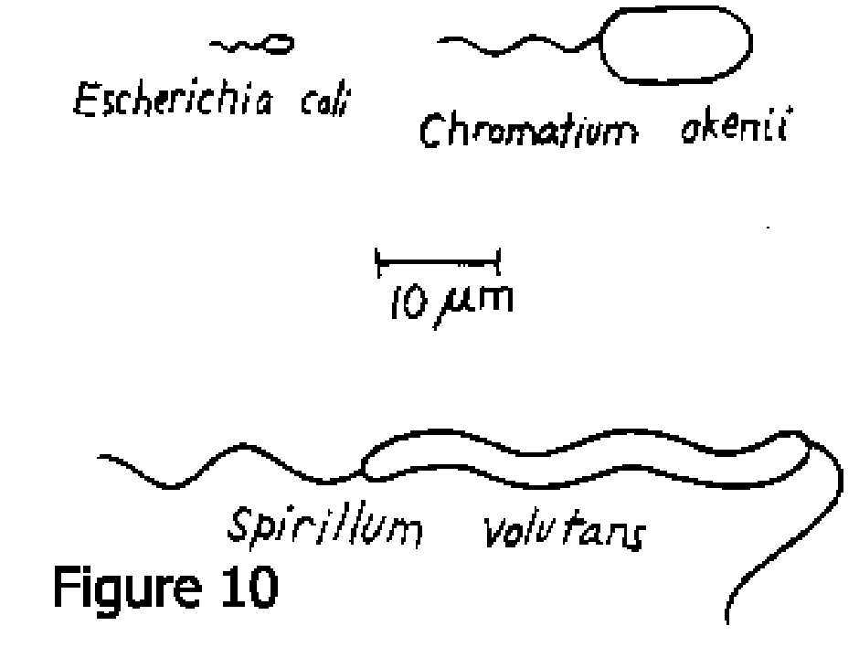
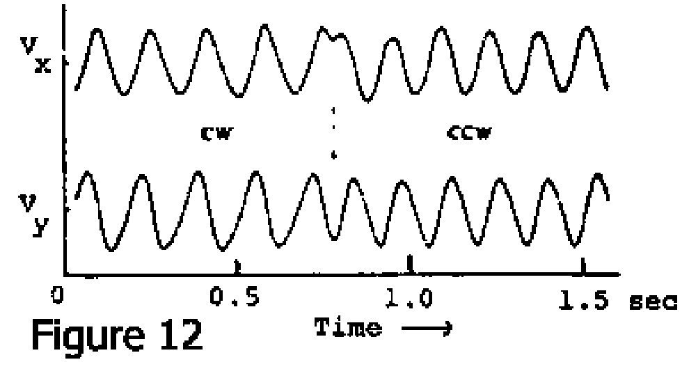
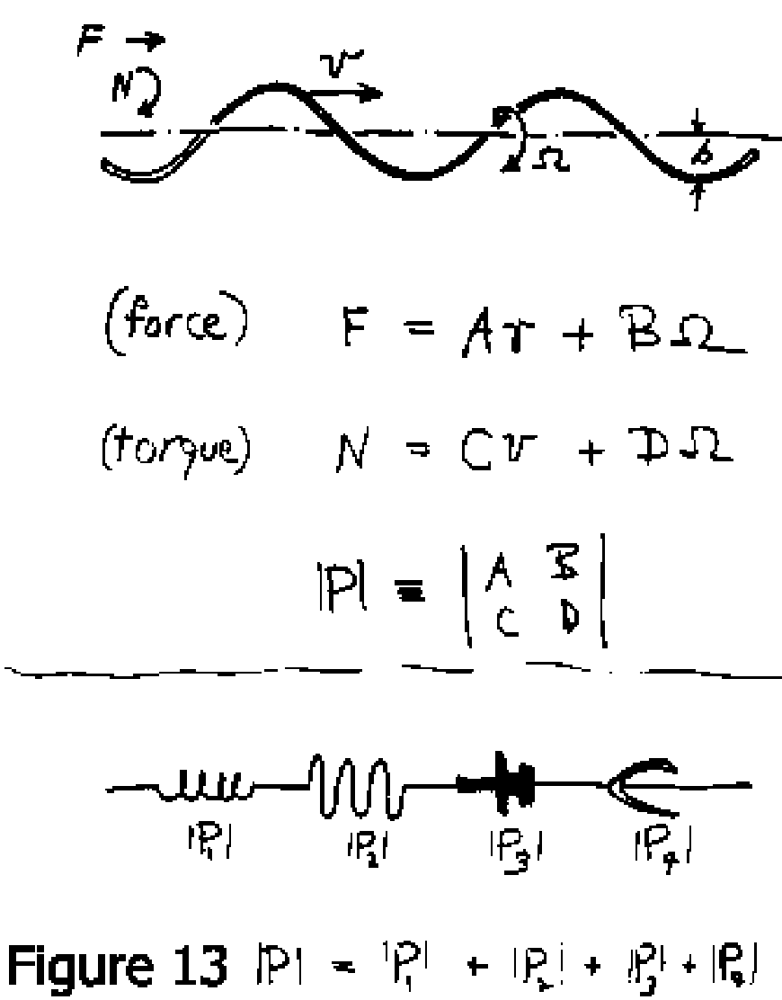
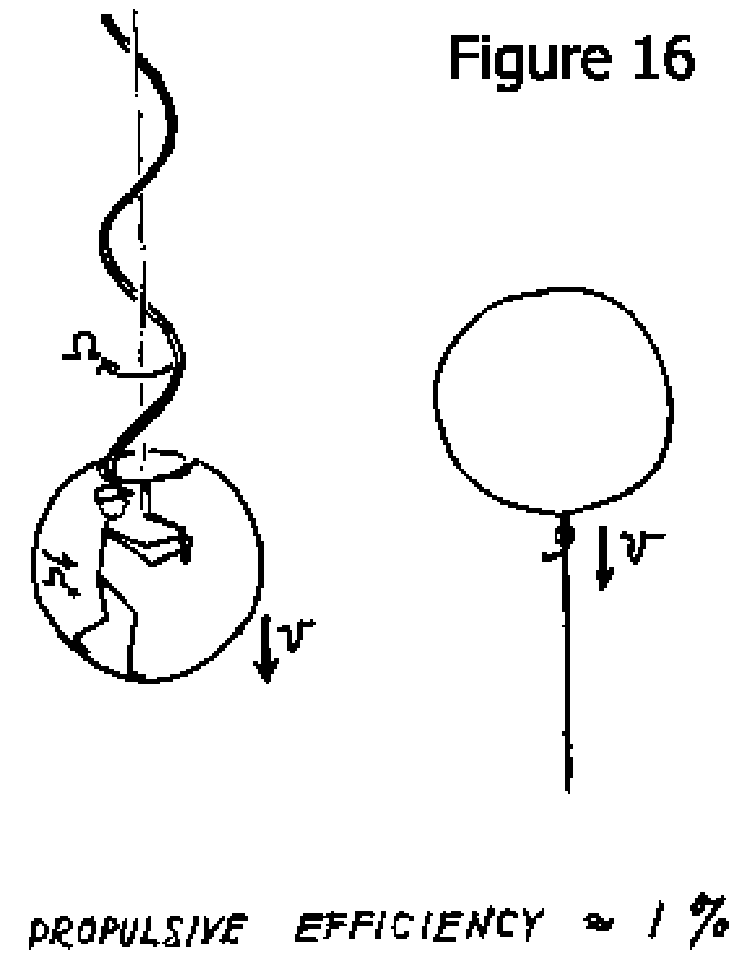
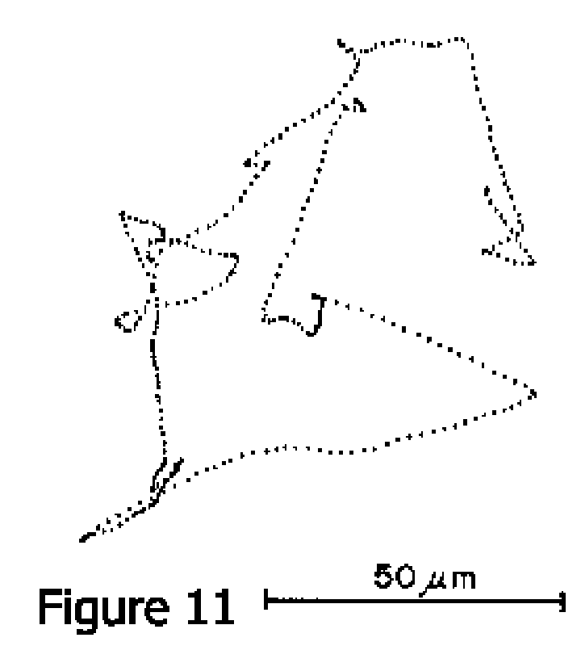
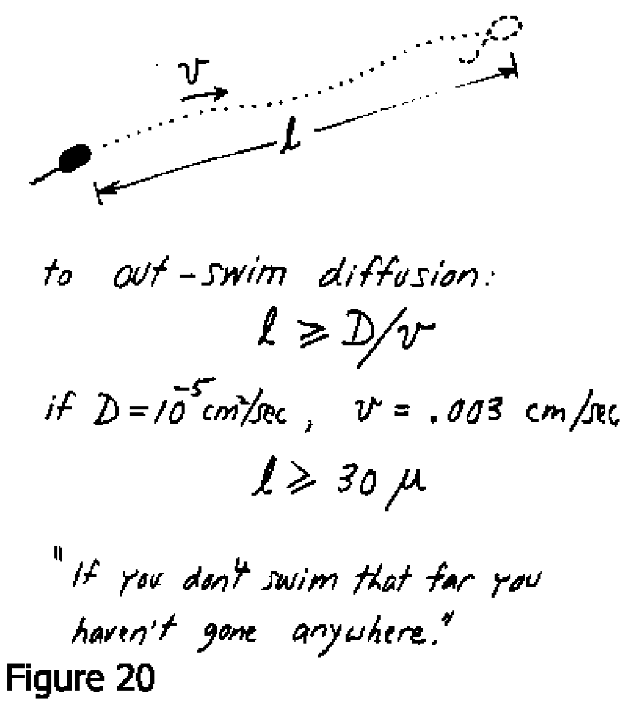

_\[This post is part of an ongoing challenge to understand 52 papers in 52 weeks. You can read previous entries, [here](http://swizec.com/blog/category/52-papers-in-52-weeks), or subscribe to be notified of new posts by [email](http://swiz.ec/52papers-list)]_

Have you ever wondered how [micro-organisms](http://en.wikipedia.org/wiki/Microorganism "Microorganism") can just live in a drop of water like that? I have and now I have an answer.

Part of the answer anyway ... the part explaining how come water looks so solid to those creatures and how that affects their behaviour. The answer comes from a talk [Life at Low Reynolds Number](http://jila.colorado.edu/perkinsgroup/Purcell_life_at_low_reynolds_number.pdf) given by E. M. Purcell and published as a paper in June 1976.

## What is a Reynold's number

In fluid dynamics [Reynold's number](http://en.wikipedia.org/wiki/Reynold%27s_number) is the ratio between inertial and [viscous forces](http://en.wikipedia.org/wiki/Viscosity "Viscosity") for an object moving through a fluid. It depends on the object's dimensions - usually just one significant dimension - its velocity, and the fluid's density and viscosity.

You can think of it as a measure of how well a particular object is going to travel through a particular fluid at a certain velocity.

In the formula, 'ρ' is the fluid's density, 'v' is the object's velocity, 'L' its significant dimension, and 'μ' the fluid's kinematic viscosity.

For a person swimming in water 'Re' would be in the order of 104, for a small fish it can go as far down as 102. Which might be why they're so difficult to catch with your bare hands. Water just feels more solid to them than to you.

But at the [microscopic scale](http://en.wikipedia.org/wiki/Microscopic_scale "Microscopic scale"), for something like a paramecium or a bacteria, the 'Re' of water will go as far down as 10-4. At that scale, inertia simply stops existing.

At Reynold's numbers that small, the only thing that matters are forces currently exhibited on a body. Past activity doesn't matter and even time itself becomes irrelevant.

## What does it mean to swim

This _only current forces matter_ business poses a huge problem to moving around.

Think about what swimming is like for a person in water. You push yourself off of the water and then, while you're still moving ahead, move your arms and legs back into position so you can push off again. The reciprocal motion slows you down, but you make up for it on the next stroke.

To swim, you deform your body in a cyclical reciprocal motion.

\[caption id="" align="alignnone" width="552"] Scallop theorem\[/caption]

But at low Reynold's numbers that doesn't really work. Hard as you might try, you are never going to move forward fast enough to bring your limbs back into starting position. In fact, doing so will just move you back the same distance it moved you forward.

Take for instance a scallop: Scallops swim by closing their shell quickly and opening it slowly, which produces a jet of water they can ride. At a low Reynold's number they'd be moving back and forth in place.

To solve this problem, animals have to use cyclical motion that isn't reciprocal.

## The flagellum

\[caption id="" align="alignnone" width="564"] Flagella\[/caption]

One common solution for locomotion at a low Reynold's number is the flagellum - a lash-like growth on the outside of the cell that can move like a whip.

With a flagellum, cells can simulate two of the simplest theoretical means of propelling yourself forward in such conditions:

- the flexible oar
- the corkscrew

The flexible oar works because it can bend in such a way it doesn't push in the wrong direction when recoiling and a corkscrew works much like a ship's propeller. Propellers are complicated and Purcell says it's merely coincidental that our intuitive understanding matches what actually goes on.

Perhaps even more surprisingly, [E. Coli](http://en.wikipedia.org/wiki/Escherichia_coli "Escherichia coli") uses its flagellum as a corkscrew. It's odd for a living organism to have a rotary motor and joint, but experiments performed by Silverman and Simon showed this is the case.

After a speculative paper by Howard they used a type of antibody to glue a particular strain (no flagellum, only hooks) of E. Coli together. When glued to the microscope glass, the bacteria were spinning.

\[caption id="" align="alignnone" width="594"] Velocity components of glued E. Coli\[/caption]

The graph shows two velocity components of such a spinning cell and as you can see _Vx_ and _Vy_ are 90° out of phase. This means the cell is going in a circle.

## How a corkscrew works

To be honest I don't fully understand this part of the paper, but the basic tenet seems to be that because we're talking about low Reynold's number conditions, everything is linear. This means we can use matrices to describe the behaviour of a corkscrew.

We're interested in force exhibited on the surrounding liquid and the screw's torque. The linear equations for these can be expressed in a four element matrix.

\[caption id="" align="alignnone" width="522"] Corkscrew as a matrix\[/caption]

After some mathematical magic that wasn't fully explained, it becomes obvious this matrix must be a-diagonal, if we want the corkscrew to work. Something about the difference between the experimental wire moving perpendicular or parallel to its length.

A slinky works much better than a round wire though. Supposedly because it's flat, which creates a better difference between the perpendicular and horizontal thing.

The end result of all this is that using corkscrews is really _really_ inefficient. They use a lot of energy to not do much at all.

\[caption id="" align="alignnone" width="440"] 1% efficiency of a corkscrew\[/caption]

## Why swim at all?

So why would you want to use such inefficient means of propulsion anyway? Why on earth do bacteria want so much to do the equivalent of a human swimming through molasses?

Nutrient differentials.

Microorganisms swim in their nutrients, which means they technically don't have to do anything to feed themselves. In fact, they _can't_ do anything because viscosity is so high compared to other forces that their environment sort of sticks to them.

What this means is that no matter how much an organism stirs the fluid it's surrounded by, nothing will change. The environment will be exactly the same unless they can stir at 20 times the speed they're able to move at. Not practical.

But what they can do is shoot around looking for greener pastures.

All they have to do is outrun diffusion, which in the average parameters means moving by about 30 μm. Then waiting around for diffusion to feed you, then moving away again.

\[caption id="" align="alignnone" width="432"] Movement patterns of E. Coli\[/caption]

As it turns out, observed bacteria choose a direction at random, then keep moving until the situation is better than what it was where they left off. If you hit a rough patch, it doesn't make sense to stop moving, and if conditions are improving, they might improve a bit more if you keep moving.

Having a minimum distance you have to travel every time you move has funny effects like that.

\[caption id="" align="alignnone" width="634"] Outrunning diffusion\[/caption]

